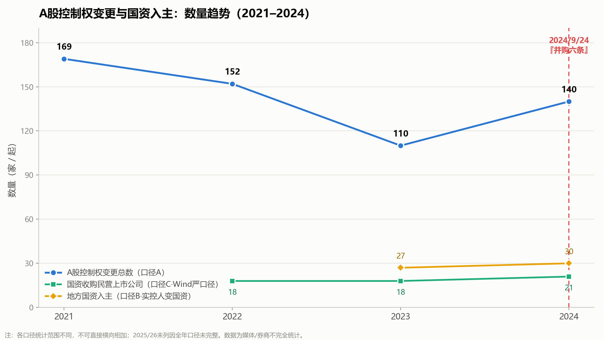
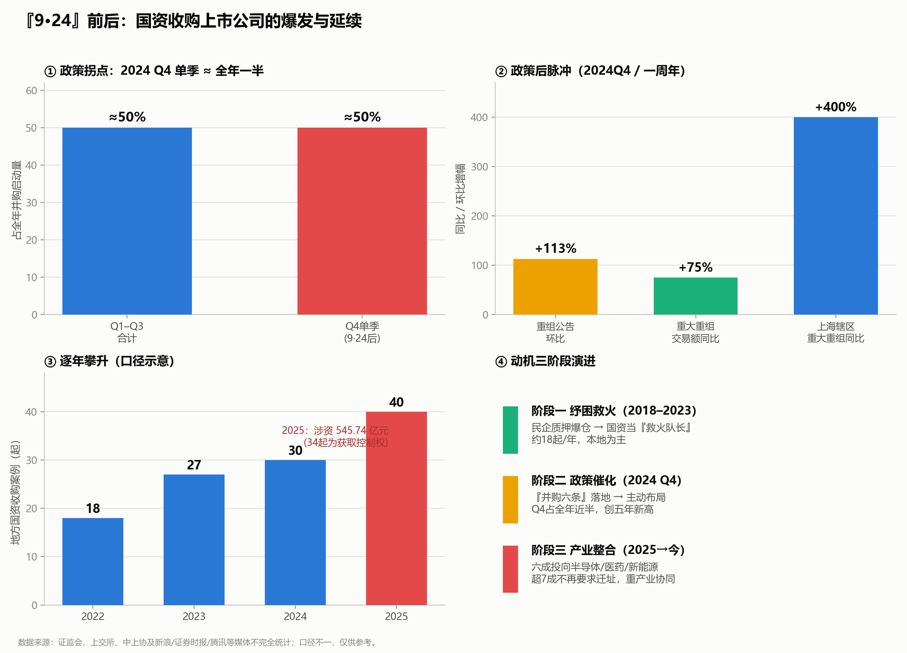

# "9·24"前后国资入主上市公司：完整数据与变化趋势

> 主题：2024年9月24日"并购六条"政策前后，地方国资/国资收购上市公司控制权的数量、规模与趋势
> 数据截止：2026年7月（本文档整理日期 2026-07-20）
> 性质：讨论性整理，数据多为媒体、券商及行业协会"不完全统计"，口径不一，仅供参考

---

## 重要说明：口径不统一（务必先读）

"国资入股潮"没有单一权威口径，不同机构统计对象不同，**绝对数字会有出入**。本文档涉及以下几种口径：

| 口径 | 含义 | 数量级 |
|------|------|--------|
| **口径A：A股控制权变更总数** | 含所有接盘方（国资+民企+产业资本） | 每年 100–150 家 |
| **口径B：国资/地方国资入主数** | 实控人变更为国资 | 每年 20–30 余家 |
| **口径C：国资收购民营上市公司（Wind严口径）** | 仅"民转国" | 每年 18–24 起 |
| **口径D：并购重组总量** | 所有资产重组事件（非仅控制权） | 每年 2000–3000 单 |

阅读时请对齐口径。精确数据需用 **Wind / Choice / iFinD** 等数据库交叉核对。

---

## 一、关键政策节点：2024年9月24日

2024年9月24日，中国证监会发布**《关于深化上市公司并购重组市场改革的意见》（"并购六条"）**，同日央行等推出一揽子增量政策（"9·24"行情起点）。

"并购六条"核心：
1. 支持向新质生产力方向转型升级
2. 鼓励加强产业整合
3. 提高监管包容度
4. 提升重组市场交易效率
5. 加大产业整合支持力度
6. 提高支付灵活性和审核效率

这是国资收购、并购重组明显提速的**分水岭**。

---

## 图表速览

**图1：数量趋势（2021–2024，多口径）**

**图2：『9·24』前后爆发与延续（四面板看板）**

> 图片文件：`国资入主_主趋势.png`、`国资入主_看板.png`（与本文档同目录 `C:/tmp/`）；生成脚本：`make_charts.py`（Python + matplotlib，可改数据重跑）。

---

## 二、完整时间序列（2021 → 2026年中）

### 口径A / C：控制权变更总数 & 国资"民转国"

| 年份 | 控制权变更总数（口径A） | 地方国资入主（口径B） | 国资收购民企（口径C，Wind严口径） | 关键特征 |
|------|------------------------|----------------------|-----------------------------------|----------|
| **2021** | 约 **169 单** | — | — | 高基数 |
| **2022** | 约 **152 单** | — | **18 起** | 前十大交易超七成由国资主导 |
| **2023** | **108 家 / 筹划 110 次**，国资接手约占三成 | **27 家** | **18 起**（与2022持平） | 国资扮演"救火队长"，纾困为主 |
| **2024** | **140 家**，创近五年新高 | 约 **30 家**（严口径）；宽口径前三季度已超 60–65 起 | **21–24 起**（民转国） | 9·24后Q4爆发，占全年约42–50% |
| **2025** | 半年即约 53 家次（≈2024全年57家次） | 地方国资收购 **40 起／545.74亿元**（34起为控制权） | — | 涉地方国资并购事件累计 **122 起** |
| **2026(至今)** | 已披露 **逾 40 家** 控制权变更 | 延续国资主导 | — | 产业整合导向延续 |

> 注：口径A的"总数"含所有接盘方；同一年不同来源数字有差异（如2024年既有"140家控制权变更"，也有"57家次交易性变更"的更严口径），因统计范围不同所致。

---

## 三、"9·24"前后的直接对比（增量效应最直观）

| 时间窗口 | 数据 |
|----------|------|
| 9·24 **之前**（2024前三季度） | 全年并购/控制权变更节奏平稳，前三季度国资入主已超60–65起（宽口径） |
| 9·24 **之后（Q4单季）** | 约 60 家公司启动并购，**占全年近 50%** |
| 政策后半个月 | 重大资产重组公告环比 **+113%** |
| 截至 2024/10/28 | 重大资产重组 86 起，交易额 1774 亿元，**同比 +75%** |
| 全年交易性控制权变更 | Q4 占全年约 **42%** |

**结论**：政策后一个季度贡献了全年近一半的并购活动，是明显的政策驱动拐点。

---

## 四、"并购六条"一周年成效（2024/9/24 – 2025/9/23）

| 指标 | 数据 | 同比 |
|------|------|------|
| 全市场累计披露资产重组 | 超 **2100 单** | — |
| 其中重大资产重组 | **230 余单** | — |
| 2025年以来披露资产重组 | 超 1300 单 | 去年同期 **1.4 倍** |
| 2025年以来重大资产重组 | 近 160 单 | 去年同期 **2.3 倍** |
| 沪市新增重大资产重组 | **111 单**，交易额超 **3007 亿元** | 接近政策前两年之和 |
| 上海辖区重大资产重组 | 15 单 | **+400%** |
| 半导体产业并购重组 | 230 余起 | 近 **+40%** |
| 约六成交易 | 涉及半导体、生物医药、新能源等新质生产力 | — |
| 民营企业在重大重组中占比 | 约 **2/3** | — |

审核效率：国泰君安吸并海通证券从受理到过会仅 **16 天**；2025年过会/注册项目数是去年同期 **2.4 倍**。

---

## 五、变化趋势：三个阶段

国资入主上市公司的逻辑，可清晰划分为三个阶段：

### 阶段一：纾困救火期（2018–2023）
- **背景**：民企大股东股权质押爆仓、流动性危机。
- **角色**：地方国资是"**白衣骑士 / 救火队长**"。
- **数据**：2022、2023 年国资收购民企各约 18 起；2023年地方国资入主 27 家。
- **方式**：股权转让、表决权委托，以及**司法拍卖、破产重整**等新路径。
- **动机**：以纾困、维稳、提升本地证券化率为主。

### 阶段二：政策催化爆发期（2024 Q4）
- **背景**：9·24"并购六条"+ 一揽子增量政策。
- **表现**：Q4单季并购占全年近一半；重组公告环比翻倍。
- **数据**：2024全年控制权变更140家创五年新高；国资入主约30家。
- **转折**：从"被动接盘"转向"主动布局"。

### 阶段三：产业整合 / 国有资本证券化期（2025 → 至今）
- **背景**："并购六条"红利持续释放，国企改革深化。
- **表现**：约六成交易投向新质生产力（半导体、生物医药、新能源）。
- **数据**：2025年地方国资收购40起／545亿元；涉国资并购事件累计122起；重组同比+68.42%。
- **新特征**：
  - **超7成国资不再要求企业迁址**（vs 早期"必须落户本地"）→ 说明目的从"抢税源/抢GDP"转向"产业协同"。
  - 表决权委托退场，"协议转让+表决权放弃"等组合工具兴起。
  - 标的偏小市值（多低于50亿）、传统行业困境公司出清 + 硬科技布局并行。

---

## 六、结构性分布（谁在买、买什么、在哪买）

| 维度 | 特征 |
|------|------|
| **接盘主力** | 地方国资、产业资本、央企 |
| **重点地区** | 浙江、江苏、四川、安徽、广东、山东（山东、浙江长期居前） |
| **重点行业** | 半导体、生物医药、新能源（新兴）；房地产、基础化工、建筑装饰（2025国资并购前三，偏传统整合） |
| **收购方式** | 协议转让为主；"协议转让+表决权委托/放弃"组合兴起；拍卖、重整成新路径 |
| **标的特征** | 小市值（多低于50亿元）、传统行业困境公司，或硬科技龙头 |

### 市场背景（截至2025/2）
- A股上市公司总数 **5404 家**（沪2282、深2858、北264）
- 国有控股占比 **27%**，非国有 **73%**，总市值 87.1 万亿元

### 代表性案例
- 中国船舶吸收合并中国重工（市值超1100亿）
- 国泰君安 + 海通证券合并（2025首单通过、16天过会）
- 山东黄金 127.6 亿收购银泰黄金（2023，跨区）
- 红旗连锁实控人变更为四川省国资（2024/11/13）
- 亚邦股份实控人变更为武进国资办（2024/10/22）
- 长电科技、华大九天、世运电路等硬科技标的国资入主（部分浮盈超70%）

---

## 七、总体变化的一句话概括

- **量的跃升**：国资收购民企从 2022–2023 年稳定的 **约18起/年**，到 2024 年国资入主约 **30家**、2025 年地方国资收购 **40起／545亿元**，并购重组总量从每年约3000单水平在政策后进一步"量额齐升"。
- **拐点清晰**：2024 年"9·24并购六条"后 **Q4 单季并购约占全年一半**，是明确的政策驱动拐点；一周年沪市新增重大重组即达政策前两年之和。
- **性质三级跳**：从 **纾困救火**（2018–2023）→ **政策催化**（2024Q4）→ **产业整合+国有资本证券化**（2025至今），目的从"救民企/抢税源"转向"产业升级、打造龙头、做大国有资本"，正对应"股权财政"中**国有资本运营/控股上市平台**的核心逻辑。

---

## 数据来源

**2021–2023 基准与纾困期**
- [界面新闻：地方国资2023年共"迎娶"27家上市公司](https://www.jiemian.com/article/10617254.html)
- [新浪财经：2023年A股108家上市公司筹划控制权变更，国资接手占三成](https://finance.sina.com.cn/jjxw/2023-12-29/doc-imzzsywq5952819.shtml)
- [雪球/Wind：盘点2023年国资收购上市公司交易（2022、2023各18起）](https://xueqiu.com/6994390024/294226545)
- [新浪财经：2022年上市公司并购重组2972单，同比减少10.88%](https://finance.sina.com.cn/stock/hkstock/ggscyd/2023-04-11/doc-imypypnq7572988.shtml)
- [搜狐：2022并购市场盘点，前十大交易超七成由国资主导](https://news.sohu.com/a/636329765_121124371)

**2024 政策拐点**
- [新浪财经：A股上市公司易主"国资版图"再度扩张](https://finance.sina.com.cn/stock/stockzmt/2024-10-09/doc-incsanpzv2806847.shtml)
- [新浪财经：2024年度A股上市公司控制权变动市场回顾](https://finance.sina.com.cn/stock/stockzmt/2025-01-16/doc-inefesvu7207117.shtml)
- [搜狐财经：2024年A股控制权交易市场新特征与趋势分析](https://www.sohu.com/a/870744012_121976703)
- [新浪科技："并购六条"后A股资产重组井喷](https://finance.sina.com.cn/tech/roll/2024-11-20/doc-incwteuk5351631.shtml)
- [新浪财经：2024年30家公司实控人变更为国资，科技龙头受青睐](https://finance.sina.com.cn/stock/relnews/cn/2025-01-22/doc-inefvuvv7565155.shtml)

**2025 产业整合期 & 一周年成效**
- [搜狐财经：2025年1月国资收购12家上市公司控制权分析](https://www.sohu.com/a/861595652_122066676)
- [今日头条：2025年122起并购涉地方国有控股上市公司](https://www.toutiao.com/article/7471488792395579919/)
- [新浪财经：2025年地方国资积极布局并购，全年涉545.74亿元](https://finance.sina.com.cn/jjxw/2025-01-23/doc-inefyqsr5794700.shtml)
- [腾讯新闻："并购六条"发布一周年：沪市新增重大资产重组111单，交易额超3000亿元](https://new.qq.com/rain/a/20250924A01D9600)
- [人民在线："并购六条"一周年答卷：市场活力足，产业"筋骨"强](https://www.peoplezzs.com/caijing/2025/0924/69536.html)
- [腾讯新闻：三大动因驱动，地方国资掀收购上市公司热潮](https://new.qq.com/rain/a/20250815A01MZ900)

---

*本文档为讨论性质整理，数据口径不统一、多为不完全统计，不同来源绝对数字存在差异，不构成投资或政策建议。*
