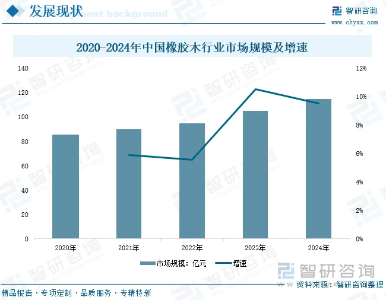

# 海南橡胶（601118）橡胶木加工业务分析

> 橡胶木加工是海南橡胶全部业务板块中**毛利率最高**的板块——2024 年合并报表披露毛利率 **16.50%**，远超贸易（~2.7%）、初加工（~2%）、种植（~3%）。但收入仅 2.42 亿元，占总营收 **0.50%**。本文深度拆解橡胶木业务的商业模式、真实盈利能力、改革历程、行业环境、原料供给机制，以及其在高毛利与低净利之间的矛盾根源。

---

## 一、业务基本盘

### 1.1 经营主体：海南农垦宝橡林产集团（海垦林产，873010）

| 指标 | 数据 |
|------|------|
| 全称 | 海南农垦宝橡林产集团股份有限公司 |
| 挂牌 | 新三板（873010），当前被 ST（"ST 海垦林"） |
| 控股股东 | 海南橡胶（601118） |
| 主营业务 | 橡胶木采伐加工、木结构工程、高分子改性材料 |
| 年加工产能 | **2 万立方米**（2025 年报口径；早期宣传口径为 4 万立方米以上） |
| 认证 | FSC-COC 产销监管链认证（海南首家）；海南省唯一一级木结构工程施工资质；国家高新技术企业（2019） |
| 核心客户 | 宜家家居（IKEA）——通过 FSC 认证进入其全球供应链 |

### 1.2 业务模式：橡胶树更新采伐 → 木材加工 → 销售

```
橡胶树生命周期：
  种植 → 7-8 年后开割 → 采胶 25 年 → 产量下降 → 砍伐更新
                                              ↓
                                    橡胶木进入加工环节
                                              ↓
                           ┌──────────────────┼──────────────────┐
                           ↓                  ↓                  ↓
                      原木直销          锯材/刨光材          高分子改性材
                    （基地分公司）    （宝橡林产加工）      （高附加值产品）
                           ↓                  ↓                  ↓
                      低毛利/高周转      中毛利/稳定       高毛利/小众市场
```

### 1.3 产品线

| 产品类别 | 说明 | 毛利率层级 |
|----------|------|-----------|
| 橡胶木原木 | 直接出售未加工木材（各基地分公司自行销售） | 极高（树木已折旧，成本近乎为零） |
| 家具刨光材 | 供应家具厂的标准板材 | 中低（行业竞争激烈） |
| 指接拼板 | 小料拼接成大幅面板材 | 中 |
| 装饰材/地板料 | 地板、楼梯部件用材 | 中 |
| 高分子改性材 | 高温热改性、防腐处理后的高性能木材 | 较高（有技术壁垒） |
| FSC 认证材 | 全链条可追溯的"零添加"环保木材 | 溢价 10-30%（欧美市场需求） |

这里可以直接进行两大分类，即橡胶原木销售和原木加工，24年他们的数据如下：
| 业务        |           收入 |           成本 |        毛利润 |        毛利率 |
| --------- | -----------: | -----------: | ---------: | ---------: |
| **橡胶木加工** |     2.5158亿元 |     2.5351亿元 | **-193万元** | **-0.77%** |
| **原木销售**  |     0.8810亿元 |     0.4613亿元 | **4197万元** | **47.63%** |
| **合计**    | **3.3969亿元** | **2.9964亿元** | **4004万元** | **11.79%** |


可以发现橡胶木加工基本上不赚钱。赚钱高毛利的是原木销售，毛利率接近50%，两者业务占比：
按收入计算
橡胶木加工：2.5158 ÷ 3.3968 ≈ 74.05%
原木销售：0.8810 ÷ 3.3968 ≈ 25.95%

之前分析财报的时候的橡胶木业务的毛利率16%是将上面这两者综合下来，最后计算出的。

这边目前已知的是橡胶原木销售是高毛利赚钱的，那么还需要看一下行业趋势，也就是国内橡胶木市场的发展趋势是如何的，未来要么有利于橡胶木。




https://www.chyxx.com/industry/1231654.html#:~:text=%E6%95%B0%E6%8D%AE%E6%98%BE%E7%A4%BA%EF%BC%8C2020-2024%E5%B9%B4%E4%B8%AD%E5%9B%BD%E6%A9%A1%E8%83%B6%E6%9C%A8%E8%A1%8C%E4%B8%9A%E5%B8%82%E5%9C%BA%E8%A7%84%E6%A8%A1%E4%BB%8E85%E4%BA%BF%E5%85%83%E5%A2%9E%E9%95%BF%E8%87%B3115%E4%BA%BF%E5%85%83%EF%BC%8C%E5%B9%B4%E5%A4%8D%E5%90%88%E5%A2%9E%E9%95%BF%E7%8E%87%E4%B8%BA7.8%25%E3%80%82%20%E9%9A%8F%E7%9D%80%E7%A7%8D%E6%A4%8D%E6%8A%80%E6%9C%AF%E7%9A%84%E4%B8%8D%E6%96%AD%E8%BF%9B%E6%AD%A5%E5%92%8C%E7%A7%8D%E6%A4%8D%E9%9D%A2%E7%A7%AF%E7%9A%84%E6%89%A9%E5%A4%A7%EF%BC%8C%E5%85%A8%E7%90%83%E6%A9%A1%E8%83%B6%E6%9C%A8%E4%BA%A7%E9%87%8F%E9%80%90%E5%B9%B4%E6%94%80%E5%8D%87%E3%80%82,%E6%B3%B0%E5%9B%BD%E3%80%81%E5%8D%B0%E5%B0%BC%E3%80%81%E9%A9%AC%E6%9D%A5%E8%A5%BF%E4%BA%9A%E7%AD%89%E5%9B%BD%E5%AE%B6%E7%9A%84%E6%A9%A1%E8%83%B6%E6%9C%A8%E4%BA%A7%E9%87%8F%E5%8D%A0%E6%8D%AE%E4%BA%86%E5%85%A8%E7%90%83%E4%BA%A7%E9%87%8F%E7%9A%84%E4%B8%BB%E5%AF%BC%E5%9C%B0%E4%BD%8D%E3%80%82%20%E4%B8%AD%E5%9B%BD%E5%8F%97%E6%B0%94%E5%80%99%E6%9D%A1%E4%BB%B6%E7%AD%89%E8%87%AA%E7%84%B6%E5%9B%A0%E7%B4%A0%E7%9A%84%E5%BD%B1%E5%93%8D%EF%BC%8C%E7%A7%8D%E6%A4%8D%E9%9D%A2%E7%A7%AF%E8%BE%83%E5%B0%8F%EF%BC%8C%E6%A9%A1%E8%83%B6%E6%9C%A8%E4%BA%A7%E9%87%8F%E4%B8%8D%E8%83%BD%E5%AE%8C%E5%85%A8%E6%BB%A1%E8%B6%B3%E5%9B%BD%E5%86%85%E9%9C%80%E6%B1%82%EF%BC%8C%E5%9B%A0%E6%AD%A4%E9%9C%80%E8%A6%81%E5%A4%A7%E9%87%8F%E8%BF%9B%E5%8F%A3%E3%80%82%20%E8%BF%91%E5%B9%B4%E6%9D%A5%EF%BC%8C%E4%B8%AD%E5%9B%BD%E5%AF%B9%E6%B3%B0%E5%9B%BD%E6%A9%A1%E8%83%B6%E6%9C%A8%E7%9A%84%E9%9C%80%E6%B1%82%E9%87%8F%E6%8C%81%E7%BB%AD%E6%94%80%E5%8D%87%E3%80%82
这个是相关的链接国内橡胶木市场从2021年到2025年持续增长，国内家具市场中的橡胶家具占比接近20%，说明这块还是大有可为，行业趋势没问题。

### 1.4 原料供给机制

| 指标 | 数据 |
|------|------|
| 海南橡胶胶园总面积 | ~341 万亩 |
| 橡胶树开割年限 | 7-8 年开割 → 采胶 25 年 → 更新砍伐 |
| **年更新采伐比例** | **约 3%**（公司官方口径） |
| 年更新面积 | 约 **8-10 万亩/年** |
| 2024 年实际采伐面积 | **7.65 万亩**（改革后提速 114%） |
| 2025 年计划更新种植 | **8 万亩** |
| 老龄残次胶园比例 | **25.23%**（更新滞后严重） |

> ⚠️ **关键认知**：橡胶木的原料供给**完全受橡胶种植周期的约束**。它不是独立的木材生意——原料来源是被动产生的（橡胶树老了必须砍），不能主动扩产。这是橡胶木业务的**天然天花板**。

---

## 二、财务数据深度拆解：16.50% 毛利率的真相

### 2.1 合并报表口径（海南橡胶 601118，2024 年报）

| 指标 | 数据 | 数据来源 |
|------|------|----------|
| 橡胶木材收入 | **2.42 亿元** | 年报分产品披露 |
| 橡胶木材成本 | 2.02 亿元 | 年报分产品披露 |
| **毛利** | **0.40 亿元** | 倒算 |
| **毛利率** | **16.50%** | 年报披露，验算通过 |
| 占主营收入比例 | **0.50%** | 2.42 / 485.77 |

### 2.2 子公司口径（海垦林产 873010，新三板披露）

| 指标 | 2023 | 2024 | 2025 | 2025 H1 |
|------|------|------|------|---------|
| 营业收入（亿元） | 0.32 | **1.48** | **1.10** | 0.78 |
| 净利润（万元） | **−5,108** | **+101** | **−575** | +132 |
| 净利率 | −162% | 0.68% | −5.23% | 1.69% |
| 毛利率 | — | — | **7.43%** | 10.09% |
| 净资产（万元） | — | — | **−629**（资不抵债） | — |
| 累计未弥补亏损 | — | −1.41 亿 | −1.47 亿 | — |

> 🔴 **ST 警示**：海垦林产因净资产为负（−629 万元），已被冠以"ST 海垦林"标识，审计机构出具**带持续经营重大不确定性段落的无保留意见**。

### 2.3 关键矛盾：16.50% 的毛利率 vs 几乎为零的净利率

这是理解橡胶木业务最核心的矛盾：

```
合并报表层面（601118）：橡胶木材收入 2.42 亿，毛利 0.40 亿，毛利率 16.50%
                                    ↓
                    但海垦林产（873010）2024 年净利润仅 101 万元
                                    ↓
                    0.40 亿毛利 → 0.01 亿净利 = 97.5% 的毛利消失了
```

**原因拆解**：

#### 原因一：合并口径 2.42 亿 ≠ 海垦林产 1.48 亿

合并报表的 2.42 亿橡胶木材收入中，包含两类收入：

| 收入来源 | 估算金额 | 性质 | 隐含毛利率 |
|----------|---------|------|-----------|
| 各基地分公司直接卖原木 | ~0.94 亿 | 未经加工的橡胶木原木直销 | 极高（30-40%+，树木已折旧，成本近乎为零） |
| 宝橡林产加工销售 | ~1.48 亿 | 加工后的板材/方材/改性材 | 较低（海垦林产 2024 毛利率约 8-10%） |
| **合并合计** | **2.42 亿** | — | **加权 16.50%** |

> 16.50% 的高毛利主要来自**卖原木**（无需加工，低成本），而非来自加工环节。加工环节（宝橡林产）的毛利率仅 7-10%。

#### 原因二：加工端毛利微薄 + 费用刚性

海垦林产 2024 年营收 1.48 亿，按毛利率 ~9% 倒推，毛利约 0.13 亿。但：

- 管理/销售/财务费用合计远超毛利
- 历史包袱（累计亏损 1.41 亿）带来的减值、坏账、诉讼成本
- 2024 年扭亏仅靠改革红利（采伐量翻倍 + 集中统管），而非加工本身盈利改善

#### 原因三：2025 年迅速转亏，证明扭亏不可持续

海垦林产 2025 年全年净亏 575 万——在 2024 年刚扭亏一年后就重新亏损。核心原因：

- 营收下滑 25.48%（1.48 亿 → 1.10 亿）
- 毛利率从 ~10% 下滑至 7.43%
- 上半年还盈利 132 万，下半年大幅恶化

> **结论：16.50% 的合并毛利率是一个"统计幻觉"——它被低成本的卖原木业务拉高了。真正承担加工职能的宝橡林产，毛利率不到 10%，且在微利与亏损之间反复横跳。**

---

## 三、改革历程：从濒死到微利再到转亏

### 3.1 改革前（2023 年上半年及之前）：深陷困局

| 问题 | 表现 |
|------|------|
| **木材卖不掉** | 网上招标首次竞标流标率 **超过 90%**，部分标的流标七八次 |
| **采伐停滞** | 木材卖不掉 → 无法更新采伐 → 国家天然橡胶良种良法任务推进缓慢 |
| **严重亏损** | 2023 年海垦林产营收仅 3,157 万，净亏 5,108 万 |
| **债务压顶** | 连年亏损，背负沉重债务 |
| **大环境恶化** | 房地产下行 → 家具需求萎缩 → 木材市场冰冻 |

### 3.2 改革第一步（2023 年 7 月起）：集中统管

- 将林木**采伐、加工、销售**权限统一委托宝橡林产集团运营
- 通过招标选取 **10 个采伐队 + 12 个代加工厂**形成"产能联盟"
- 打破了过去"各自为政、无人负责"的局面

**改革效果（2024 年）**：

| 指标 | 改革前 | 2024 年 | 变化 |
|------|--------|---------|------|
| 采伐面积 | ~3.6 万亩（2022） | **7.65 万亩** | **+114%** |
| 林木板块利润总额 | — | **4,489 万元** | **+215%** |
| 海垦林产加工/销售/营收 | — | — | **增长 6 倍** |
| 海垦林产净利润 | −5,108 万（2023） | **+101 万** | **扭亏为盈** |

### 3.3 改革第二步（2024 年 7 月起）：权责归位

- **采伐权下放**给各基地分公司——最熟悉橡胶林情况的基层单位负责采伐
- 林木销售收入**直接计入基地分公司收益**，调动积极性
- **宝橡林产聚焦加工**——集中精力做好自有工厂运营

### 3.4 2025 年现状：改革红利消退，重新转亏

| 指标 | 2024 年 | 2025 年 | 变化 |
|------|---------|---------|------|
| 海垦林产营收 | 1.48 亿 | 1.10 亿 | −25.48% |
| 海垦林产净利润 | +101 万 | **−575 万** | 止盈转亏 |
| 海垦林产毛利率 | ~9% | **7.43%** | ↓1.6pp |
| 海垦林产净资产 | — | **−629 万** | 资不抵债 |

> 2024 年的扭亏是改革红利的一次性释放（统管后采伐量翻倍），而非加工业务本身竞争力的提升。一旦红利消退，海垦林产迅速回到亏损状态。

### 3.5 改革深意：保"更新"而非保"赚钱"

海南橡胶做橡胶木业务的**第一目的不是赚钱**，而是：

```
橡胶木必须砍 → 才能种新树 → 才能维持橡胶产量
     ↑
  如果木材卖不掉 → 采伐无法推进 → 老树占着土地 → 橡胶产量下降
     ↑
  所以必须有人来统管采伐+销售 → 宝橡林产的角色
```

**木材加工业务本质上是橡胶种植业务的"清道夫"——帮主业清理老树、腾出土地。赚钱是次要的，完成更新任务是首要的。**

---

## 四、行业市场环境：量缩价涨，成本倒挂

### 4.1 中国橡胶木市场格局

| 维度 | 数据 |
|------|------|
| 主要进口来源 | 泰国（占绝对主导地位） |
| 2024 年 1-11 月进口泰国锯材 | **452 万立方米**，同比 +10%，金额 11 亿美元 |
| 2025 年 Q1 进口 | **111 万立方米**，同比 **−9%** |
| 2025 年 9 月进口 | 29.7 万立方米，同比 **−29.1%**（急剧萎缩） |
| 进口均价 | 约 253-255 美元/立方米（2024），同比 +5%（2025） |

### 4.2 价格走势

| 品种/规格 | 价格区间（元/立方米） | 趋势 |
|-----------|---------------------|------|
| 泰国橡胶木锯材 CIF | ~350-450 美元/立方米 | 温和上涨 |
| 4/8（20mm 厚）AB 料 | ~3,630 | 库存积压，价格承压 |
| 5/8 AB 料 | ~4,550-4,600 | 供应偏紧，价格暂稳 |
| 指接材 | 5/8 AB 料基础上溢价 10-20% | 需求有限 |
| FSC 认证材 | 普通材基础上溢价 **10-30%** | 欧美需求驱动 |

### 4.3 行业核心困境：成本倒挂

```
上游（泰国原料）：供应缩减 → 进口价持续上涨
        +
下游（家具建材）：房地产低迷 → 需求疲软
        +
中游（加工厂）：拼板成品价格长期低位 → 无法传导成本
        ↓
  "生产越多、亏损越多"——部分工厂暂停生产
```

| 需求结构 | 占比 | 当前状态 |
|----------|------|----------|
| 家具制造（餐桌椅、床、柜） | ~65% | 需求低迷，库存超 4 万 m³ |
| 地板及楼梯部件 | ~15% | 随房地产下行 |
| 细木工板芯条 | ~10% | 一般 |
| 其他（出口、建材等） | ~10% | — |

### 4.4 海南橡胶的竞争位置

| 维度 | 海南橡胶（宝橡林产） | 主要竞争对手（泰国进口锯材商） |
|------|---------------------|-------------------------------|
| 原料来源 | 自有胶园更新砍伐（**零原料成本**） | 从泰国进口锯材（承担进口成本 + 运费） |
| 原料成本优势 | **显著**（橡胶树已折旧） | 无 |
| 加工产能 | 2 万 m³（极小） | 大中型工厂 10-50 万 m³ |
| 规模劣势 | **显著**，固定成本无法摊薄 | 规模化生产 |
| 产品附加值 | FSC 认证 + 高分子改性（有差异化） | 同质化严重 |
| 进口材价格参照 | 被动跟随泰国进口材定价 | 定价主体 |

> 海南橡胶（宝橡林产）的核心优势是**原料零成本**（橡胶树作为橡胶种植的副产品，折旧已计入种植成本），这是进口商无法比拟的。但这个优势被**规模太小**（2 万 m³ vs 全行业 450+ 万 m³/年）和**加工效率不足**所抵消。

---

## 五、原料供给机制深度分析

### 5.1 橡胶树的"双重身份"

橡胶树对海南橡胶而言，扮演两个角色：

```
角色一：产胶资产（7-30 年树龄）
  → 每年割胶，产生橡胶收入
  → 这是主业，是核心

角色二：木材来源（25 年后砍伐）
  → 砍伐后卖木材，产生木材收入
  → 这是副产品，是被动产生的
```

**橡胶树的木材价值不是海南橡胶决定"要不要变现"的选择，而是橡胶树老化后必然发生的事件。** 不砍不行（老树产胶量下降，占着土地），砍了才有木材。

### 5.2 年更新采伐量的刚性约束

| 约束因素 | 说明 |
|----------|------|
| **生物学约束** | 橡胶树开割 25 年后产量大幅下降，必须更新 |
| **比例约束** | 每年约 3%（~10 万亩）需要更新 |
| **政策约束** | 国家天然橡胶良种良法种植任务要求按时更新 |
| **土地约束** | 老树不砍，新树没法种 |
| **上限约束** | 不能提前大量砍伐（正在产胶的树砍了 = 橡胶产量下降） |

### 5.3 2024 年的特殊情况：台风加速更新

2024 年超强台风"摩羯"导致 23 万亩胶园报废——这部分橡胶树的木材也进入了市场。但这是**一次性事件**，不能作为常态。

### 5.4 原料供给的未来趋势

| 时期 | 年更新面积 | 木材产量（估算） | 说明 |
|------|-----------|-----------------|------|
| 2025-2030 | 8-10 万亩/年 | ~12-16 万 m³/年 | 常态化更新 + 台风后加速补种 |
| 2030 年后 | 可能下降 | ~10-15 万 m³/年 | 新种植的树还没到砍伐期（须等 25+ 年） |

> ⚠️ **远期风险**：2030 年后，随着历史上种植面积的低谷期树木进入更新期，可供砍伐的橡胶树数量可能下降。加上 2024 年台风一次性报废了 23 万亩，这批树在未来 25 年内不会再有木材产出。

---

## 六、利润弹性分析：什么情况下橡胶木能赚钱？

### 6.1 利润驱动的三个变量

| 变量 | 当前状态 | 改善方向 | 可改善空间 |
|------|---------|---------|-----------|
| **采伐量（原料量）** | 7.65 万亩/年 | 加速老残胶园更新 | 有上限（每年最多 10-12 万亩） |
| **木材价格** | 低位徘徊 | 房地产市场复苏 / 出口增长 | 取决于宏观经济 |
| **加工毛利率** | 7-10% | 提升 FSC/改性材等高附加值产品占比 | 有空间但规模受限 |
| **加工规模** | 2 万 m³ 产能 | 产能利用率提升 / 扩产 | 自有工厂产能小，依赖代加工 |

### 6.2 不同情景下的利润推演

以海垦林产（加工端）为核心，假设年加工量 2 万 m³（自有工厂产能）：

| 情景 | 加工收入 | 毛利率 | 加工毛利 | 费用 | **净利（估算）** |
|------|---------|--------|---------|------|----------------|
| 悲观（当前） | ~1.1 亿 | 7.4% | ~800 万 | ~1,200 万 | **−400 万** |
| 中性（改善） | ~1.5 亿 | 10% | ~1,500 万 | ~1,200 万 | **~300 万** |
| 乐观（景气） | ~2.0 亿 | 12% | ~2,400 万 | ~1,400 万 | **~1,000 万** |
| 超级景气 | ~2.5 亿 | 15% | ~3,750 万 | ~1,500 万 | **~2,250 万** |

### 6.3 合并报表层面（含原木直销）

| 情景 | 原木直销（基地分公司） | 加工端净利 | **合计净利** | 占集团利润比重 |
|------|----------------------|-----------|-------------|---------------|
| 悲观 | 0.50 亿（6 万亩 × 极低利润） | −0.04 亿 | **~0.46 亿** | 极小 |
| 中性 | 0.70 亿（7.5 万亩） | +0.03 亿 | **~0.73 亿** | 很小 |
| 乐观 | 1.00 亿（10 万亩 + 价格上涨） | +0.10 亿 | **~1.10 亿** | 不显著 |
| 超级景气 | 1.50 亿（10 万亩 + 价格大涨） | +0.23 亿 | **~1.73 亿** | 有贡献但非核心 |

> **结论**：即使在最乐观的假设下，橡胶木业务的利润贡献也不超过 **2 亿元**。相比自产胶在牛市中的 20+ 亿毛利和贸易端的 6-10 亿净利，橡胶木业务无论怎么算都只是**"小菜"**。

### 6.4 橡胶牛市 vs 熊市对橡胶木的影响

| 市场环境 | 对橡胶木业务的影响 | 机制 |
|----------|-------------------|------|
| **橡胶牛市**（3 万+） | **中性偏正面** | 高胶价 → 更愿意采胶而非砍树 → 木材供给偏紧 → 木材价格可能小幅上涨；但影响有限（年更新量是刚性的） |
| **橡胶熊市**（1 万以下） | **中性偏负面** | 低胶价 → 加速淘汰老树 → 木材供给增加 → 木材价格承压 |
| **房地产复苏** | **正面** | 家具建材需求回暖 → 木材价格上涨 → 销量+售价双升 |
| **出口增长**（FSC 材） | **正面** | 欧美市场对 FSC 认证材需求刚性上升 → 溢价扩大 |

> **橡胶木与橡胶价格的相关性较弱。** 影响橡胶木利润的核心变量是**房地产市场**和**家具出口需求**，而非橡胶期货价格。这是它与贸易/种植/加工板块的本质区别——橡胶木是一个**独立于橡胶周期的小型建材业务**。

---

## 七、纯卖原木利润测算

> 本节回答一个核心问题：如果海南橡胶不搞加工、不养宝橡林产，**纯粹只卖原木**（砍树 → 运到路边 → 卖掉），一年能赚多少？极端情况下全部砍掉又能赚多少？

### 7.1 关键参数

| 参数 | 数值 | 来源 |
|------|------|------|
| 每亩出原木量 | **3 立方米/亩** | 学术文献（目前我国更新胶园产量） |
| 国产橡胶木原木单价 | **800-1,200 元/立方米** | 从 2024 年实际数据反推，与泰国进口锯材 CIF 交叉校验 |
| 采伐 + 运输成本 | **300-500 元/亩** | 仅含砍伐人工、装车、短途运输 |

> **参数校验**：2024 年采伐 7.65 万亩、橡胶木总收入 2.42 亿 → 反推约 1,054 元/m³（2.42 亿 ÷ (7.65 万亩 × 3 m³)），落在 800-1,200 元/m³ 区间内，验算通过。

### 7.2 为什么纯卖原木的毛利率这么高？

橡胶树作为"产胶资产"已经折旧了 25 年，账面净值接近于零。砍树卖木头是**纯粹的副产品**——不砍也得砍（树老了产胶量下降，必须更新）。唯一的增量成本就是砍伐人工 + 运输，每亩几百块。

```
正常制造业：原料成本（大头）+ 加工成本 + 运输 = 总成本
纯卖原木：  原料成本（$0）+ 砍伐（~300元/亩）+ 运输（~100元/亩）= 总成本

→ 毛利率 80-90%，是海南橡胶最接近"无本生意"的板块
```

### 7.3 情景一：年化可持续利润（每年 10 万亩匀速更新）

| 情景 | 原木单价 | 年收入 | 年成本 | **年利润** | 毛利率 |
|------|---------|--------|--------|-----------|--------|
| 保守 | 800 元/m³ | 2.40 亿 | 0.50 亿 | **1.90 亿** | 79% |
| 中性 | 1,000 元/m³ | 3.00 亿 | 0.40 亿 | **2.60 亿** | 87% |
| 乐观 | 1,200 元/m³ | 3.60 亿 | 0.30 亿 | **3.30 亿** | 92% |

```
计算逻辑（中性）：
  收入 = 10万亩 × 3m³/亩 × 1,000元/m³ = 3.00亿
  成本 = 10万亩 × 400元/亩 = 0.40亿
  利润 = 3.00 − 0.40 = 2.60亿
```

> 这个利润水平在海南橡胶的版图里已经不算"小菜"了——**年化 ~2.6 亿的纯利，比贸易端正常年份的 ~1 亿净利还高出一倍多。** 而且零风险、零库存、零资金占用，是真正意义上的"坐着收钱"。

### 7.4 纯卖原木 vs 加工后再卖

这是橡胶木业务最讽刺的对比：

| 模式 | 年收入 | 年利润 | 需要什么 |
|------|--------|--------|---------|
| **纯卖原木**（基地分公司） | 3.00 亿 | **~2.60 亿** | 一把油锯 + 一辆卡车 |
| **加工后卖**（宝橡林产） | 1.48 亿 | **~0.01 亿**（2024 最好年份） | 工厂 + 设备 + 工人 + FSC 认证 + 宜家供应链 |

> **加工环节是价值毁灭者。** 纯卖木头比加工木头多赚 200 倍。宝橡林产折腾了一圈——建工厂、拿认证、对接宜家、搞高分子改性——结果最好的年份净利 101 万，第二年就转亏。而基地分公司只管砍树装车，年化 ~2.6 亿利润稳稳入账。

### 7.5 情景二：一次性砍掉 30 万亩成熟橡胶林

| 情景 | 原木单价 | 收入 | 成本 | **一次性利润** |
|------|---------|------|------|-------------|
| 保守 | 800 元/m³ | 7.20 亿 | 1.50 亿 | **5.70 亿** |
| 中性 | 1,000 元/m³ | 9.00 亿 | 1.20 亿 | **7.80 亿** |
| 乐观 | 1,200 元/m³ | 10.80 亿 | 0.90 亿 | **9.90 亿** |

但这是一次性事件——砍完这 30 万亩，要等新种的树再长 25 年才有下一批木材。可持续的年化利润还是上面的 ~2.6 亿/年。

### 7.6 情景三（理论极值）：460 万亩全砍

| 情景 | 原木单价 | 收入 | 成本 | **一次性利润** |
|------|---------|------|------|-------------|
| 保守 | 800 元/m³ | 110.4 亿 | 23.0 亿 | **87.4 亿** |
| 中性 | 1,000 元/m³ | 138.0 亿 | 18.4 亿 | **119.6 亿** |
| 乐观 | 1,200 元/m³ | 165.6 亿 | 13.8 亿 | **151.8 亿** |

```
计算（中性）：
  收入 = 460万亩 × 3m³/亩 × 1,000元/m³ = 138.0亿
  成本 = 460万亩 × 400元/亩 = 18.4亿
  利润 = 138.0 − 18.4 = 119.6亿
```

#### ⚠️ 两个硬约束让这个数字无法实现

**第一，460 万亩不全是橡胶林。** 实际已种植橡胶的面积约 360 万亩（国内 300 万 + 海外合盛 ~60 万），剩余 ~100 万亩是未种植储备地、HCV 保护区、社区森林（海外 102 万亩中大部分永久禁止砍伐）。只算已种植的 ~360 万亩：

| 情景 | 实际利润 |
|------|---------|
| 保守 | **68.4 亿** |
| 中性 | **93.6 亿** |
| 乐观 | **118.8 亿** |

**第二，最关键——市场容量装不下。** 中国每年进口泰国橡胶木锯材约 450 万 m³（折合原木 ~900 万 m³），全国橡胶木市场总规模也就千万立方米级别。一次性抛出 1,380 万 m³ 原木——相当于整个市场一年半的供应量同时出现：

```
正常市场：每年 ~900 万 m³ 原木 → 价格 800-1,200 元/m³
全砍抛售：一次性 1,380 万 m³   → 价格可能崩到 300-500 元/m³
                                    ↓
                            利润从 ~120 亿 → ~40-60 亿（还要看有没有人接得住）
```

**第三，自产胶永久归零。** 460 万亩全砍 = 每年 12 万吨自产胶（牛市价值 20+ 亿毛利/年）永久消失。**为了 120 亿的一次性利润，放弃未来每年 20+ 亿的永续现金流——这个账算不过来。**

> **结论**：460 万亩全砍是一个永远无法实现的理论极值。真实世界中，橡胶木业务的利润就是每年 **~2-3 亿**（纯卖原木，10 万亩/年）——稳定、可持续，但在自产胶（牛市 20+ 亿）和贸易端（牛市 6-10 亿）面前，依然不是主角。

### 7.7 利润对比总览

| 业务模式 | 年利润 | 可持续性 | 风险 |
|----------|--------|---------|------|
| **纯卖原木（10 万亩/年）** | **~1.9-3.3 亿** | ✅ 每年稳定 | 木材价格波动 |
| 加工后再卖（宝橡林产） | ~0-0.03 亿 | ❌ 时盈时亏 | 持续经营风险（已 ST） |
| 30 万亩一次性砍伐 | ~5.7-9.9 亿（一次性） | ❌ 砍完等 25 年 | 不可持续 |
| 460 万亩全砍 | ~87-152 亿（纸面） | ❌ 市场崩盘 | 市场容量 + 自产胶归零 |
| **自产胶（对比参考）** | **~4.8 亿（1.5 万）→ 21.6 亿（牛市）** | ✅ 永续 | 橡胶价格 + 天气 |
| **贸易端（对比参考）** | **~1 亿（正常）→ 6-10 亿（牛市）** | ✅ 永续 | 价格波动 + 汇率 |

---

## 八、核心矛盾与天花板

### 7.1 矛盾一：高毛利 vs 低净利

```
合并毛利率 16.50%（好看）
        ↓
加工端毛利率 7-10%（一般）
        ↓
海垦林产净利率 0-2%（几乎为零）
        ↓
原因：高毛利来自卖原木（加工端吃不到），加工端规模太小、费用刚性
```

### 7.2 矛盾二：原料优势 vs 规模劣势

| 优势 | 劣势 |
|------|------|
| 自有胶园 = 零原料成本 | 年加工产能仅 2 万 m³ |
| FSC 认证 = 欧美市场准入 | 全国进口泰国锯材 ~450 万 m³/年 → 宝橡林产市占率可忽略 |
| 高分子改性 = 技术壁垒 | 固定成本无法摊薄（产能利用率低） |
| 全链条可追溯 = EUDR 合规 | 代加工厂模式 → 品控和利润双重流失 |

### 7.3 矛盾三：战略定位的矛盾

海南橡胶做木材加工，面临一个根本性的身份困境：

| 作为"清道夫" | 作为"独立盈利业务" |
|-------------|------------------|
| 目标是保障更新、腾出土地 | 目标是赚钱 |
| 不以盈利为导向 | 需要规模和技术壁垒 |
| 采伐量刚性，不管市场好不好都得砍 | 需要踩准市场节奏 |
| 加工端只是附属品 | 需要独立竞争能力 |
| ✅ 当前实际定位 | ❌ 不可能三角 |

> 如果木材市场行情不好，海南橡胶还是要砍树（因为橡胶更新任务必须完成），只能低价卖——木材业务就变成**被动接受市场价格的"清库存"行为**。它无法像纯粹的木业公司那样"市场不好就少砍、等价格好了再卖"。

### 7.4 天花板清单

| 天花板 | 约束强度 | 说明 |
|--------|---------|------|
| **原料供给天花板** | ★★★★★ | 每年最多 10 万亩可砍伐，对应 ~15 万 m³ 木材。无法扩产 |
| **加工产能天花板** | ★★★★ | 自有工厂仅 2 万 m³，扩产需要资本开支 |
| **市场需求天花板** | ★★★★ | 家具建材市场年 ~450 万 m³，但公司市占率可忽略 |
| **盈利天花板** | ★★★★★ | 最乐观情景下年净利 < 0.3 亿（加工端）或 < 2 亿（含原木） |
| **管理天花板** | ★★★ | 代加工厂模式下品控和利润管控难 |

### 7.5 唯一的潜在突破口：FSC 认证 + EUDR 合规

如果海南橡胶能把 FSC 认证橡胶木的产能和销量做大：

| 当前 | 潜在 |
|------|------|
| FSC 认证材占比很低 | 利用 32 万亩 FSC-FM 认证胶园，扩大认证材产出 |
| 出口量有限 | 对接宜家等全球家具巨头的 ESG 采购需求（宜家目标 100% FSC 木材） |
| 溢价 10-30% | 规模效应下溢价更显著 |
| 年收入 ~2,000-3,000 万（估计） | 如果 FSC 材占比提升到 30%，年收入增量 ~0.6 亿 |

> 但即使 FSC 材占比翻倍，橡胶木业务的总收入依然在 3 亿以内——**天花板依然很低**。

---

## 九、总结

### 9.1 财务总结

| 层级 | 收入 | 毛利率 | 净利润 | 状态 |
|------|------|--------|--------|------|
| 合并报表（601118） | 2.42 亿 | **16.50%** | 不单独披露 | 高毛利但体量小 |
| 原木直销（基地分公司） | ~0.94 亿 | 极高（30-40%） | 隐含在种植板块 | 稳定微利 |
| 加工端（海垦林产） | 1.48 亿（2024）→ 1.10 亿（2025） | 7-10% | **−0.06 亿**（2025） | ST 状态，资不抵债 |

### 9.2 业务本质

> **橡胶木加工本质上不是独立的木材生意，而是橡胶种植业务的"清道夫"——帮主业清理老橡胶树、腾出土地种新树。** 16.50% 的合并毛利率是一个统计幻觉（被高毛利的卖原木拉高），真正承担加工职能的宝橡林产（海垦林产）毛利率仅 7-10%，且已陷入资不抵债的 ST 状态。

### 9.3 利润排序（与集团其他板块对比）

| 板块 | 收入规模 | 毛利率 | 盈利状态 | 利润弹性 | 战略地位 |
|------|---------|--------|---------|---------|---------|
| 橡胶贸易 | ~290 亿 | 2.5% | ~1 亿净利（正常）→ ~8 亿（牛市） | ★★★★★ | 核心支柱 |
| 自产胶种植 | ~17.5 亿 | ~3% | ~4.8 亿毛利（正常）→ ~21.6 亿（牛市） | ★★★★★ | 牛市引擎 |
| 初加工 | ~120 亿 | 2% | 微利/微亏 | ★ | 基础业务 |
| **橡胶木加工** | **2.42 亿** | **16.50%** | **~0.4 亿毛利，净利趋零** | **★** | **"清道夫"功能** |
| 深加工 | ~3.7 亿 | 5% | 全部亏损 | −★ | 转型探索 |
| 热带农业 | ~7.5 亿 | 18.59% | ~1.39 亿毛利 | ★★ | 概念性 |

### 9.4 一句话

> **橡胶木加工是海南橡胶毛利率最高的板块（16.50%），但也是最"小"的板块（占总营收仅 0.50%）。它的高毛利是统计假象（原木直销拉高均值），加工端（宝橡林产）已是 ST 状态、资不抵债。橡胶木业务的战略价值不在赚钱——而在于保障橡胶树更新、腾出土地种新树，是橡胶种植主业的"清道夫"。作为独立投资逻辑，它几乎可以忽略不计。**

