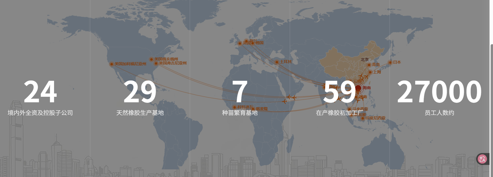
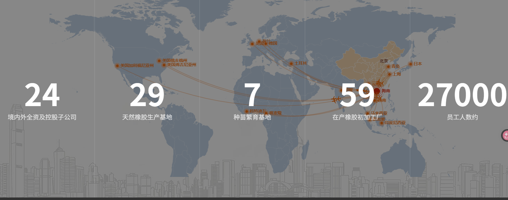

   海南天然橡胶产业集团股份有限公司（以下简称“海南橡胶”）成立于2005年3月，2011年1月7日在上海证券交易所挂牌上市（证券简称：海南橡胶；证券代码：601118），是中国资本市场唯一的天然橡胶全产业链上市公司，也是全球最大的集天然橡胶科研、种植、加工、贸易一体化的跨国企业集团。

        海南橡胶立足国内庞大的市场需求，充分利用国内国际两个市场、两种资源，积极构建全球化的种植、加工和贸易格局。公司在境内外拥有全资及控股子公司23家，控制两家境外上市企业和一家境内新三板挂牌公司，拥有天然橡胶生产基地30家以及国内最大的天然橡胶种苗繁育基地，在产橡胶初加工厂61家（含KM），全球员工约2.5万人。公司在全球范围内经营管理土地490万亩，其中胶园土地380万亩；年加工能力235万吨（含KM）；年加工量131万吨（含KM）；年销售贸易量337万吨（含KM、ART），各项指标居行业首位。公司产业版图覆盖除中国以外的美国、英国、日本、泰国等15个国家，贸易网络遍布全球。

       海南橡胶是天然橡胶行业标准制定的参与者和推动者，也是国内少数能大规模生产特种胶和专业胶等高品质产品的生产企业之一，也是天然橡胶全乳标胶期货交割品的主要生产商，为全球客户提供一系列天然橡胶产品。海南橡胶以科技赋能全产业链发展，拥有一流的胶园“种植-管理-养护-采割”技术，胶园管理水平全球行业领先，并在高端用胶研发、智能化割胶机器研发、加工环境保护、生产自动化和信息化技术应用等方面均处于国际与行业的领先水平。

       海南橡胶的公司客户遍布全球，覆盖世界前十大轮胎厂，以HeveaPRO 标准生产的天然橡胶产品广受赞誉，代表了海南橡胶对最高质量、社会责任和管理标准的承诺。“美联”“宝岛”“五指山”等品牌深受客户青睐，其中“美联”品牌是目前被中国乳胶制品行业广泛认可的第一品牌，“好舒福”品牌乳胶寝具定位中高端市场，客户好评率始终领先，FSC® C166366橡胶木“零添加”产品成功进入全球最大家具家居用品企业供应链。

关键数据：11年上市，天然橡胶科研，种植，加工，贸易一体化
30家种植基地，加工厂61家，全球员工：2.5万人   土地规模：490万    胶圆：380万亩    年加工：235万吨   年销售：337万吨
正分阶段推进180万亩省级标准化胶园建设

海南橡胶目前拥有高效农业种植面积约11万亩。公司积极利用海南自由贸易港有关大力发展热带特色高效农业政策红利，充分发挥海南热带气候和公司资源优势，推动建立非胶产业种植管理、产品加工、品牌赋能、多元化销售模式一体化机制，做强做优做大非胶产业。
在材料创新方面，自主开发纳米黏土胶、高弹减震胶、无氨胶乳等特殊性能产品。

海南橡胶下属子公司江苏爱德福乳胶制品有限公司，是亚太地区最大的乳胶发泡制品供应商之一，主营业务为天然乳胶卷材、床垫和枕头的生产与销售以及代工生产等业务，合作伙伴包括慕思、宜家家居、雅兰、丝涟等国内外知名品牌家具供应商。目前乳胶床垫产能1,800万平方米，枕头产能270万只。“爱德福”“宝珀”“好舒福”品牌乳胶寝具，具备很强的行业竞争优势。
海南橡胶下属子公司海南经纬乳胶丝有限责任公司，是国内最大的乳胶丝生产销售厂家。公司拥有8条先进的乳胶丝生产线，依托海南丰富优质的天然橡胶资源生产乳胶丝，年乳胶丝产能达2万吨，自主品牌“海佑”“HNRT”乳胶丝产品国内外市场占有率逐年递增，产品质量深得用户信赖。
在非洲喀麦隆，合盛农业雇佣当地人数超7,000人，直接或间接提供超4万个就业机会，为32个村庄建设58所学校、2所医院。此外，合盛农业与喀麦隆政府合作，提出“喀麦隆种植者计划”和“社会行动计划”，助力喀麦隆的教育和社会经济发展。

海南橡胶七大主营业务：橡胶种植，橡胶初加工，橡胶深加工，橡胶木加工，橡胶贸易，科技研发，热带特色高效农业

1.橡胶种植：海南橡胶于2009年7月成立了种苗分公司，主营业务为天然橡胶种苗培育和销售。公司拥有良种良苗繁育基地4,000亩，是中国最大的天然橡胶种苗生产基地，年产能约400万株，种苗良种率达100%，有效保障了海南橡胶天然橡胶种植良种良苗供应。1692348886044021381.jpg
种植端       海南橡胶经营管理土地490万亩，其中胶园土地380万亩，境内外天然橡胶种植基地共30个，分布在中国、喀麦隆、科特迪瓦、马来西亚等4个主产区国家。海南橡胶拥有几十年的天然橡胶种植生产经验和成熟稳定的技术管理队伍，拥有一流的胶园“种植－管理－养护－采割”技术，正分阶段推进180万亩省级标准化胶园建设，为保障下游产业链原料供给提供了基础支撑。

2.橡胶初加工：海南橡胶拥有境内外在产天然橡胶初加工厂59家，分布在中国、印度尼西亚、马来西亚、泰国、科特迪瓦等多个国家和地区，全球年初加工产能约245万吨。公司初加工产品包括全乳胶、浓缩乳胶、TSR 10、TSR 20、SCR 10、SCR 20、10#子午胶、胶清胶、混合胶、烟片胶、印尼标胶等，且具备大规模生产特种胶、专业胶等高品质产品的能力。公司在中国的天然橡胶初加工厂全部通过ISO9001质量管理体系认证，“美联”“宝岛”“五指山”等品牌深受下游企业青睐，其中“美联”品牌是目前被中国乳胶制品行业广泛认可的第一品牌。下属子公司合盛农业制定了行业较为领先的HeveaPro生产标准并实现对外输出，以HeveaPro标准生产的天然橡胶产品广受赞誉，共有35个工厂取得全球前十大轮胎厂商认证。

3.橡胶深加工： 海南橡胶下属子公司江苏爱德福乳胶制品有限公司，是亚太地区最大的乳胶发泡制品供应商之一，主营业务为天然乳胶卷材、床垫和枕头的生产与销售以及代工生产等业务，合作伙伴包括慕思、宜家家居、雅兰、丝涟等国内外知名品牌家具供应商。目前乳胶床垫产能1,800万平方米，枕头产能270万只。“爱德福”“宝珀”“好舒福”品牌乳胶寝具，具备很强的行业竞争优势。海南橡胶下属子公司海南经纬乳胶丝有限责任公司，是国内最大的乳胶丝生产销售厂家。公司拥有8条先进的乳胶丝生产线，依托海南丰富优质的天然橡胶资源生产乳胶丝，年乳胶丝产能达2万吨，自主品牌“海佑”“HNRT”乳胶丝产品国内外市场占有率逐年递增，产品质量深得用户信赖。

4.橡胶木加工：海南橡胶下属子公司海南农垦宝橡林产集团股份有限公司，是海南唯一集橡胶木产品研发、加工、销售、贸易、木结构、电子商务等为一体的综合性企业，拥有FSC-COC产销监管链认证和一级木结构工程施工资质。公司是海南木材行业第一家“新三板”挂牌公司。公司拥有全智能化木材改性车间、刨光加工流水线和后端精深加工中心，配备国内一流的木材精加工生产设备，可定制供应家具刨光材、装饰材、指接拼板、改性材等木制品基材，年加工橡胶木产能4万立方米以上。产品营销网络遍布华南、华东、西南等国内大型家具制造业集散地。目前橡胶木 FSC“零添加”产品成功进入全球最大家具家居用品企业供应链，深受宜家等境内外家具行业龙头企业及消费者的青睐。

5.橡胶贸易：海南橡胶天然橡胶销售贸易端平台包括新加坡R1国际私人有限公司、上海龙橡国际贸易有限公司、合盛农业旗下HeveaGlobal、NCE、HASL、CMCI，以及受托管理的印度尼西亚KM公司（含ART公司），公司橡胶产品销往亚洲、欧洲、北美等数十个国家上百个地区，主要客户覆盖全球前十大轮胎厂商，年销售贸易量414万吨，在全球天然橡胶行业拥有较强的行业影响力和市场竞争力。

6.科技研发：海南橡胶长期致力于天然橡胶全产业链科技创新，在种植端持续推进智能割胶装置研发和生产，完成割胶机4.0版本开发；在天然橡胶“管、养、割、收”等环节全面开启数字化、信息化建设，开发橡胶智慧收购平台，实现胶农信息数据化管理；加工端响应“双碳”号召，引领环保天然橡胶加工工艺技术创新，推进加工自动化、绿色化科技升级；全面推进天然橡胶期现货系统、财务共享系统等信息化平台建设，提高运营管控效率；在材料创新方面，自主开发纳米黏土胶、高弹减震胶、无氨胶乳等特殊性能产品。

7.热带特色高效农业：海南橡胶目前拥有高效农业种植面积约11万亩。公司积极利用海南自由贸易港有关大力发展热带特色高效农业政策红利，充分发挥海南热带气候和公司资源优势，推动建立非胶产业种植管理、产品加工、品牌赋能、多元化销售模式一体化机制，做强做优做大非胶产业。

亩产：2012年亩产80kg
净利润：2011年：7.61亿元。
营业额：2011：105亿
pe:2011年40-50
2011年：公司天然橡胶产品销售均价约 24685 元/吨

2013：上市公司拥有土地面积 353万亩,概念上受益于“土地流转”主题。母公司海南农垦各国营农场拥有土地资源 1127万亩, 其中划入海南农垦集团及其所属农场投资公司的土地资源为 393.7 万亩,余下的 733 万亩土地仍由各农场集体所有。 在海南农垦集团的 393.7 万亩土地中, 约有353万亩土地归子海南橡胶所有。根据海南农垦“十二五”规划,为提高海南省整体城镇化水平,配合国际旅游岛建设,计划用 3~5 年时间,由公司主导,把龙江、八一、东和等 11个集体农场建设成为产业发展水平较高、功能完善的新型“产业化农垦小镇”,待农村集体建设用地的确权和收购工作的完成可正式启动建设。
随着天胶主要消费地区下游汽车、轮胎行业临近“金九银十”的产销旺季,以及国内新一季天胶收储计划的推出,在缺乏新增利空因素作用下,预计天然橡胶价格阶段性将维持震荡向上走势。

2015：母公司海南农垦各国营农场拥有土地资源1127万亩，其中呼入海南农垦集团及所属农产投资公司的土地资源为393.7万亩，其中约有353万亩胶园承包给海南橡胶，公司概念上受益于“土地流转”。公司过去的实际控制人是国家农业部，现在是海南省政府。
 海南橡胶作为海南农垦唯一上市平台,目前主要控制海南农垦橡胶资源,海南橡胶共有353万亩橡胶林。未来上市公司可能作为本垦区的整合平台,整合垦区内资源,存在资产注入投资机会。橡胶方面资源:海南农垦国内仍有30万亩橡胶林未在上市公司,国外有新加坡R1公司60%股权未在上市公司,R1公司2014实现橡胶销售73.5万吨,实现销售收入14.17亿美元。同时集团定下发展思路,以海胶集团为平台,抓住胶价低迷的好时机,继续稳步实施并购、扩张。

其他资源:海南农垦总土地资源1128万亩,农垦系统内存在大量企业,2014年农垦集团全年完成营业收入212.4亿元,约上市公司2倍的收入。
     海南橡胶拥有353万亩橡胶林,土地资源本身具有稀缺性,而海南先天的地理优势更是让这些土地蕴含巨大的价值。橡胶林作为可再生资源,主要产品为橡胶,公司自有年产干胶能力20万吨,一旦橡胶价格回升,公司利润将出现大幅增长。而橡胶林木,在国家严格控制商业性砍伐林木的背景下,公司每年自然更替橡胶林约7-10万亩,约200-300万株胶树,具备极大的后续开发价值。

我们预计公司2015-2017年实现归属于母公司净利润0.96/1.50/2.29亿。海南橡胶作为我国最大的天然橡胶生产企业,公司拥有超过350万亩的橡胶林,海南农垦共拥有超过1000万亩土地资源。海南确定新一轮农垦改革主线,海南农垦引领农垦变革,海南橡胶将受益农垦改革。我们给予“买入-A”评级,6个月目标价15元。

2015： 农垦改革加速,海南农垦有望引领农垦系统变革!据我们近期对农垦系统草根调研了解,改革文件在农垦系统内征求意见已完毕,并已上报中央进行讨论,预计纲领性文件出台在即。我们认为农垦系统全面变革在即,农垦系统将在2015年迎来全面深化改革元年。
预计农垦改革加速推进，海南农垦系统土地最大优势在于拥有旅游和商业地产潜力：海南农垦是中国第三大垦区，公司作为海南农垦集团下属上市平台，凭借丰富的土地资源，公司将受益于农垦改革带来的土地重估价值的增长。公司拥有海南岛独特、丰富的旅游资源，有1000 余亩土地经过调研适应于休闲旅游资源开发，在政策放开后有望加快相关土地建设，与海南旅游岛发展匹配。
  　　2015 年全年营收同减24.99%，净利-9.83 亿元（上年同期0.29 亿元），EPS-0.25 元。2015 年公司实现营收84 亿元，同减24.99%；归属净利润-9.9 亿元（上年同期0.22 亿元），扣非净利润-12.7 亿元（上年同期-3.53 亿元），EPS-0.25 元。其中，单四季营收27.4 亿元，同减21.18%，环增20.2%；净利润-5.03 亿元（上年同期0.18 亿元）；归属净利润-5.06 亿元（上年同期0.14 亿元）；扣非净利润-5.44 亿元（上年同期0.16 亿元）。

2016：天然橡胶价格下滑致公司业绩下降。2015 年公司橡胶制品销售量及单位胶价均出现下滑，橡胶产品销售收入77.78 亿元，同减26.4%，其中自产橡胶制品销售8.14 万吨，同减41.77%，库存6.08 万吨，同增196%，公司销售减少库存增加主要是15 年天然橡胶市均价11350 元/吨（同减15.8%），低于成本线，对天然橡胶生产经营、上下游产业等造成了较大影响；同时新的利润增长点还在培育当中。
我们看好公司未来发展前景，逻辑如下：公司目前自有橡胶产能20 多万吨，占国内橡胶总产能近三分之一，加上贸易业务，公司每年橡胶销售规模达到70 多万吨，1）未来天然橡胶价格存在较大上涨空间，且由经济复苏拉动的橡胶消费扩大化势头明确，将对公司橡胶产品销售形成强力支撑；2）在我国军用航空轮胎橡胶国产化的背景下，公司积极借助中国先进橡胶产业联盟的平台，开发专用胶、特种胶等高附加值产品，进一步强化核心竞争力；3）公司围绕天然橡胶主业，积极开拓天然橡胶等大宗商品供应链金融业务，完善公司金融板块产业布局，公司风控能力进一步加强
天然橡胶价格持续下行是公司一季度亏损的主因。公司2016 年一季度实现营业收入11.65 亿元，同减29.39%，净利润亏损0.87 亿元（上年同期亏损1.1 亿元）。报告期内，天然橡胶市均价10114 元/吨，较上年同期12227 元/吨同比下降17.3%，公司橡胶生产成本约为12000元/吨，市场价低于成本线；天然橡胶价格持续走低致公司一季度业绩下滑

2016：首次覆盖,给予“增持”评级。公司作为国内天然橡胶生产龙头,土地资源禀赋优越。增发项目布局非胶农业、橡胶加工贸易领域,产业升级转型值得期待。预计2016-2018 年EPS 为0.02/0.17/0.22 元。参考行业平均估值,考虑公司未来成长性,给予2017 年40 倍PE,目标价6.8 元,首次覆盖,给予“增持”评级。
公司是集天然橡胶种植、加工、仓储物流、销售贸易、金融等为一体的大型综合企业集团,是我国最大的天然橡胶生产企业。公司现拥有353 万亩橡胶园,其中200 万亩为核心胶园;19 家橡胶加工厂,产能超过40 万吨,年销售量超过70 万吨;胶园面积和干胶产量占全国的30%左右。

公司规划将40 万亩低产胶园用于发展热带非胶农业和观光旅游业务，且拟募集资金10 亿元，共计投资13.5 亿元用于发展热带高效非胶农业，未来或将成为转型升级重要突破口，主要基于：（1）利用低产胶园发展非胶农业有利于提高胶园的生产效能，降低主营业务风险，丰富公司产业结构。（2）公司所在的海南地区水热条件便利，发展热带非胶农业有利于充分利用资源优势，形成新的利润增长点。此外发展热带非胶农业的盈利回收周期缩短，企业绩效亦将得到明显提升。

2016：　销量提升带动收入增长，但胶价仍低于成本导致公司出现亏损。2016年上半年公司天然橡胶销量达到33.5 万吨，同比增长24%；新加坡子公司完成美元胶销售10.54 万吨，实现净利315 万元，同增148%；进而带动公司营业收入同比增长11%。橡胶价格方面，上半年天然橡胶市场平均价10750 元/吨，同减12.1%，环增1.15%；二季度天然橡胶均价11317 元/吨，同减10.3%，环增11.9%；二季度胶价略有回升，实现利润同比减亏，但仍低于公司成本线，且销量较一季度增加，导致亏损环比加大。此外，由于上半年销售橡胶产品中较多为库存产品，采购支出相对减少，橡胶产品毛利率相较于上年提升1.3 个百分点

2017： 公司是我国最大的天然橡胶生产企业，产业链完整，如天然橡胶价格上涨将有较大的业绩弹性。公司主导产品为各种规格的标准胶及浓缩天然胶乳，拥有我国最大的天然橡胶生产基地，形成了从天然橡胶种苗、种植、抚管，到割胶、收购和加工等一整套成熟的技术体系。公司目前拥有353 万亩橡胶园，海南岛内13 家加工分公司，产能达32 万吨；在云南拥有6 家加工厂，产能达到10 万吨。公司在国内外均有销售平台，近年来年销售量超过70 万吨，此外，公司下属企业林产集团拥有11 家橡胶木加工厂，具有年产橡胶木板方材27 万立方米、集成材3 万立方米、实木门8000 套（件）、橱柜家具5000 套（件）的生产能力。公司在仓储物流业务、农资业务和农旅业务方面也有所涉及。
 公司收购R1国际股权进一步整合天然橡胶贸易业务。公司拟以7671万美元收购R1 国际71.58%股权，交易完成后公司将合计持有R1国际86.58%股权。R1 国际是全球知名的天然橡胶贸易商之一，在其主要从事的橡胶贸易和加工业务板块建立了广泛的采购、生产和销售渠道，能够及时准确地掌握全球橡胶市场状况，调整并实现最优采购和销售策略。本次交易有利于增强公司在天然橡胶产业链全球贸易环节的优势，从而实现更大限度地整合全球橡胶资源，完善公司业务布局，提高公司业务的国际化水平，扩大公司在天然橡胶市场领域的议价能力和影响力，同时有效解决公司与R1 国际之间存在的同业竞争问题。

2019：公司发布2018 年业绩预告，预计全年归母净利润2.0 亿元~3.0 亿元。扣非后归母净利润亏损9.0 亿元~13.5 亿元。

    　　公司2018 年业绩预盈主要是由于非经常性损益：1）2018 年9 月，公司与控股股东就解除部分低产胶园土地承包关系及由此涉及的相应资产处置和经济补偿等事项达成一致，该事项产生的收益计入非经常性净收益8.15 亿元；2）2018 年度无效套期的金融工具公允价值变动收益1.69 亿元；3）2018 年度收到及摊销计入本年的政府补助2.45 亿

2024： 盈利预测与估值：公司主业存在优化空间，未来有望依靠品牌和渠道优势稳步扩张业务规模并通过内部升级不断改善主业盈利能力，我们预计公司2023-2025 年归母净利润分别为2.2/1.4/1.7 亿元（yoy+217.5%/-37.9%/+25.7%），EPS 分别为0.05/0.03/0.04 元。通过多角度估值，预计公司合理估值4.8-5.1 元，相对目前股价溢价空间约为5%，首次覆盖，给予“中性”评级。

2024：国信农业观点：1）报告期内，**公司业绩面临胶园减产**、汇率波动等多重压力，然而受益于年内天然橡胶价格持续上行，公司2024Q2 单季度归母净利润及扣非归母净利润均实现同环比明显减亏。2）行情方面，2024 年1-5 月ANRPC 成员国天然橡胶合计产量为3568.50 万吨，同比-3.87%，合计消费量为4790.20 万吨，同比+8.41%。后续在产量收缩、需求向好背景下，国内外天然橡胶景气有望保持同步共振上行。海南橡胶作为国内最大橡胶种植企业、全球最大橡胶加工贸易企业，有望直接受益景气。3）风险提示：发生极端天气导致胶园大幅减产的风险；期货套保操作或判断不当造成大幅亏损的风险。4）投资建议：公司主业近年持续优化，叠加外部景气上行，后续业绩有望持续修复。考虑到汇率波动导致财务费用增幅明显且衍生金融工具收益有所减少，我们调整公司2024-2025 年归母净利润预测为1.2/1.7 亿元（原为1.4/1.7 亿元），预测2026 年归母净利润为4.0 亿元，对应2024-2026 年EPS 分别为0.03/0.04/0.09 元，对应当前股价PE 分别为168/112/49X，维持“中性”评级。产量见顶叠加需求向好，后续或去库走势或延续，天然橡胶景气有望保持上行（1）国内：需求向好背景下，2024 年库存存在调减可能。据ANRPC 统计，2023 年国内天然橡胶进口明显增加抵消了旺盛需求对库存的影响，考虑到当前全球产量基本见顶，我们认为国内2024 年供给增量预计有限，届时如果消费维持向好趋势，国内可能再度出现库存调减情况。参考同花顺金融统计，在旺盛轮胎需求带动下，国内港口库存维持环比去化趋势。截至2024 年7 月5 日，青岛天然橡胶库存已降至49.30万吨，较峰值累计调减47%，较去年同期调减47%。

2024：事件：公司发布2024 年半年报。2024H1 公司实现营收192.1 亿元，同比+31.6%，归母净利润-2.96 亿元，同比-9.9%，扣非归母净利润-2.88 亿元，同比减亏1.33 亿元。业绩落于业绩预告下沿。单Q2 实现营收110.7 亿元，同比+26.6%，环比+35.9%，实现归母净利润-1.35 亿元，同环比减亏。
    胶价回暖+降本增效带动公司业绩改善,合盛农业财务费用较高是主要拖累项，后期有望受益海外降息。2024H1 橡胶产品营收188.8 亿元，同比+34.1%，毛利率2.86%，较23 年提升1.13pct。一方面，上半年海内外胶价均出现不同程度上涨，国内天然橡胶价格由年初的14340 元/吨上涨至6 月28 日的14945 元/吨，涨幅4.2%，新加坡SICOM TSR20 价格由年初的1558 美元/吨上涨至6 月28 日的1695美元/吨，涨幅8.8%。另一方面，公司上半年积极进行降本增效工作，从种植、加工、贸易各环节进行管理优化，在生产经营环节实现降本增效约8000 万元。另外，合盛农业上半年亏损2.66 亿元，拖累整体业绩表现，主要系海外财务成本较高所致，后期有望受益海外降息。

    预计公司2024-2026 年营业收入分别为435.0/549.3/723.7 亿元（前次24-25 年分别为321.3/457.2 亿元），归母净利润分别为3.21/5.65/10.19 亿元（前次24-25 年分别为2.46/4.79 亿元），当前股价对应PE 分别为63.7/36.2/20.1 倍，维持“买入”评级。

2024年末：　公司Q3 利润率延续同环比改善。公司2024Q1-Q3 销售毛利率2.88%，同比+0.53pct，其中Q3 销售毛利率为2.68%，环比+0.38pct，同比+0.93pct；2024Q1-Q3 销售净利率-1.82%，同比+0.69pcts，其中Q3 销售净利率为-1.43%，环比+0.16pct，同比+1.37pct。公司毛利率和净利率同环比改善主要得益于天然橡胶价格回升。
　经营性现金流明显改善。2024 前三季度公司经营性现金流净额15.50 亿元，同比+190.81%，经营性现金流净额占营业收入比例为4.74%（同比+2.56pct），销售商品提供劳务收到的现金占营业收入比例为100.11%（同比-3.59pct），现金流改善明显的原因主要系本年收到的保险赔款及低产胶园用地补偿收入较上期有所增加。在主要流动资产周转方面，2024 前三季度公司存货天数达43.10 天（同比+35.41%），应收账款周转天数达14.39 天（同比+43.48%）
    　　投资建议：在主产区减产和需求韧性增长共同驱动下，天然橡胶价格有望保持景气上行，而公司作为全球最大的天然橡胶种植加工贸易企业，主业优化和经营规模扩张并进，后续有望充分受益行业景气上行。我们维持公司2024 年归母净利润预测为1.2 亿元，上调公司2025-2026 年归母净利润预测为2.0/4.4 亿元（原为1.7/4.0 亿元），对应2024-2026年EPS 分别为0.03/0.05/0.10 元，评级上调为“优于大市”。

2025年2月：行业景气判断：长期上行趋势明确，产区机会成本支撑上方空间。从基本面来看，短期供需矛盾演绎的激烈程度虽难抵上一轮上涨周期（2009-2011 年），但未来供给的长期调减和需求的稳定增长趋势是明确的，天然橡胶价格中枢有望在供需差不断扩大过程中逐年抬升；从估值来看，考虑到2010 年以来的通胀因素以及替代产业机会成本支撑，我们预计本轮橡胶周期的价格高点会比上轮周期更高。
公司盈利弹性：管理优化与技术突破并进，未来有望充分受益景气上行。（1）种植端：自产胶是公司主要的盈利弹性来源，目前公司在管天然橡胶种植园面积接近400 万亩（**其中海南为333 万亩**），年干胶产能超过20 万吨。成本方面，受并表HAC 以及非洲胶园产能爬坡影响，目前公司单吨干胶完全成本偏高，但未来依靠割胶管理优化以及智能割胶机推广，成本下降潜力较大。

2025年5月：受益橡胶行情回暖，业绩表现维持同比修复。公司2024 年实现营业收入496.73 亿元，同比+31.80%，主要得益于橡胶销售价格回暖以及橡胶贸易量增加；2024 年实现归母净利润1.03 亿元，同比-65.20%，原因系公司本期资产处置补偿收入减少导致营业外收入减少约5 亿元，“摩羯”台风灾害导致营业外支出同比增加约1.8 亿元，非洲胶园减值导致资产减值增加约1.7 亿元。扣除非经常性损益后，2024 年实现归母净利润-5.81 亿元，同比减亏约40%，主要得益于橡胶行情回暖。分季度来看，公司2025Q1 收入利润维持同比修复趋势，其中营业收入100.39 亿元，环比-40.14%，同比+23.30%;归母净利润-1.08 亿元，环比-119.22%，同比+32.76%。

　自有胶园因受灾减产，贸易规模维持扩张。2024 年公司橡胶板块整体收入483.35 亿元，同比+29.93%，毛利率2.91%，同比+1.17pct，主要得益于橡胶行情回暖。其中在种植环节，公司2024 年自有胶园橡胶产量12.15 万吨，同比-13.05%；销量11.67 万吨，同比-15.92%，自有胶园产销规模下滑主要受海南地区摩羯台风灾害影响；在加工贸易环节，公司2024 年销售贸易量超过414 万吨(含受托管理的KM 和ART)，规模及市场影响力进一步提升。

    　　非胶业务收入同比增加明显，增厚公司利润表现。2024 年公司其他业务实现营业收入10.96 亿元，同比+164.97%；实现毛利2.04 亿元，同比60.00%，对应毛利率18.59%，明显高于橡胶产品。近年公司正积极发展林下经济，拓展水果等非胶作物种植，未来有望持续增厚公司业绩表现。

2025年：事件：公司发布2025 年三季报。前3 季度营收339.6 亿元，同比+3.23%、归母净利润-2.75 亿元，同比+40.24%。Q3 营收111 亿元，同比-18.9%、归母净利润-0.99 亿元，同比+39.6%。业绩显著减亏源自期间费用下降及地租收入增加。

    　　前三季度毛利率2.69%，同比-0.09pct，Q3 单季毛利率1.32%，同比-1.36pct；Q3存货较2024 年末+1.5%；期间费用率5.2%，创近10 年同期新低。Q3 财务费用4.9亿元，是并表合盛农业的新低。

    　　三季度，海南地区接连遭受台风“剑鱼”、台风“麦德姆”影响，公告显示，两次台风预计分别造成干胶减产约0.25 万吨、约0.28 万吨。2024 年公司干胶产量12.13 万吨，预计合计减幅4.4%。

    　　根据海垦控股集团承诺，在2025 年12 月31 日前，海垦控股集团将通过把全资子公司HSF(S)Pte.Ltd.所持的KM 公司、ART 公司全部股权转让给上市公司或无关联第三方等方式解决潜在同业竞争。

    　　4 月，中共中央、国务院印发《加快建设农业强国规划（2024－2035 年）》。提出要推进天然橡胶老旧胶园更新改造，加快建设特种胶园。同月，海南省发布《关于进一步深化农村改革扎实推进乡村全面振兴的实施意见》，明确提出“建设30 万亩标准化胶园，更新8.38 万亩老龄低产受灾胶园”的目标，标志着海南天然橡胶全产业链升级迈入新阶段。还是4 月，洋浦国际智慧供应链中心日前正式建成全国首个天然橡胶集散站。该中心1#库是海南省目前唯一获批天然橡胶期货交割仓资质的仓库，为海南自贸港链接全球橡胶产业链注入强劲动能。今年12 月18 日，海南全岛执行封关政策。

**以控制资源为核心**：大收购”、“大加工”、“大贸易 获取话语权  （17年的战略方针，17年总收入100亿，到22年稳定在150亿）

公司的战略目标：成为在国际天然橡胶行业拥有话语权和影响力的优秀企业，做天然橡胶产
业链的价值提升者。（17年）
重点进行智能割胶工具、环保设施创新升级、橡胶初加工自动化生产系统等生
产设备研发，提高自动化、智能化水平，降低对劳动力的高依赖，降低生产成本，提升产品一致
性。（17年说的）

25年说的计划：扩大智能割胶机中试规模至20万台以上