接下来这章我们主要将海南橡胶09年到25年的财报中的数据进行整理，然后综合分析，看这家公司到底赚不赚钱，怎么样，看看他在历史中的表现。

目录如下：
# 海南橡胶（601118）财务表 — 目录

> 数据整理日期：2026-08-26 重新分类整理
> 本目录下是海南橡胶历年财务数据的子表、分析笔记与图表，已按「三大报表 → 专题」分类归档。

## 📁 目录结构（6 个文件夹 + 索引）

```text
财务表/
├── 00_目录/            本文件
├── 01_利润表/          收入·成本·利润（损益表核心）
├── 02_现金流量表/      经营现金流净额
├── 03_资产负债表/      资产·负债·股东权益
├── 04_土地与资源/      土地承包费·种植面积·土地面积（资源股地基）
├── 05_股本与股东/      股本数量·股东人数变化
└── 06_人力与薪酬/      高层薪资·员工薪资支出
```

### 阅读顺序（即文件夹先后顺序）

1. **01_利润表** → 2. **02_现金流量表** → 3. **03_资产负债表** → 4. **04_土地与资源** → 5. **05_股本与股东** → 6. **06_人力与薪酬**

各文件夹内文件按「原始数据 → 整理表 → 图表」以及报表自上而下的逻辑排列。

### 各主题清单

| 序号 | 主题 | 所在文件夹 | 状态 |
|------|------|-----------|------|
| 1 | 营业总收入 | 01_利润表 | √ |
| 2 | 营业成本 | 01_利润表 | √ |
| 3 | 净利润 | 01_利润表 | √ |
| 4 | 扣非净利润 | 01_利润表 | √ |
| 5 | 归母净利润 | 01_利润表 | √ |
| 6 | 经营现金流净额 | 02_现金流量表 | √ |
| 7 | 资产负债 | 03_资产负债表 | √ |
| 8 | 土地支出的刚性费用 | 04_土地与资源 | √ |
| 9 | 固定总资产 | 03_资产负债表 | √ |
| 10 | 流动总资产 | 03_资产负债表 | √ |
| 11 | 股本数量变化 | 05_股本与股东 | √ |
| 12 | 股东人数变化 | 05_股本与股东 | √ |
| 13 | 高层总薪资 | 06_人力与薪酬 | √ |
| 14 | 员工薪资支出变化 | 06_人力与薪酬 | √ |
| 15 | （原编号空缺，未使用） | — | — |
| 16 | 种植面积变化 | 04_土地与资源 | √ |
| 17 | 土地面积变化 | 04_土地与资源 | √ |

---

## 财报看什么？

这是我们需要重点关注的
1.净利润
2.归母净利润
3.经营现金流净额
4.资产负债
5.扣非净利润

### 分析财报时的思路

1.看扣非净利润——主营业务赚钱能力有没有变强？
2.看归母净利润——股东最终赚了多少钱？
3.比较两者差距——利润中有多少来自非经常性损益？
4.阅读业绩变动原因——增长是来自主营业务，还是投资、公允价值变动、政府补助等？

### 一个简单的判断标准

- 归母净利润 ≈ 扣非净利润：利润质量较高，盈利主要来自主营业务。
- 归母净利润远高于扣非净利润：需要进一步分析差额来源，判断这些收益是否具有可持续性。
- 扣非净利润增长，而归母净利润增长更多：通常说明主营业务改善，同时还有一次性收益加持。


## 01海南橡胶利润表

这部分用来分析海南橡胶的收入，成本，利润相关的数据，并看看能不能从中找到相关关联性。

1.海南橡胶09-25年营业总收入和总成本数据如下：
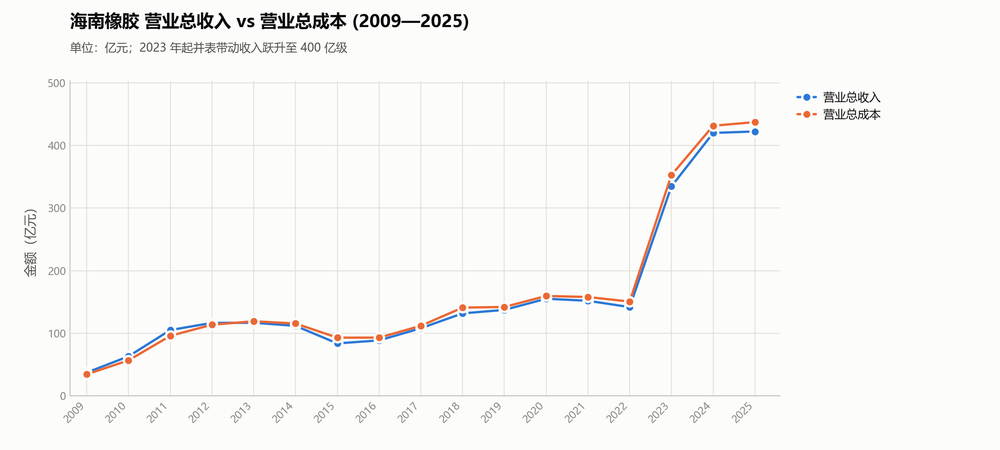

可以发现营业总收入和总成本从09年到现在基本都是上升的，这说明企业的业务规模在过去增大了很多倍，从09年的50亿增长到现在的400亿，整体规模扩大了8倍数。说明即使这些年橡胶价格低迷，行业赚钱效应差，但是企业却是实打实的长大了8倍，而不是什么都不变。（企业规模扩大了这么多倍，股价一直低迷，这很有意思hhh）。再来看这两类的数据关系，之前基本上都是相等的一个关系，即营业总收入和总成本是相等的，而在24，25年两者的差值开始扩大。（之前相等是合理的，毕竟在行业不景气的时候，很多企业都是入不敷出，这里收入和成本差不多可以说明之前确实不怎么赚钱。而25年开始差值扩大，也侧面说明橡胶在24，25年价格有过较高的价格）。
这里重点看一下24，25年差值变大背后倒推的逻辑，去看24，25年的橡胶期货价格数据

| 指标       |        2024年价格 |
| -------- | -------------: |
| 年内最低     | **约13,120元/吨** |
| 年内最高     | **约19,850元/吨** |
| 主力合约全年均价 | **约15,053元/吨** |
| 年初主力结算价  | **约14,340元/吨** |
| 年末主力结算价  | **约17,810元/吨** |
| 年末较年初涨幅  |     **约24.2%** |


| 时间        |             大致价格水平 |
| --------- | -----------------: |
| 2025年初    | **约17,000～18,000** |
| 2025年一季度  | **约16,500～18,500** |
| 2025年二季度  | **约14,500～17,500** |
| 2025年三季度  | **约14,500～16,500** |
| 2025年四季度  | **约15,000～18,500** |
| 2025年最低区域 | **约14,000～14,500** |
| 2025年最高区域 | **约18,500～19,000** |

可以发现25年橡胶期货价格有过剧烈波动，而且这一年橡胶期货价格涨到过18000以上，对应可以验证它在这个价格的时候赚到了钱，进而导致25年产生营业总收入和营业总成本产生了较大的价差。
**再者通过这个发现，我们可以大胆假设，橡胶价格到达大约18000以上的时候是这个企业开始真正赚钱的时候。也就是这个价格点位是它业绩开始反转的点位。**（对于这个观点后续文章积进行验证）

2.接下来看利润表。


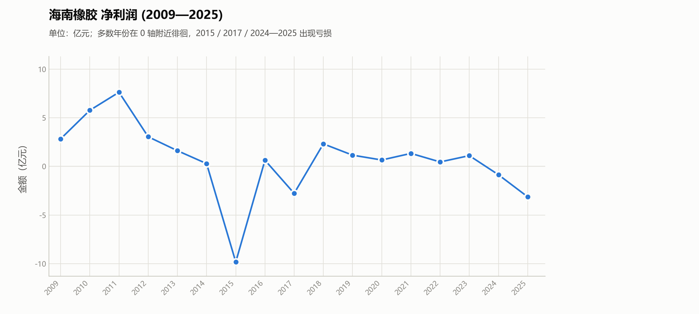
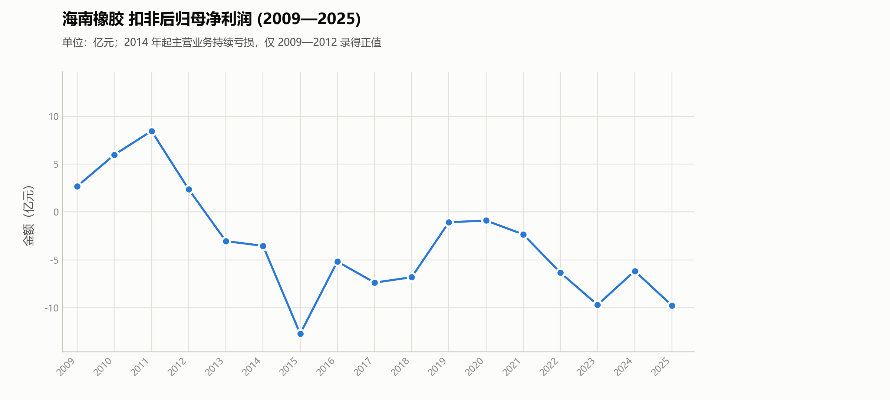
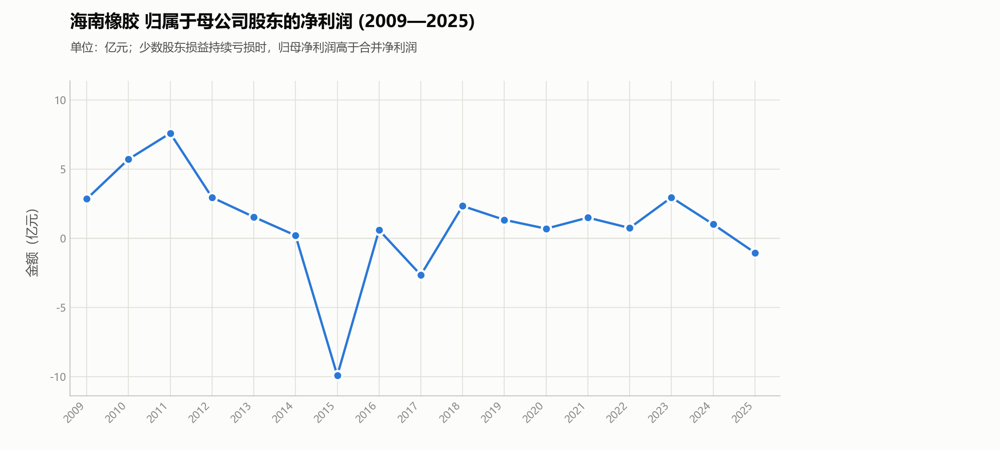
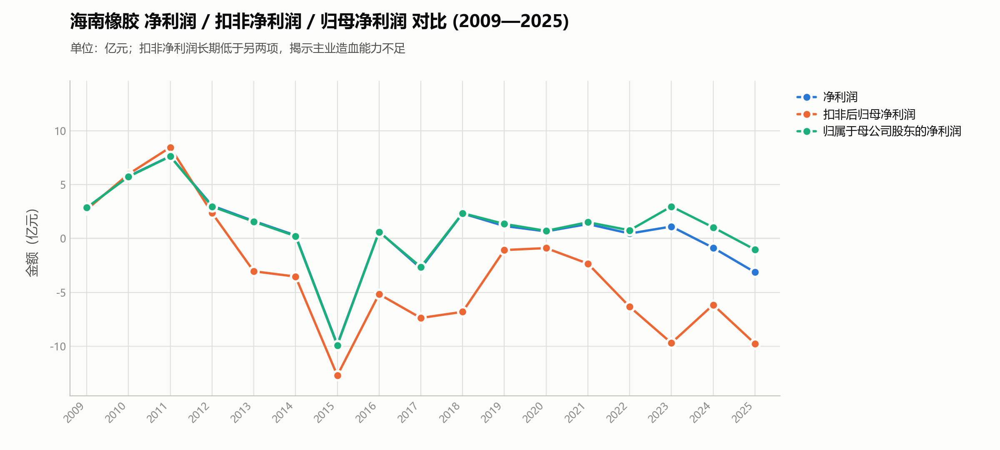

我们可以发现净利润，扣非净利润，归母净利润三项数据是跟橡胶周期有强关联的，11年都在高点，而在这之后开始下探，期间有些反弹（伴随橡胶期货价格走势反弹），而我们最需要关注的是最近三年的走势。

25年是因为台风问题导致30万亩橡胶林减产，这三项数据下降，如果排除25年的灾害，自然情况下这三项数据很可能继续上升。

这里先解释一下三者的意思：
① 净利润：看整个海南橡胶集团最终赚了多少钱。包括：主营业务，投资收益，公允价值变动，资产处置，政府补助/其他收益，营业外收支。所得税，少数股东损益。是整个集团最终的会计利润
② 归母净利润：看最终真正属于海南橡胶上市公司股东的钱。因为海南橡胶下面有很多子公司，而部分子公司并不是100%持股。
③ 扣非后归母净利润：扣除非经常性损益后的归属于母公司股东的净利润，也就是说如果把那些一次性的、偶发性的、非主营经营产生的利润全部剔除，海南橡胶正常经营一年到底能给上市公司股东赚多少钱？它主要展现的是 **主营业务的真实盈利能力**

看它到底赚不赚钱，按三部分去看：
第一：
扣非归母净利润：橡胶产业本身到底赚钱不赚钱？
第二：
归母净利润：最终上市公司股东到底拿到了多少利润？
第三：
净利润：整个海南橡胶集团最终的会计利润是多少？

11年橡胶牛市（价格冲到4万以上的时候），它50多亿的规模却能有7-8亿的利润，这是较为可观的，后续可以用这个来做参考。


上面的三大项的数据很烂，在熊市周期尾部，这部分的数据还没有反转，不过不着急。让我们接着来分析下面的
再来看经营现金流：

## 02_经营现金流
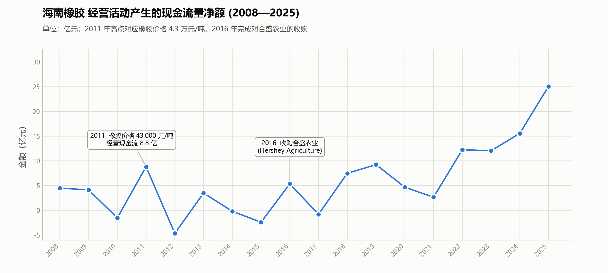

经营活动产生的现金流量净额是什么意思：“经营活动产生的现金流量净额”就是公司靠正常经营（卖产品、付成本）最终真正赚到的现金。  
**它反映的是 企业主业的真实“现金赚钱能力”，比净利润更“硬”。也就是实打实能赚到的钱。**

海南橡胶 2025 年净利润为 -1.03 亿元（亏损），经营现金流却是 +25.0 亿元（大幅为正），这说明公司账面亏损，但主业仍然持续产生大量现金，经营质量并不差，亏损可能来自：资产减值，汇率影响，公允价值变动，非经常性损益，商誉减值等非现金项目等次要因素，这些不会影响现金流。
**现金流量净额 越来越大代表公司主业“越来越能真金白银赚钱”。**
现在再来看这个图表，让我们值得高兴的是，从23年开始公司的现金流量净额开始快速上升，25年甚至到达了25亿，说明他是真的能赚钱，（这里的主要原因我觉得还是收购合盛农业的原因），只是现在橡胶价格还没有开始到达1.8万以上导致它现在利润比较薄，而导刚刚的三大指标看上去有点惨不忍睹。

到这里我们能够确定的是它确实是能够真金白银赚钱的。
到这里算是比较舒一口气了。
接下来看负债问题（由于这部分我之前单独类出来分析过了，因此本章中这部分只列数据不做推论和说明）。


## 03_资产负债表
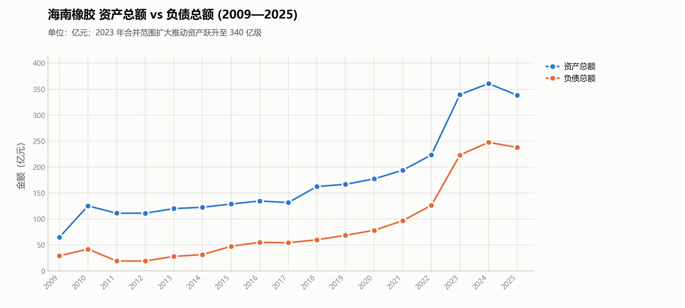
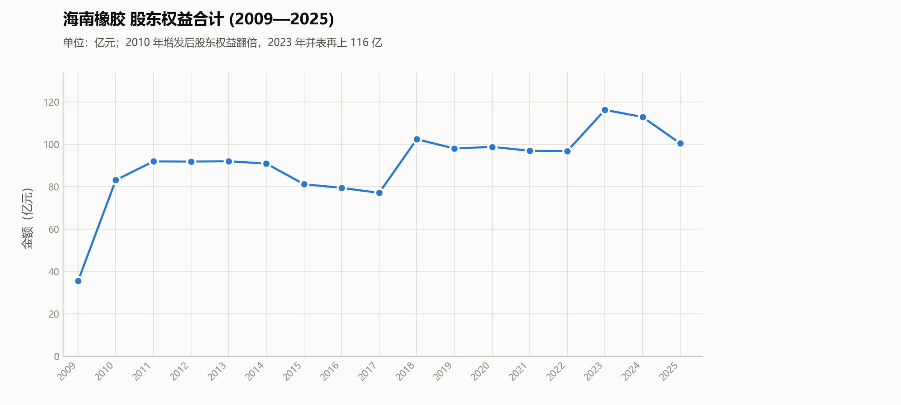
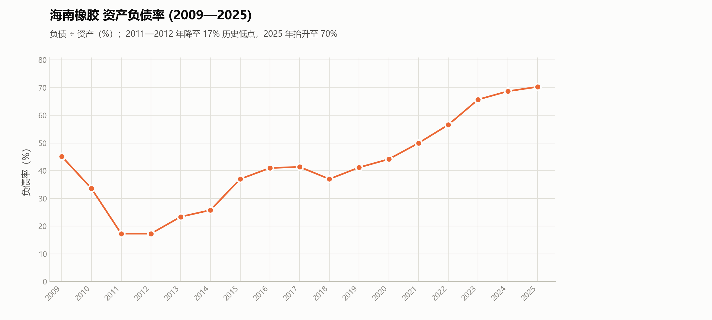

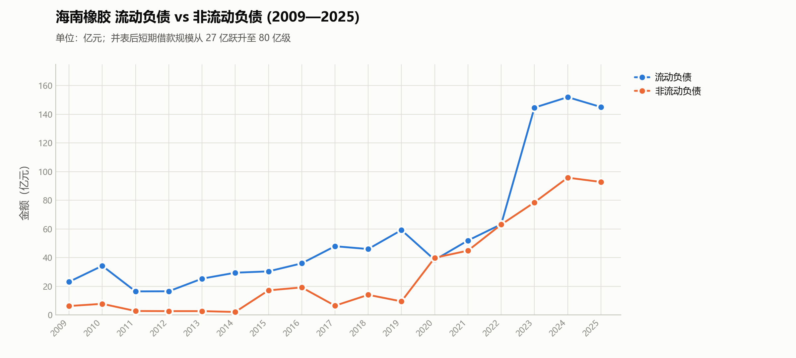
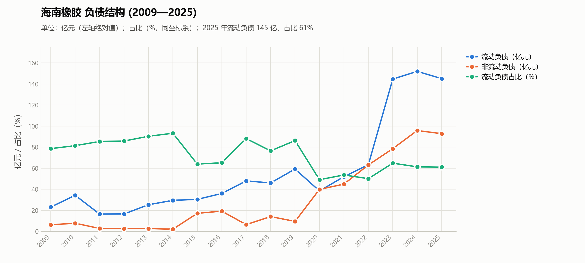
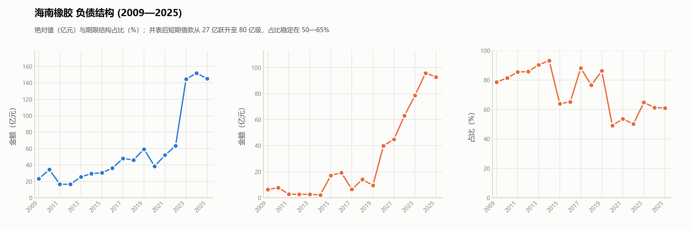
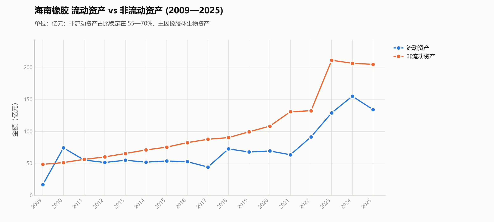
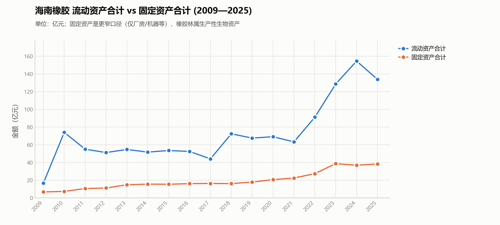


## 04土地与资源

这部分浅浅展示看一下它的土地和相关的资源数据。（这部分具体的详细分析放到后面）

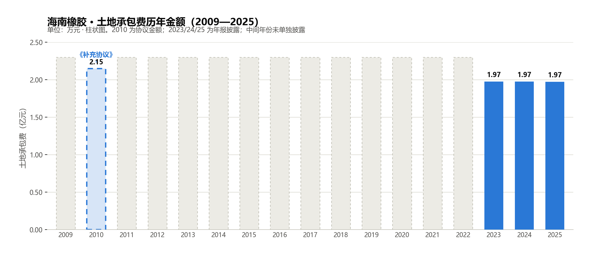
土地承包费是这样子的，海南农垦集团（背后是海南省国资委）和海南橡胶签订了合同，海南橡胶租用它的土地，每次合同时间很长，到期后继续续上，下次到期时间大概是2030年之后（所以目前不用分析这个租赁问题），根据这里的数据我们可以发现十多年前的租赁费用和现在的租赁费用差别不大，说明海南农垦没有坐地起价乘人之危。能够维持十年的东西，接下来注定还能够维持下一个十年。而且这部分租金对于海南橡胶来说压力较小。（在下面的土地承包费用占比中体现）
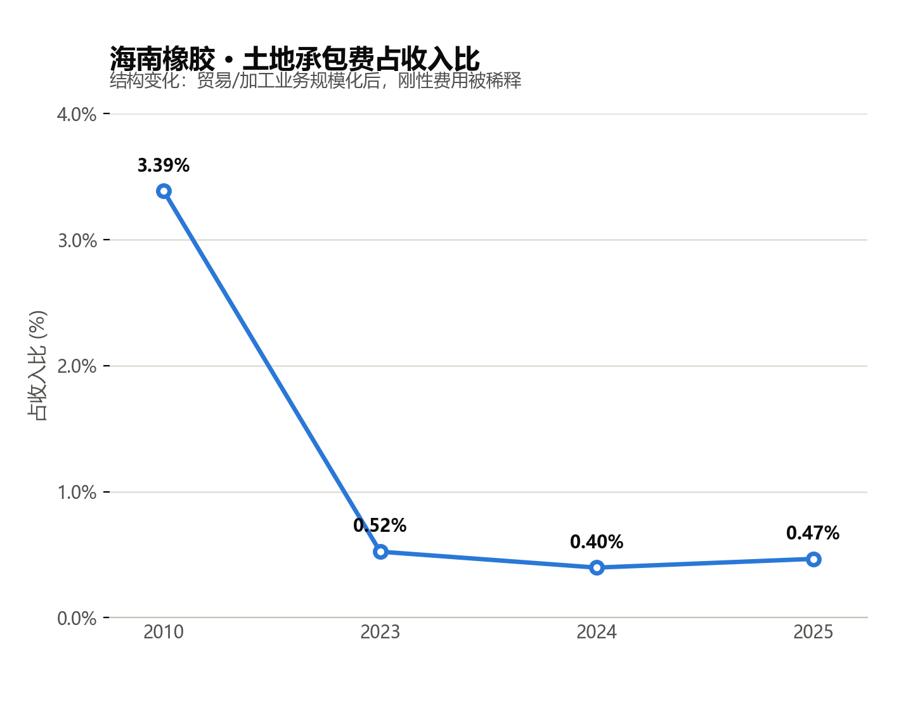
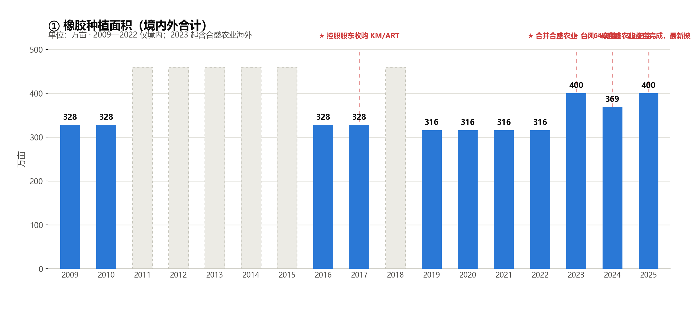
这里种植面积在23年一下子扩大了100万，解释一下，是因为收购了合盛农业，在此之前海南橡胶拥有的土地是只有境内，境内橡胶种植面积300万亩。而收购合盛后，合盛的那部分境外种植面积并入到集团里了。
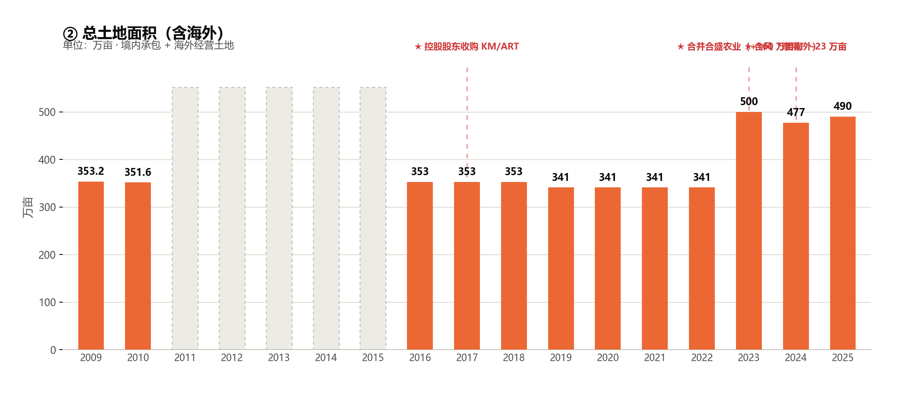

根据这个，可以说明海南橡胶国内总土地资源大约350万亩，300万亩种植橡胶。境外总共160万亩土地资源，大约100万亩种植橡胶，60万亩闲置土地。
综合看下来它拥有的土地资源还是很丰厚的，至于里面具体的细节单独列出一期讲。


## 05股东与股本
这部分之前也分析过，这里不多做赘述，只列数据。


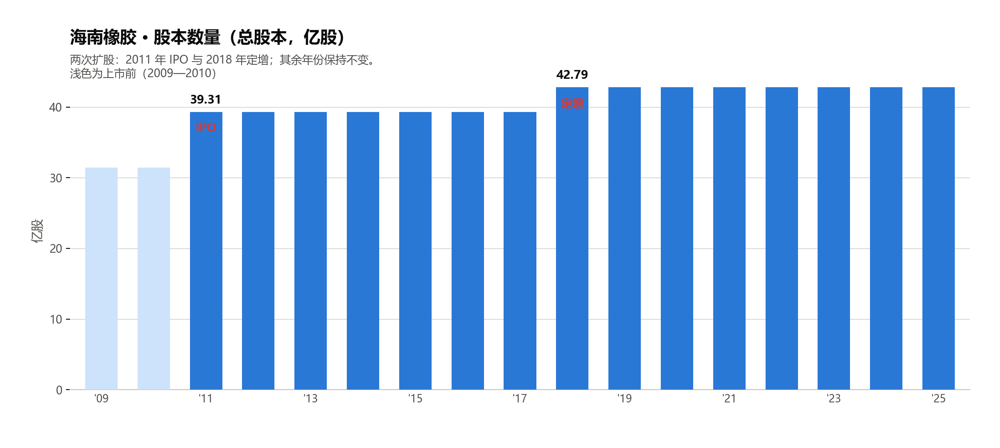
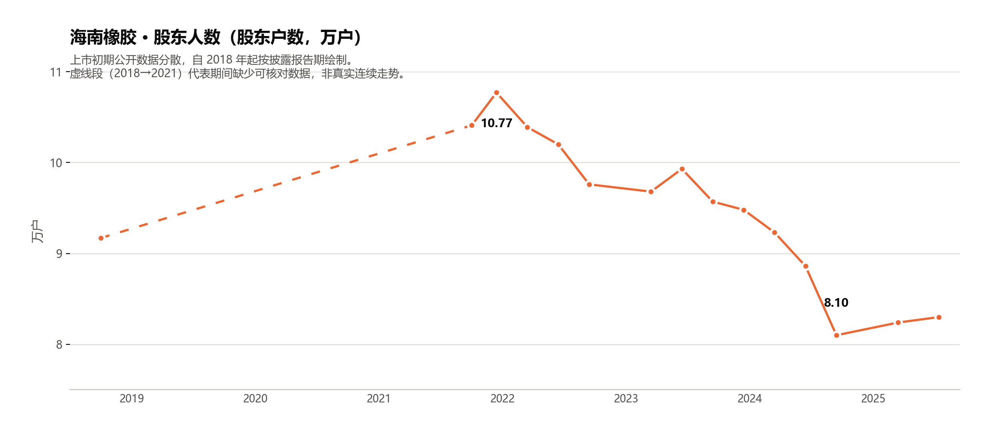


## 06人力薪酬
最后说明一下人力资源相关的，看一下它的员工规模以及高层数据
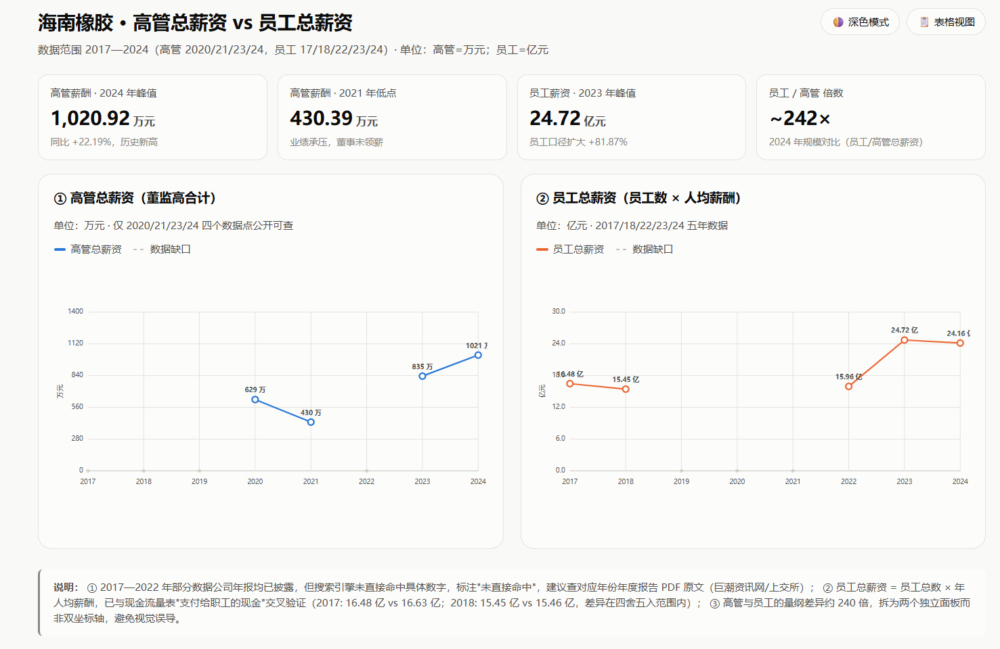
员工薪资主要支出大头是割胶工欧冠，国内割胶工成本支出较高。