# 🧪 合成橡胶原料与生产工艺完整解析
引言：
- 本文将通过四个部分去分析合成橡胶原料-丁二烯和乙烯，乙烷，石脑油之间的关系，并推导出合成橡胶的未来的发展趋向以及它对于天然橡胶的影响。
- 本文在天然橡胶分析体系中的定位：弥补之前天然橡胶的利用因素-合成橡胶的分析，**补全天然橡胶、合成橡胶、非洲橡胶种植（科特迪瓦）三个最重要的节点。支撑起天然橡胶理论分析体系。**
- **本文中心论点：合成橡胶和天然橡胶的价格变化将逐步发生改变，从对立逐步走向统一，并且在未来两者之间的牛市会形成共振。**

> **核心主题**：从石油到橡胶的完整产业链——单体来源、生产工艺、产业格局，并根据发展趋势推断天然橡胶和合成橡胶的未来趋势和状态。
> **数据基准年**：2010-2025 年
> **适用范围**：石油化工、高分子材料、橡胶股票，期货投资分析

---

## 📑 目录
>注：本文采用循序渐进的方式带领读者一起进行研究分析，各个环节之间有紧密的关联，每个部分的结尾会衔接下一个部分的主题和方向，这样从可以由浅及深去找到问题本源。最终得到中心论点。
- [第一部分：合成橡胶原料——四大类核心原料及占比](#第一部分合成橡胶原料四大类核心原料及占比)
- [第二部分：丁二烯的生产方式——两种核心生产方式](#第二部分丁二烯的生产方式两种核心生产方式)
- [第三部分：蒸汽裂解副产法——各原料裂解及丁二烯市场占比分析](#第三部分蒸汽裂解副产法各原料裂解及丁二烯市场占比分析)
- [第四部分：乙烯，乙烷，丁二烯，石脑油，裂解原料路线之争及其对丁二烯-橡胶产业链的传导](#第四部分乙烯乙烷丁二烯石脑油裂解原料路线之争及其对丁二烯-橡胶产业链的传导)
- [第五部分：逻辑补充与综合分析](#第五部分逻辑补充与综合分析)

---

# 第一部分：合成橡胶原料——四大类核心原料及占比

之前研究天然橡胶的时候，忘记了讨论合成橡胶，在传统观点里天然橡胶和合成橡胶是对立的一种状态，他们都可以做为汽车轮胎的原材料。天然橡胶的价格上涨受到合成橡胶制约，而要研究天然橡胶牛市，就还需要研究合成橡胶。
>第一部分是来讲解合成橡胶的材料和占比，以此来对合成橡胶有初步认识。

合成橡胶（Synthetic Rubber）是人类为摆脱对天然橡胶的依赖而人工合成的弹性体材料。其性能主要由**单体**决定，原料主要来自石油化工产业链。
合成橡胶的种类繁多，但其核心逻辑都遵循"**单体→聚合→加工**"的基本框架。

## 📋 本节目录（第一部分）

- [1️⃣ 丁二烯（Butadiene）——"万能基石"，占比 >50%](#1️⃣-丁二烯butadiene万能基石占比-50)
- [2️⃣ 苯乙烯（Styrene）——"硬度的来源"，在 SBR 中占 23.5%~40%](#2️⃣-苯乙烯styrene硬度的来源在-sbr-中占-23540)
- [3️⃣ 异戊二烯（Isoprene）——"天然橡胶替代者"](#3️⃣-异戊二烯isoprene天然橡胶替代者)
- [4️⃣ 其他重要单体（专用胶种使用）](#4️⃣-其他重要单体专用胶种使用)

---
合成橡胶的主要原料包括以下四大核心原料及占比：
## 1️⃣ 丁二烯（Butadiene）——"万能基石"，占比 >50%

| **项目** | **内容** |
|:-----|:-----|
| 化学式 | C₄H₆（CH₂=CH-CH=CH₂） |
| 来源 | 石油裂解 C4 馏分抽提 |
| 全球产能（2024） | ~1,700~1,900 万吨/年 |
| 占合成橡胶消耗比例 | >50% |
| 用途 | BR、SBR、NBR、IIR 的核心单体 |

---

## 2️⃣ 苯乙烯（Styrene）——"硬度的来源"，在 SBR 中占 23.5%~40%

| **项目** | **内容** |
|:-----|:-----|
| 化学式 | C₈H₈（C₆H₅-CH=CH₂） |
| 来源 | 乙苯脱氢制取 |
| 用途 | 与丁二烯共聚生产 SBR |
| SBR 中比例 | 乳聚 ESBR：23.5%；溶聚 SSBR：40% |

---

## 3️⃣ 异戊二烯（Isoprene）——"天然橡胶替代者"

| **项目** | **内容** |
|:-----|:-----|
| 化学式 | C₅H₈（CH₂=C(CH₃)-CH=CH₂） |
| 来源 | 异戊烷脱氢或乙烯裂解副产 |
| 用途 | 合成异戊橡胶（IR）的主要单体 |
| 特点 | 分子结构与天然橡胶几乎一致，被誉为"合成天然橡胶" |

---

## 4️⃣ 其他重要单体（专用胶种使用）

| **单体** | **代表胶种** | **全球产量** |
|:-----|:---------|:---------|
| 异丁烯（Isobutylene） | IIR 丁基橡胶（内胎、气密层） | ~150 万吨 |
| 丙烯腈（Acrylonitrile） | NBR 丁腈橡胶 | ~80 万吨 |
| 氯丁二烯（Chloroprene） | CR 氯丁橡胶 | ~40 万吨 |
| 乙烯 + 丙烯 + 二烯烃 | EPDM 乙丙橡胶 | ~180 万吨 |
| 含氟烯烃 | FKM 氟橡胶 | ~6~8 万吨 |
| 硅氧烷 | MQ/VMQ 硅橡胶 | ~120 万吨 |
| 二元醇 + 二异氰酸酯 | PU 聚氨酯橡胶 | ~250 万吨 |

### 从上述可以发现丁二烯就是合成橡胶的核心材料，后面的其他比如氯丁二烯，和苯乙烯都是然都是基于丁二烯的，所以研究合成橡胶就需要抓住主要矛盾-丁二烯去研究。
---

# 第二部分：丁二烯的生产方式——两种核心生产方式

## 📋 本节目录（第二部分）

- [📌 前言：两种生产方式，一主一辅](#-前言两种生产方式一主一辅)
- [🅰️ 方式一：蒸汽裂解副产法（Steam Cracking By-Product）](#🅰️-方式一蒸汽裂解副产法steam-cracking-by-product)
- [🅱️ 方式二：丁烷/丁烯脱氢法（Dehydrogenation）](#🅱️-方式二丁烷丁烯脱氢法dehydrogenation)
- [📊 两种核心生产方式对比](#-两种核心生产方式对比)

## 📌 前言：两种生产方式，一主一辅

由于丁二烯占合成橡胶原料消耗的 **50% 以上**，是合成橡胶的核心材料，所以研究丁二烯的生产方式对分析合成橡胶至关重要。

全球丁二烯的生产方式主要有**两种**：

| **生产方式** | **全球占比** | **性质** | **重要程度** |
|:---------|:---------|:-----|:---------|
| **🅰️ 蒸汽裂解副产法** | **~90~95%**（绝对主流） | 联产物（依附乙烯装置） | ⭐⭐⭐⭐⭐ |
| **🅱️ 丁烷/丁烯脱氢法** | **~5~10%**（补充调节） | 专产（独立生产） | ⭐⭐ |

> 🎯 **核心结论**：
> - **蒸汽裂解副产法**占全球丁二烯产量的 **90~95%**，是绝对主流；
> - **丁烷/丁烯脱氢法**只占 **5~10%**，主要用于市场调节；
> - 两种方式合计占全球丁二烯产量的 **约 100%**。
>
> 💡 **后续研究方向**：由于蒸汽裂解副产法占据 90~95% 的绝对主导地位，且与乙烯装置开工率、原油价格高度联动，是合成橡胶价格分析的最关键驱动因素。**本文将着重研究蒸汽裂解副产法。**

---

## 🅰️ 方式一：蒸汽裂解副产法（Steam Cracking By-Product）

**这是绝对主流，全球约 90~95% 的丁二烯来自这条路。**

### 📌 关键认知：裂解原料不止石脑油

蒸汽裂解装置的**原料有多种选择**，不同原料的乙烯收率和丁二烯收率差异巨大：

| **原料** | **主要成分** | **乙烯收率** | **丁二烯收率**（按裂解原料计） | **主要使用地区** |
|:-----|:---------|:---------|:------------------------------|:-------------|
| **乙烷** | C₂H₆ | **80%+** | **极低**（接近 0） | 美国、中东（页岩气革命后） |
| **丙烷** | C₃H₈ | 42% | **低**（~3%） | 中东、美国 |
| **丁烷** | C₄H₁₀ | 40% | 中（~3~5%） | 中东 |
| **石油脑（石脑油）** | C5~C12 混合 | 30~35% | **高（4~6 wt%）** | 欧洲、**亚洲（中国/日韩）** |
| **轻柴油** | C15~C25 | 25% | 中（~6~8%） | 部分装置 |
| **加氢尾油** | C20+ | 28~32% | 中（~7~9%） | 中国 |

> 💡 **核心洞察**：
> - **石脑油裂解是丁二烯的"主要来源"**——因为只有 C5+ 长链原料才能在裂解中产生足量 C4 馏分；
> - **乙烷裂解基本不出丁二烯**——乙烷只有 2 个碳，裂解产物主要是乙烯，几乎不含 C4 馏分；
> - 因此 **美国（乙烷为主）和中东（乙烷/丙烷为主）虽然是乙烯大国，但丁二烯产量相对较少**；
> - **亚洲（中、日、韩）和欧洲以石脑油为主裂解原料，是全球丁二烯的主产地**。

### 🔧 典型工艺流程（以石脑油为例）

```
石油脑（石脑油）+ 高温水蒸气
        ↓
   800~900°C，0.1~0.3 秒（蒸汽裂解）
        ↓
裂解气（C1~C8 混合）
        ↓
深冷分离
        ↓
C4 馏分（含丁二烯约 40~50%）
        ↓
萃取蒸馏（DMF / ACN / NMP 法）
        ↓
纯丁二烯（>99.5%）
```

### 📋 关键参数

| **项目** | **内容** |
|:-----|:-----|
| **全球占比** | **~90~95%** |
| **核心原料** | **石脑油（丁二烯收率最高）、乙烷、丙烷、丁烷、轻柴油、加氢尾油等** |
| **副产物** | 乙烯、丙烯、芳烃等（价值很高） |
| **成本** | 低（丁二烯作为联产物分摊成本） |
| **规模** | 通常 ≥30 万吨/年 |
| **代表企业** | 中石化、中石油、LyondellBasell、INEOS、Sabic |
| **优点** | 规模大、成本最优、副产物综合利用 |
| **缺点** | 受乙烯装置开工率影响，不能独立调节丁二烯产量 |

---

## 🅱️ 方式二：丁烷/丁烯脱氢法（Dehydrogenation）

**这是"专门生产丁二烯"的工艺，主要用于调节市场平衡，占比仅 5~10%。**

```
正丁烷（C₄H₁₀）
    ↓ 600~700°C，催化剂（氧化铬/氧化铝）
脱氢
    ↓
丁二烯（C₄H₆）+ 2H₂
```

| **项目** | **内容** |
|:-----|:-----|
| **全球占比** | **~5~10%** |
| **副产物** | 主要是氢气（可作为清洁能源利用） |
| **成本** | 高于裂解联产 30~50% |
| **规模** | 通常 10~30 万吨/年 |
| **代表企业** | 美国 TPC Group（休斯顿）、中国部分企业 |
| **优点** | 可独立调节产量、副产氢气 |
| **缺点** | 能耗高、设备投资大、催化剂易积碳 |

---

## 📊 两种核心生产方式对比

| **维度** | **🅰️ 蒸汽裂解副产法** | **🅱️ 丁烷/丁烯脱氢法** |
|:-----|:--------------|:--------------|
| **全球占比** | **~90~95%** | **~5~10%** |
| **性质** | 联产物（依附乙烯装置） | 专产（独立生产） |
| **成本** | 低 | 高于裂解联产 30~50% |
| **灵活性** | 受乙烯装置开工率影响 | 可独立调节产量 |
| **规模** | ≥30 万吨/年 | 10~30 万吨/年 |
| **主要分布** | 全球（亚洲、美国、欧洲、中东） | 美国、中东、中国、印度 |
| **核心驱动** | 乙烯装置满产率 | 油价/丁烷价格 |

---

### 从上述可以发现蒸汽裂解副产法是丁二烯生产的绝对主流（占 90~95%），丁烷/丁烯脱氢法只是辅助调节（占 5~10%）。所以研究丁二烯的供应与价格，就必须抓住主要矛盾——**蒸汽裂解副产法**——去深入研究

**接下来重点研究：**

- 蒸汽裂解副产法的完整产业链（石油脑 → 裂解 → C4 馏分 → 丁二烯抽提）
- 不同裂解原料（石脑油、乙烷、丙烷等）对丁二烯产量的影响
- 乙烯装置开工率与丁二烯供应的联动关系
- 原油-石脑油-丁二烯-SBR 的价格传导链

---

# 第三部分：蒸汽裂解副产法——各原料裂解及丁二烯市场占比分析

## 📋 本节目录（第三部分）

- [📌 研究范围](#-研究范围)
- [一、各裂解原料基础数据](#一各裂解原料基础数据)
- [二、全球乙烯产能格局与各原料占比](#二全球乙烯产能格局与各原料占比)
- [三、各原料路线对全球丁二烯供应的贡献测算](#三各原料路线对全球丁二烯供应的贡献测算)
- [四、地缘格局与价格联动](#四地缘格局与价格联动)
- [五、关键数据汇总](#五关键数据汇总)

## 📌 研究范围

聚焦蒸汽裂解副产法（约占全球丁二烯产量 90~95%），深入分析：

- 该方法涉及的**多种裂解原料**（石脑油、乙烷、丙烷、LPG、丁烷、轻柴油、加氢尾油等）
- 各原料在**全球乙烯产能中的使用占比**
- 各原料的**丁二烯收率**差异
- 各原料路线**对全球丁二烯供应的实际贡献**

---

## 一、各裂解原料基础数据

### 📊 表 1：各原料的化学组成与基本物性

| **原料** | **化学式/碳数** | **沸点范围** | **状态** | **主要来源** |
|:-----|:-----------|:---------|:-----|:---------|
| **乙烷** | C₂H₆（C2） | -89°C | 气体 | 油田伴生气、页岩气 |
| **丙烷** | C₃H₈（C3） | -42°C | 气体（可液化） | 油田伴生气、LPG |
| **丁烷** | C₄H₁₀（C4） | -0.5°C | 气体（可液化） | 油田伴生气、LPG |
| **石油脑（石脑油）** | C5~C12 | 30~200°C | 轻质液体 | 原油蒸馏、炼厂 |
| **轻柴油** | C15~C25 | 200~350°C | 液体 | 原油蒸馏 |
| **加氢尾油** | C20+ | 较高 | 液体 | 炼厂加氢装置副产 |

---

### 📊 表 2：各原料的裂解产物收率对比（典型中度裂解条件，按裂解原料计）

| **原料** | **乙烯收率** | **丙烯收率** | **丁二烯收率** | **其他副产品** |
|:-----|:---------|:---------|:--------------|:-----------|
| **乙烷** | **80%+** | ~2% | **0.2%-0.8%（接近 0）** | 甲烷、氢气 |
| **丙烷** | 42% | ~16% | **~3%** | 甲烷、乙烯 |
| **丁烷** | 40% | ~17% | **~3~5%** | 丙烯、乙烯 |
| **石油脑（石脑油）** | 30~35% | 14~17% | **4~6 wt%** | 芳烃、异戊二烯 |
| **轻柴油** | 25% | ~13% | 中（~6~8%） | 芳烃 |
| **加氢尾油** | 28~32% | ~14% | 中（~7~9%） | 芳烃 |

- 通过上述两个表数据，我们可以得出下面的相关线索：
乙烷、乙烯、丁二烯、石油脑
而乙烯和丁二烯是乙烷和石油脑裂解都会产生的产物。所以第三部分中接下来的的二、三会着重分析乙烯和丁二烯，四中会去分析这四种原材料当前的地缘格局与价格联动关系
> 💡 **核心数据（口径说明）**：
> - 表中收率均按**裂解原料计**（Feed basis），即每 100 吨原料裂解后得到的产物重量；
> - 石脑油丁二烯收率 **4~6 wt%** 显著高于乙烷（接近 0）和丙烷（~3%）；

---

## 二、全球乙烯产能格局与各原料占比

### 📊 表 4：2024 年全球乙烯产能格局（按地区）

| **排名** | **国家/地区** | **乙烯产能（万吨/年）** | **占全球比例** |
|:-----|:----------|---------------------|:-----------|
| 🥇 | **中国** | ~5,500 | **~25%** |
| 🥈 | 美国 | ~4,000 | ~18% |
| 🥉 | 沙特阿拉伯 | ~1,800 | ~8% |
| 4 | 韩国 | ~1,200 | ~5% |
| 5 | 印度 | ~900 | ~4% |

- 可以发现中美是乙烯产能大国。
---

### 📊 表 5：各地区主要裂解原料结构

| **地区** | **主要裂解原料** | **丁二烯联产能力** | **备注** |
|:-----|:-------------|:---------------|:-----|
| **美国** | 乙烷为主（>70%） | **弱** | 页岩气革命后大量使用乙烷，丁二烯供应紧张 |
| **中东** | 乙烷、丙烷为主 | **弱** | 油田伴生气丰富，丁二烯自给率低 |
| **欧洲** | 石脑油为主 | **强** | 缺乏廉价天然气，多用石脑油 |
| **中国** | 石脑油为主、加氢尾油为辅 | **强** | 缺油少气，多联产最优 |
| **日本/韩国** | 石脑油为主 | **强** | 依赖进口石脑油，是丁二烯主要出口国 |
| **印度** | 石脑油 + 乙烷混合 | 中 | 多元化原料结构 |

---

### 📊 表 6：全球裂解原料结构估算（按乙烯产能口径）

| **裂解原料** | **占全球乙烯产能比例** | **丁二烯收率（按裂解原料计）** | **对丁二烯供应的实际贡献** |
|:---------|:-------------------|:--------------------------|:----------------------|
| **乙烷** | **~45%**（主导） | 接近 0 | **极低** |
| **丙烷** | ~10% | ~3% | 低 |
| **丁烷** | ~5% | ~3~5% | 中低 |
| **石脑油** | **~30%** | **4~6 wt%** | **高（丁二烯主力来源）** |
| **轻柴油 / 加氢尾油** | ~5~8% | 6~9% | 中 |

> 💡 **关键解读**：
> - 从上述表中我们可以发现中美是乙烯产能大国，而在全球视角看，通过乙烷制乙烯的比例接近一半，但是丁二烯收率却接近 0（不足百分之1），对丁二烯供应贡献极小。而石脑油制作乙烯的产能接近30%，但丁二烯收率却接近 4~6 wt%，实际贡献了**全球绝大部分丁二烯供应**（约 75~85%）。

---

## 三、各原料路线对全球丁二烯供应的贡献测算

### 📊 表 7：丁二烯供应来源拆解（按原料路线）

| **原料路线** | **占乙烯产能** | **丁二烯收率（按裂解原料计）** | **估算占全球丁二烯产量** | **备注** |
|:---------|:-----------|:--------------------------|:--------------------|:-----|
| **石脑油裂解** | ~30% | 4~6 wt% | **~75~85%** | 丁二烯绝对主力 |
| 加氢尾油裂解 | ~3% | 7~9% | ~2~4% | 中国为主 |
| 重质原料（轻柴油 / 加氢尾油合计） | ~5~8% | 6~9% | ~3~5% | 部分老旧装置与中国 |
| 丁烷裂解 | ~5% | 3~5% | ~3~5% | 中东 |
| 丙烷裂解 | ~10% | ~3% | ~3~5% | 中东、美国 |
| 乙烷裂解 | ~45% | 接近 0 | **接近 0** | 不产丁二烯 |

---

### 📊 表 8：全球丁二烯主产国/地区贡献排序

| **排名** | **国家/地区** | **主要裂解原料** | **丁二烯供应地位** |
|:-----|:----------|:-------------|:---------------|
| 🥇 | **中国** | 石脑油 + 加氢尾油 | 全球最大丁二烯生产国（占 ~30%） |
| 🥈 | 韩国 | 石脑油 | 重要出口国 |
| 🥉 | 日本 | 石脑油 | 重要出口国 |
| 4 | 欧洲（合计） | 石脑油 | 自给自足为主 |
| 5 | 美国 | **乙烷为主** | **丁二烯供应能力相对有限**（部分年份进口、部分年份出口） |
| 6 | 中东 | 乙烷 / 丙烷 | **丁二烯供应能力相对有限** |
| 7 | 印度 | 石脑油 + 乙烷 | 部分进口 |

> 💡 **关键洞察**：
> - **中国是全球丁二烯供应的"稳定器"**——中国 25% 的全球乙烯产能中绝大多数是石脑油路线，丁二烯供应稳定；
> - **美国与中东丁二烯供应能力相对有限**——美国虽是全球第二大乙烯生产国，但因大量使用乙烷，自身丁二烯供应波动较大，进口/出口状态视年份而定；
> - **亚洲（中、日、韩）+ 欧洲** = 全球丁二烯供应的核心，约占全球 80% 以上。

在讲解完原料之后，我们开始进入地缘和价格环节
第四部分讲解现在的橡胶格局与价格制约因素

---

## 四、地缘格局与价格联动

先看原料的地缘格局和传导关系

### 📊 表 9：原料路线对丁二烯价格的影响机制

| **地区** | **主导原料** | **对丁二烯市场的影响** |
|:-----|:---------|:-------------------|
| **美国** | 乙烷 | 削弱全球副产丁二烯供应（不直接推高价格，但减少边际供应） |
| **中东** | 乙烷/丙烷 | 同上，但规模较小 |
| **亚洲 + 欧洲** | 石脑油 | 丁二烯供应稳定，是全球价格"稳定器" |

---

### 📊 表 10：原料价格 → 丁二烯价格的传导链

```
原料端                                 丁二烯端                下游橡胶端
─────────                              ─────────              ──────────
原油价格
   ↓
石脑油价格（亚洲/欧洲主导）  ────→  丁二烯价格  ────→   SBR / BR 价格
乙烷价格（美国主导）         ────→   （不直接影响，但通过乙烯装置开工率间接影响）
乙烯装置开工率               ────→   丁二烯供应
```

> 💡 **核心传导路径**：
> - 油价 ↑ → 石脑油 ↑ → 裂解成本 ↑ → 丁二烯 ↑ → SBR/BR ↑
> - 美国乙烷裂解扩张 → 石油脑市场下降↓ → 石脑油产能下降↓ → 丁二烯供给↓ →丁二烯价格↑

---

## 五、关键数据汇总

### 📊 表 11：核心数据汇总

| **关键指标** | **数值** |
|:---------|:-----|
| 全球丁二烯产能（2024） | ~1,700~1,900 万吨/年 |
| 蒸汽裂解副产法占丁二烯产量 | ~90~95% |
| 全球乙烯产能（2024） | ~2.2 亿吨/年 |
| 全球乙烯产能中乙烷路线占比 | ~45% |
| 全球乙烯产能中石脑油路线占比 | ~30% |
| 石脑油裂解丁二烯收率（按裂解原料计） | 4~6 wt% |
| 乙烷裂解丁二烯收率 | 接近 0 |
| 石脑油裂解对全球丁二烯供应的贡献 | ~75~85% |
| 中国占全球丁二烯产量 | ~30% |
| 美国占全球丁二烯产量 | 约 10% 左右 |

---

这里还有一个重要的细节：

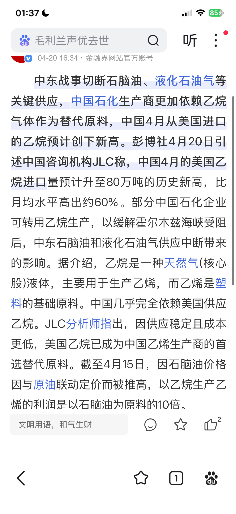
美伊战争期间导致乙烷制作乙烯的利润是石油脑制作乙烯利润的十倍。
而原因就是乙烷价格受原油制约比较小，再加上乙烷制乙烯的效率比石脑油裂解制乙烯的效率高，这就导致了两者生产的价格相差10倍。

那么我们不难想到，在这种巨大的利益差距下，乙烷会不会受到更多人青睐，从而侵蚀石脑油的市场份额。
为了探究这个问题，我找到了14年的一篇论论文，这里附上链接（苏林顺.乙烷裂解推动丁二烯生产技术创新[J].石油石化节能与减排,2014,4(5):45.）
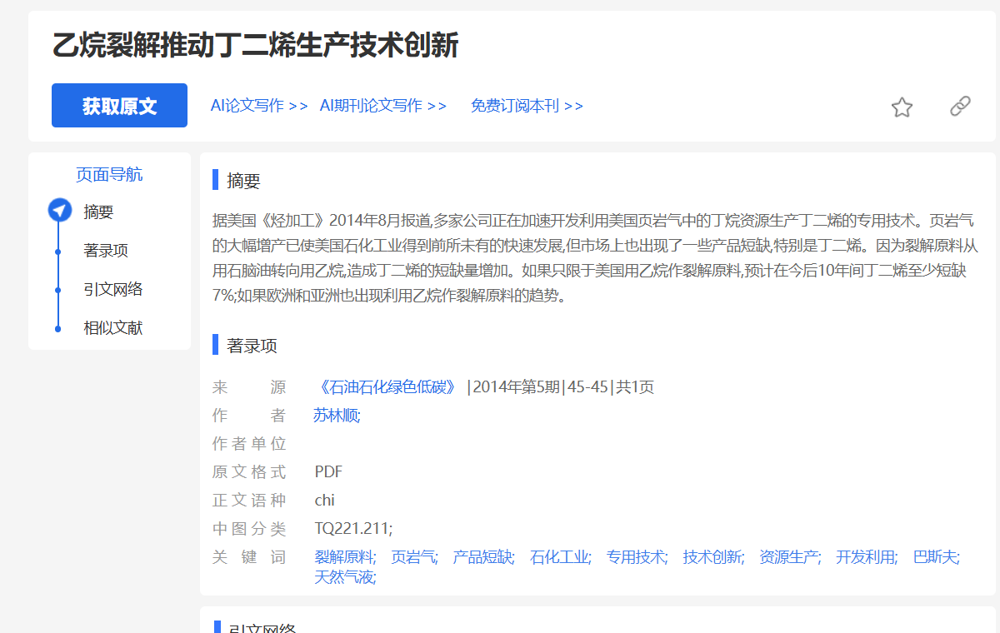

这个是14年的论文，关于乙烷代替石脑油的观点论文。
看来是有信息支撑，那么接下来
那么接下里我们需要着重去研究乙烷，乙烯，丁二烯，石脑油这几个因素的发展趋势和他们之间的相互作用关系。并且最后关联橡胶（天然橡胶和合成橡胶，找到其中的关联关系），这是整个合成橡胶这个板块研究中的核心部分。

---

# 第四部分：乙烯，乙烷，丁二烯，石脑油，裂解原料路线之争及其对丁二烯-橡胶产业链的传导

- 这部分我将分成四个部分进行讲解，主要目的是抓住核心矛盾，找出乙烯，乙烷，丁二烯，石油脑这4者之间的相互作用关系以及他们各自的发展趋势，并且将这种关系和天然橡胶和和合成橡胶去进行相关连。
- 要分析他们的相互关系，需要分别了解他们各自，以及他们的变化趋势，并从这种变化中找出关系。
- 我需要找到有一个合适的切入点，而这个切入点我觉得是乙烯，原因是乙烷裂解法制丁二烯和石脑油裂解制丁二烯都会产生它，并且它的占比在两种方法中都很大。所以接下来我会先从乙烯进行分析，之后通过乙烯找到它的影响因素，最后看他和乙烷，丁二烯、石油脑之间的关系。

>第四部分分为四个子部分，每个部分都包含一个核心问题和研究。四部分如下：
- **1.乙烯相关的基础数据和市场地位相关研究。**
- **2.乙烯的市场占比数据以及各国乙烯的相关数据研究**
- **3.分析乙烷、石油脑制作乙烯的变化趋势。**
- **4.丁二烯、石油脑制作乙烯的变化趋势研究。**

## 📋 本节目录（第四部分）

- [一、首先分析乙烯相关的基础数据和市场地位相关研究](#一首先分析乙烯相关的基础数据和市场地位相关研究)
- [二、分析乙烯的市场占比数据以及各国乙烯的相关数据研究](#二分析乙烯的市场占比数据以及各国乙烯的相关数据研究)
- [三、分析乙烷、石油脑制作乙烯的变化趋势以及其他相关情报支撑](#三分析乙烷石油脑制作乙烯的变化趋势以及其他相关情报支撑)
- [🚢 乙烷的运输分析](#-乙烷的运输分析)

## 一、首先分析乙烯相关的基础数据和市场地位相关研究。

乙烯的重要性：

乙烯（Ethylene）被称为：

"The King of Petrochemicals（石化之王）"

几乎所有行业报告都会强调：

- 全球产量最大的基础有机化工原料
- 所有石化产品中价值最高
- 整个石化产业链的起点

主要用于生产：

- 聚乙烯（PE）≈60%
- 环氧乙烷（EO）
- 乙二醇（MEG）
- 苯乙烯
- PVC
- EVA
- α-烯烃

乙烯是全球产量最大的有机化工原料（2024 年全球约 2 亿吨/年），是石化产业链的"链首分子"，下游衍生出聚乙烯、乙二醇、苯乙烯、PVC、合成橡胶单体等数十条产品线，覆盖塑料、纤维、橡胶三大合成材料。**对橡胶产业链而言，乙烯是丁二烯的"母体"——全球 70% 以上丁二烯来自乙烯裂解的 C4 副产，所以乙烯产能周期直接传导至丁二烯供给，进而决定合成橡胶的成本与价格**。此外，乙烯装置投资规模巨大（百万吨级项目动辄 200 亿元以上），是各国重化工业的战略锚点，常被视为国家石化工业水平的标志，因此要做天然橡胶的研究就离不开合成橡胶，而合成橡胶的研究离不开乙烯的生产以及现在的化工需求。**接下来文章惠着重去研究主要矛盾：即乙烯，乙烷，丁二烯，石脑油这几者之间的相互作用关系**

---

### 乙烯占全球基础石化产品比例

按产量统计：

| **产品** | **全球占比（约）** |
|:-----|:-----------:|
| 乙烯 | 28~31% |
| 丙烯 | 22~25% |
| BTX 芳烃 | 18~20% |
| 甲醇 | 10% 左右 |
| 丁二烯 | 2~3% |

业内通常认为：

乙烯约占全球基础石化产品总量的 30% 左右。

### (1) 乙烯在全球化工行业所占的比例（10-25年的数据）

| **指标** | **数值** |
|:-----|:-----|
| 全球最大的基础化工产品 | 乙烯 |
| 全球基础石化产品中占比 | **约 30%** |
| 全球石化产业价值链占比 | **约 30%~35%** |
| 全球化工行业销售额占比 | **约 10%~13%** |
| 2025 全球乙烯产量 | **约 2.05 亿吨** |
| 2025 全球乙烯产能 | **约 2.50 亿吨** |
| 全球平均开工率 | **82%~88%（不同年份略有波动）** ([科学直通车][1]) |

[1]: https://www.sciencedirect.com/topics/chemical-engineering/ethylene?utm_source=chatgpt.com "Ethylene - an overview | ScienceDirect Topics"

### (2) 2010–2025 年全球乙烯产量

| **年份** | **全球乙烯产能（Mt）** |
|:----:|:----:|
| 2010 | 143.6 |
| 2011 | 149 |
| 2012 | 154 |
| 2013 | 159 |
| 2014 | 164 |
| 2015 | 170 |
| 2016 | 176 |
| 2017 | 182 |
| 2018 | 190 |
| 2019 | 198 |
| 2020 | 206 |
| 2021 | 214 |
| 2022 | 223 |
| 2023 | 232 |
| 2024 | 241 |
| 2025 | 250 左右 |

### (3) 乙烯占全球化工总产量占比

根据全球化工产品产量（约 22～24 亿吨/年，包括基础化学品、聚合物、化肥、无机化学品等）以及乙烯衍生物产量估算：

| **指标** | **全球产量（约，2024–2025）** |
|:-----|:-----------:|
| 全球化工产品总产量 | 22～24 亿吨 |
| PE | 1.6～1.7 亿吨 |
| EO/MEG | 0.8～0.9 亿吨 |
| PVC | 0.6～0.65 亿吨 |
| 苯乙烯 | 0.35～0.40 亿吨 |
| EVA | 0.10～0.12 亿吨 |
| α-烯烃 | 0.06～0.08 亿吨 |

如果按这些**一次产品（避免重复统计）**计算：

乙烯产业链一次产品合计约 4.0～4.5 亿吨。

对应全球化工产品：

约占全球化工产品总产量的 18%～20%。

> 📌 **结论**：从这里可以发现乙烯的产量在 2010-2025 年有明显的增长，并且 2025 年的乙烯产量已经接近 250，并且由于乙烯在全球化工行业的产量占比达到约 18%-20%，说明它是非常重要的，而接下来我们要研究生产乙烯的相关线索。

---

## 二、分析乙烯的市场占比数据以及各国乙烯的相关数据研究。

这么大的占比份额，我们就需要去调查生产乙烯的生产国以及主要生产方式。

下面我采用行业中较常引用的 2025 年全球有效产能（Nameplate Capacity）来整理，误差一般在 ±3% 以内，可用于行业研究。

### 一、全球乙烯（Ethylene）产能

截至 2025 年，全球乙烯总产能约：

2.45～2.50 亿吨/年（24500～25000 万吨/年）

其中亚洲约占全球一半以上，中国是全球最大的乙烯生产国。

### (1) 2025 年全球各国乙烯产能及占比

| **排名** | **国家/地区** | **乙烯产能（万吨/年）** | **全球占比** |
|:----:|:----------|:---------------------:|:-----------:|
| 1 | 中国 | 6,100 | 24.8% |
| 2 | 美国 | 4,700 | 19.1% |
| 3 | 沙特阿拉伯 | 1,900 | 7.7% |
| 4 | 韩国 | 1,300 | 5.3% |
| 5 | 日本 | 680 | 2.8% |
| 6 | 印度 | 650 | 2.6% |
| 7 | 德国 | 550 | 2.2% |
| 8 | 加拿大 | 500 | 2.0% |
| 9 | 中国台湾 | 420 | 1.7% |
| 10 | 泰国 | 360 | 1.5% |
| 11 | 新加坡 | 310 | 1.3% |
| 12 | 荷兰 | 280 | 1.1% |
| 13 | 比利时 | 250 | 1.0% |
| 14 | 巴西 | 230 | 0.9% |
| 15 | 俄罗斯 | 220 | 0.9% |
| — | 其他国家合计 | 5,050 | 20.5% |
| — | **全球合计** | **24,600** | **100%** |

### (2) 2025 年全球各国乙烯产能以及生产方式

| **国家** | **乙烯产能（万吨）** | **丁二烯产能（万吨）** | **乙烯主要原料** | **丁二烯主要来源** |
|:-----|:-----------:|:---------------:|:----------|:----------|
| 中国 | 6,100 | 760 | 石脑油、煤制烯烃、少量乙烷 | 石脑油裂解 + C4 脱氢 |
| 美国 | 4,700 | 300 | 乙烷裂解为主 | 石脑油裂解 + C4 脱氢 |
| 沙特 | 1,900 | 110 | 乙烷 + LPG | 石脑油/LPG 裂解 |
| 韩国 | 1,300 | 180 | 石脑油 | 石脑油裂解 |
| 日本 | 680 | 160 | 石脑油 | 石脑油裂解 |
| 印度 | 650 | 80 | 石脑油 | 石脑油裂解 |

### (3) 2025 年全球各国乙烯生产方式

按照 2024–2025 年全球乙烯产量约 2.05 亿吨计算，可以得到全球各原料制乙烯的大致占比如下：

| **原料** | **全球占比** | **对应乙烯产量（2025，约）** | **主要地区** |
|:-----|:---------:|:--------:|:----------|
| 石脑油（Naphtha） | 43～45% | 88～92 Mt | 中国、日本、韩国、欧洲 |
| 乙烷（Ethane） | 31～33% | 64～68 Mt | 美国、中东、加拿大 |
| 丙烷（Propane） | 9～10% | 18～21 Mt | 中国、中东 |
| 丁烷（Butane） | 3～4% | 6～8 Mt | 中东 |
| 轻柴油/瓦斯油（Gas Oil） | 5～6% | 10～12 Mt | 欧洲、部分亚洲 |
| 其他（炼厂尾气、LPG 混合料等） | 4～6% | 8～12 Mt | 全球 |

可以发现石脑油裂解制作乙烯还是主要方式，其次是乙烷制乙烯。

那么我们就需要重点关注石油脑制乙烯的变化趋势和乙烷制乙烯的变化趋势。

---

## 三、分析乙烷、石油脑制作乙烯的变化趋势以及其他相关情报支撑。

由于该数据比较保密，我只能获取到某几年的公开数据，根据公开数据去看变化。部分相关数据运用模型进行估算。

### (1) 10-25 年全球乙烯产量以及石脑油裂解乙烯产量占比

**单位：万吨/年**

| **年份** | **全球乙烯总产量（需求）** | **石脑油裂解生产乙烯** | **石脑油占全球乙烯比例** | **数据性质** |
|:----:|:--------:|:--------:|:---------:|:----------|
| 2010 | ≈13,800 | ≈7,200 | ≈52% | 行业公开统计+原料结构 |
| 2015 | ≈14,700 | ≈7,350 | ≈50% | 行业公开统计+原料结构 |
| 2020 | ≈17,100 | ≈7,870 | ≈46% | 行业公开统计+原料结构 |
| 2023 | ≈18,400 | ≈7,910 | ≈43% | 全球产能及原料结构 |
| 2024 | ≈18,700 | ≈8,000 | ≈43% | 化工行业流量模型 |
| 2025 | ≈19,000 | ≈8,170 | ≈43% | 化工行业流量模型 |

可以发现通过石油脑裂解制乙烯的产量占比在逐年下降，从 2010 年的 52% 下降到 2025 年的 43%。

### (2) 全球乙烷裂解制乙烯历年数据以及占比（公开数据）

| **年份** | **全球乙烯总产量（万吨）** | **乙烷裂解制乙烯（万吨）** | **占全球乙烯比例** | **数据来源** |
|:----:|:--------:|:---------:|:---------:|:----------|
| 2010 | ≈13,800 | ≈4,400 | ≈32% | 美国页岩气初期，乙烷裂解快速增长 |
| 2015 | ≈14,700 | ≈5,600 | ≈38% | 美国新增大量乙烷裂解装置 |
| 2020 | ≈17,100 | ≈6,900 | ≈40% | 美国、中东继续扩产 |
| 2023 | ≈18,400 | ≈7,900 | ≈43% | 全球乙烷路线占比持续提升 |
| 2024 | ≈18,700 | ≈8,200 | ≈44% | Chemior 全球流程模型 |
| 2025 | ≈19,000 | ≈8,360 | ≈44% | Chemior 全球流程模型（约 93 Mt） |

可以看到通过乙烷裂解制乙烯的产量占比在逐年上升，从 2010 年的 32% 上升到 2025 年的 44%，显示出乙烷作为乙烯原料的地位越来越重要。

---

这里我将两者的数据变化进行整合，做成如下图。

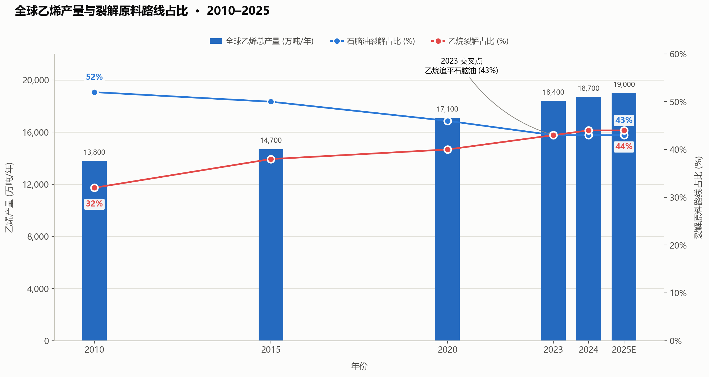

通过上述两个模型，可以得到：

- 石脑油裂解制乙烯的产量占比逐年下降
- 乙烷裂解制乙烯的产量占比逐年上升
- 在2023年来到了两者的拐点。

那么看这个这个对比如图，我们能不能想到两点问题：
1.乙烷的走势为什么在23年-25年突然放缓，是什么原因导致的。
2.乙烷的走势会不会之后持续上升，蚕食石脑油的市场份额

为了找到答案，我们需要去看乙烷的主要矛盾：主要是谁在买，谁在卖。根据我们上述的表格以及相关搜索可以得出是美国在主要卖乙烷，中国在主要买乙烷。那么为什么会在23-25年突然放缓呢？这就需要找到23-25年中美在乙烷上发生的故事。

为此我找到了相关的文章了解了这期间的原因。附上链接：https://zhuanlan.zhihu.com/p/1898410162068371048
我抓住了文章的几大核心，将下面几个关键要点进行讲解。
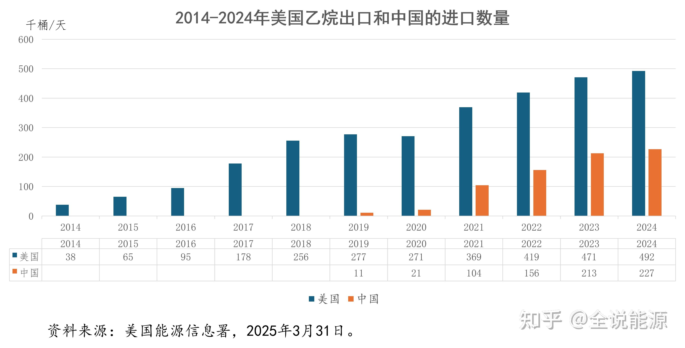
20年开始美国开始向中国出口乙烷，增长速度也很快，说明国内对于乙烷的需求非常大，进口不断在扩大。在24年中国成为美国乙烷最大的买家。

24-25年我们知道的，中美进行了关税战，高额的关税让各种物品的进出口变得困难，乙烷也不例外，不过我们可以从中看出一些猫腻：
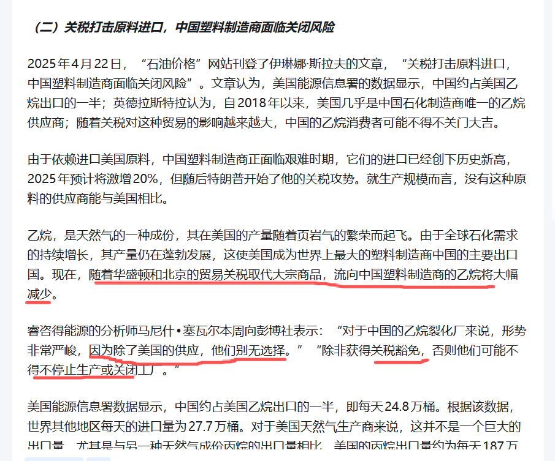
国内的塑料商离不开美国的乙烷，算是刚需了。
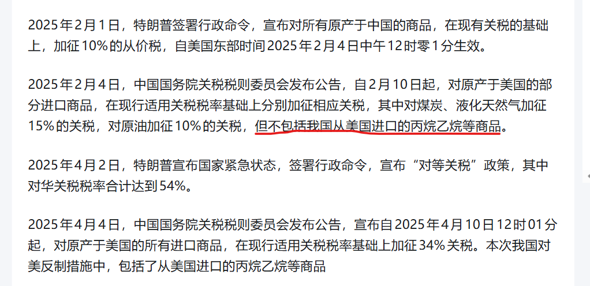
这里很有意思，在25年2月初的时候中国对美国的关税进行了反制措施，对原油等产品加征关税，但是**唯独不对乙烷进行加征关税**，这就说明对于上层来讲，乙烷进口仍然是必须的，所以对它比较温柔没有进行加关税。然后到了4月初，美国对中国加关税达到54%，此时性质已经变了，从挑衅变成战争，中国同样做出反击，而战争就不会讲究情面，乙烷也一并给加了关税。

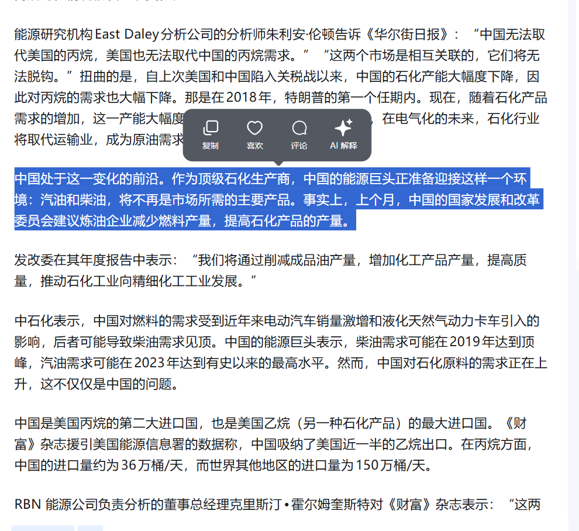
再来看看中国的能源格局，我们目前已经知道的就是要从石油能源向可再生，绿色能源去转变，从汽油柴油向高质量石化产品转变。
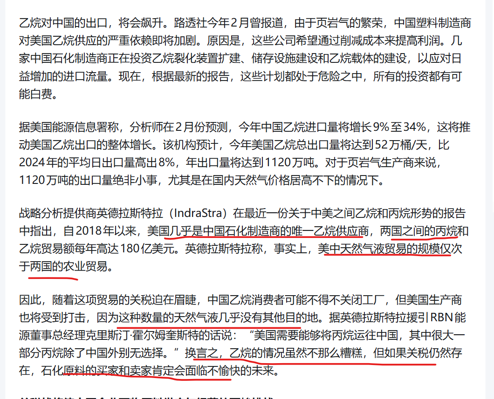
从这个图片可以看出，中美之间关于乙烷这个能源是相互依赖的一个关系卖家离不开客户，而买家又离不开卖家。由于运力有限，所以每年每每年这个美国有大量的乙烷被重新注入到地下，所以美国的乙烷供大于求，价格常年稳定。

综上我们可以看出来第一个问题的原因，是外部的政治因素导致短期内乙烷进口增速减慢。

接下来回答第二个问题：会不会持续上升，这点是肯定的，有下面几个观点支撑：
再来让我们看看25年之后也就是26年前6个月的乙烷的进口情况：
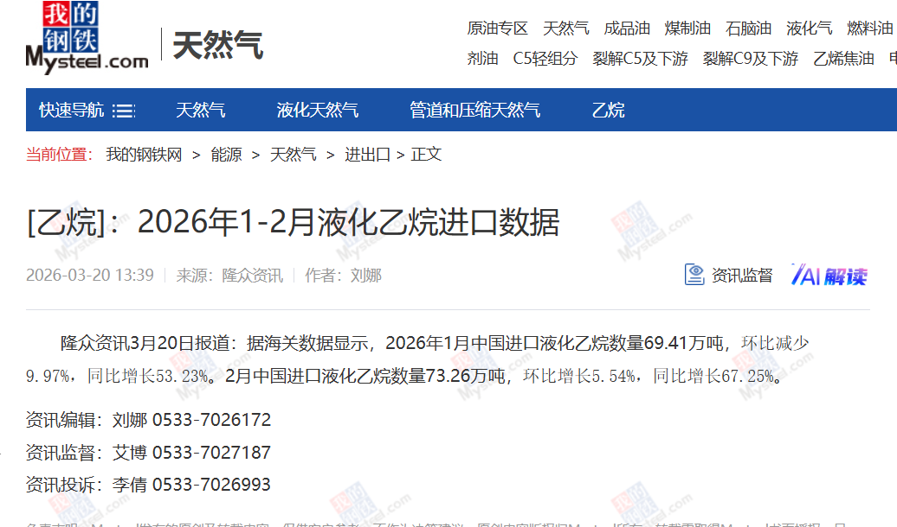
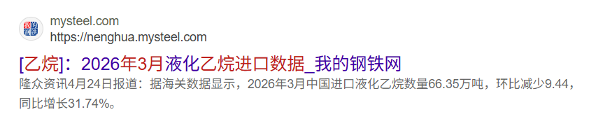
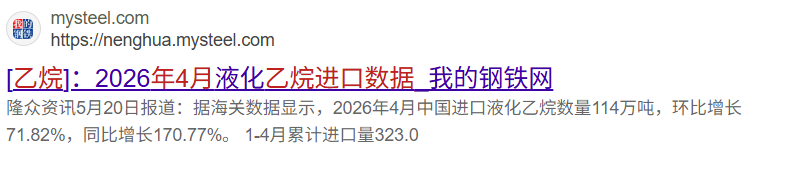
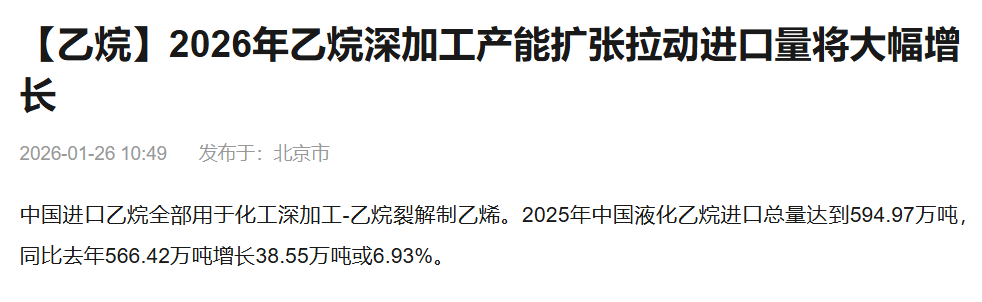
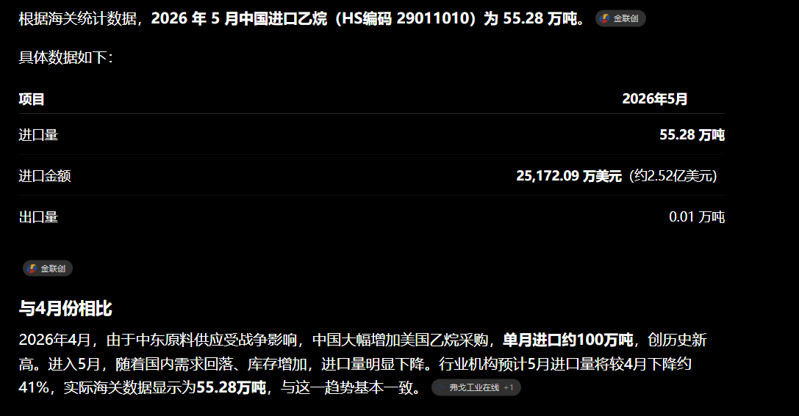
六月份的进口数据暂时还没出来，我最后整理成一个表格吧，里面跟上一年对应的月份进口额对比
| 月份         |   2024（万吨） |    2025（万吨） |   2026（万吨） |
| ---------- | ---------: | ----------: | ---------: |
| 1月         |  **41.39** |   **45.30** |  **69.41** |
| 2月         |  **55.54** |   **43.81** |  **73.26** |
| 3月         |  **27.16** |   **50.37** |  **66.35** |
| 4月         |  **50.93** |   **42.09** | **114.00** |
| 5月         |  **53.32** |  **≈42.00** |  **55.28** |
| **1-5月累计** | **228.34** | **≈223.57** | **378.30** |
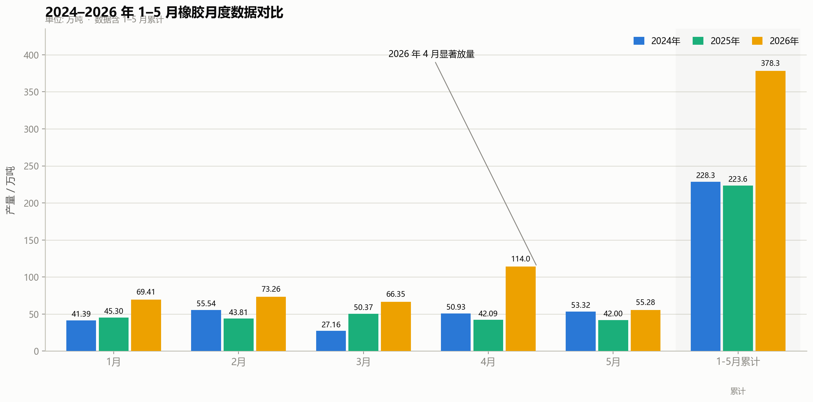
可以发现在关税战后，乙烷进口规模每年都持续增长，并且涨幅巨大。那么如今中美未来3-5年内会好转就是一个问题。
让我们再次来分析：中美之间的关系是否有缓和的趋势？
要看关系变化我们就可以从26年2月前后到26年现在两国的关系以及美方那边在外交策略上的变化。
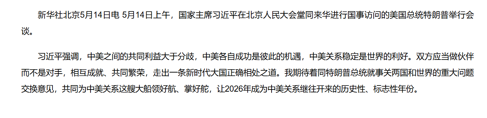
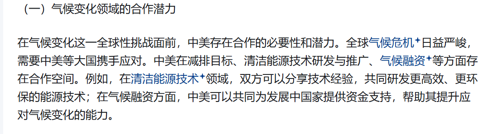
由于要去分析中美外交关系这个部分，需要通过大量文案去进行分析，篇幅会有点大，我就将这部分的推理单独做成一篇**2026年1月到7月中美外交关系的变化以及美国外交策略的演进**，感兴趣的可以去专栏看。
本人在这里直接写结论：
- **美国2026年上半年外交的最大变化**：从"单边主义+硬对抗"逐步转向"以实力求稳定"。5月访华是关键转折点，司法体系也开始约束行政权力（CIT裁定122条款无效），多边层面美国仍试图重塑规则但效果有限。
- **中美关系的最大变化**：从"高风险对抗"进入"有管理的战略稳定"。元首会晤+机制建设+对等承诺构成新三角，但科技、供应链、台湾、南海等结构性议题仍是未来挑战——尤其是7月南海仲裁重申显示，合作与竞争并行的格局已成新常态。
可以发现美国由于陷入美伊战争，外交从刚开始强硬到后面变得较为温和,正所谓“一鼓作气，再而衰，三而竭”，长时间的谈判然他逐渐泄气。不难看出未来中美关系会缓和，并且很难再出现24，25年那样的关税了。在这种情况下乙烷外贸这方面上的政治压力会变小，为乙烷贸易继续大幅增长创造先决条件。

光有政治上的保证还不行，我们还需要考虑乙烷的贸易的运输能力等条件，由于运输乙烷比较特殊，需要专门的船体运输，那么接下来我将讲解乙烷的运输相关的分析，帮大家看看这部分是否可以退保证，如果无法保证未来乙烷贸易高速增长会面临压力。

## 🚢 乙烷的运输分析

### 乙烷的运输步骤

```text
通过管道输送到港口
    ↓
在港口完成液化
    ↓
大型低温储罐
    ↓
制冷系统
    ↓
装船
    ↓
运输（使用世界最大的乙烷运输船）
    ↓
中国接收（并不是所有港口都能接收乙烷，因为：普通LNG码头不能卸。）
    ↓
低温乙烷接收站
    ↓
大型低温储罐
    ↓
乙烷专用管道
    ↓
乙烯裂解装置
```

普通LNG船（液化天然气运输船）不能运乙烷。
普通LPG船（液化石油气运输船）也不能长期运输乙烷。
必须使用：VLEC（Very Large Ethane Carrier 即：超大型乙烷运输船）
或者ULEC （Ultra Large Ethane Carrier即：超超大型乙烷运输船）
所以说乙烷的运条件非常苛刻，必须使用超大型乙烷运输船，而且还需要专门的存储装置和码头。

再来看看中美各自乙烷的码头，运输能力，存储能力等信息：

### 一、VLEC运输船队数据变化趋势

全球VLEC船队规模（运营 + 在建）

| 年份 | 全球运营VLEC | 新增订单（累计） | 备注 |
| :--- | :--- | :--- | :--- |
| 2023 | 约 24 艘 | 约 30 艘 | 供不应求 |
| 2024 | 约 27–29 艘 | 40 余艘 | 中国企业大量租船/订船 |
| 2025 | 约 30 艘 | 58 艘 VLEC + 8 艘 ULEC 在建 | 运力进入快速扩张期 |

> **关键趋势**：与 2023 年相比，2025 年订单数量翻了一倍，订单/在役比接近 2:1；2026–2028 年是集中交付高峰。

中美各自VLEC船队对比

| 维度 | 美国侧 | 中国侧 |
| :--- | :--- | :--- |
| 主流船型 | 85,000–99,000 m³（部分 8 艘 150,000 m³ ULEC） | 99,000 m³ VLEC 为主 |
| 自有船队 | 美国船东相对少，主要依赖 Navigator Gas、Avance Gas、BW LPG、MOL 等 | 卫星化学 2 艘 + 长租 1 艘；万华化学 4 艘已订 + 9 艘 AW Shipping 合资 + 太平洋气体船长租 |
| 中国买方占比 | — | 卫星 + 万华合计锁定全球新增运力 50%+ |
| 议价能力 | 中等（船位稀缺，价格上行） | 上升（自有 + 长租 + 合资组合） |

新船建造关键节点（2024–2025）

- **2024.04 江南造船**：99,000 m³ VLEC "GAS CHANGJIANG"号交付（入级美国船级社）。
- **2025.01 三星重工 / GTT**：3 艘 100,000 m³ VLEC Mark III 薄膜围护系统订单，总价约 5 亿美元。
- **2025.08 山东海洋集团 / 江南造船**：9.9 万 m³ VLEC（H2822 船）开工，太平洋气体船与万华化学长租项目。
- **2026.05 "PACIFIC DUBHE"天枢轮**：江南造船命名交付，万华化学首艘长租 VLEC。

> **结论**：船队扩张是中长期主线，2026–2028 年集中交付后将彻底改变海运能力格局；但短期内（2025 年）船位仍是稀缺资源，对贸易量构成硬约束。运输端的大型乙烷运输船在26-28年集中进入交付期，那么足够支撑乙烷贸易的增长。

### 二、中美乙烷码头与出口/接收能力数据

美国侧：出口终端（产能扩张但扩建周期长）

| 终端 | 地点 | 出口能力 | 状态 |
| :--- | :--- | :--- | :--- |
| Enterprise Morgan's Point | 休斯敦 | 约 24 万桶/日（铭牌约 57.5 万桶/日） | 在运，2024 年实际出口约 21.3 万桶/日 |
| Energy Transfer Nederland | 德州 | 18 万桶/日 | 在运，2026 Q1 二期扩建完成 |
| Enterprise Neches River（一期） | 奥兰治县 | 12 万桶/日 + 5 万吨储罐 | 2025 投运 |
| Enterprise Neches River（二期） | 奥兰治县 | 18 万桶/日 | 规划中 |
| Targa Galena Park | 德州 | — | 在运 |
| American Ethane Marcus Hook | 宾州 | 约 7 万桶/日 | 在运，主要服务欧洲（接近满负荷） |
| Orbit Ethane Export Terminal | 德州 | 约 18 万桶/日 | 在运，卫星化学合资、长约 15 万桶/日 |

美国乙烷出口能力变化趋势

| 年份 | 美国乙烷出口能力 | 主要变化 |
| :--- | :--- | :--- |
| 2023 | 约 45 万桶/日 | Morgan's Point、Nederland 为主 |
| 2024 | 约 49 万桶/日 | 中国需求快速增长，实际出口创纪录 |
| 2025 | 超 60 万桶/日 | Neches River 一期投产，Nederland 扩容 |

> **关键趋势**：EIA 预计 2025 年美国乙烷日产量约 280 万桶/日（全球占比 65%），2025 年 4 月过剩出口产能约 55 万桶/日，2026 年出口量继续约 16% 增长。
>
> **核心瓶颈**：美国码头扩建周期长达 **5–6 年**，短期内难以快速缓解出口压力。

中国侧：接收终端（数量少但向超大型化演进）

| 接收终端 | 地点 | 储罐配置 | 合计容积 | 投运状态 |
| :--- | :--- | :--- | :--- | :--- |
| 连云港卫星石化 | 江苏连云港徐圩 | 3×16 万 m³ | 48 万 m³ | 2019–2020 陆续投运 |
| 烟台万华化学（西港） | 山东烟台 | 2×16 万 m³（兼容乙烯） | 32 万 m³ | 2025.04 投运 |
| 泰兴新浦化学 | 江苏泰兴 | 2×12 万 m³（兼容丙烷） | 24 万 m³ | 2017.11 投运 |
| 天津南港乙烯 | 天津南港 | 1×16 万 m³ | 16 万 m³ | 2024.12 气顶升 |
| 连云港荣泰五期 | 江苏连云港 | 1×12 万 m³ | 12 万 m³ | 在建/规划 |
| **合计** | — | — | **约 132 万 m³** | — |

中国 VLEC 接卸节点变化趋势

| 维度 | 2022 | 2023 | 2024 | 2025 |
| :--- | :--- | :--- | :--- | :--- |
| VLEC 接卸码头 | 2 个（连云港、泰兴） | 2 个 | 2 个 | 4 个（+烟台、+天津） |
| 16 万 m³ 级储罐 | 0 | 3 台（连云港卫星） | 3 台 | 5–6 台（含万华 2 台、天津 1 台） |
| 储罐合计容积 | 约 60 万 m³ | 约 108 万 m³ | 约 108 万 m³ | 约 156 万 m³ |

> **关键趋势**：16 万 m³ 级储罐成为新建项目标配，单罐一次可接满一艘 99,000 m³ VLEC，是码头吞吐效率的核心瓶颈。码头也为乙烷贸易增长提供保证。

### 三、中美乙烷储罐能力数据

美方侧（出口端）

- 配套逻辑：新建出口终端配建超大型双层绝热低温储罐，单罐容量数万 m³ 级。
- 关键节点：Neches River 一期配套 **5 万吨** 储罐（2025 年建成）。
- 数据缺口：美方企业通常不单独公布乙烷储罐总容积。

中方侧（接货端）

- **万华化学烟台 2 台 16 万 m³**（2025.04 投运）：单罐内壁直径 82 米，拱顶重 657.73 吨，抬升高度 36.86 米，刷新同类超大型低温罐工期纪录。
- **卫星石化连云港 3 台 16 万 m³**：合计 48 万 m³，是国内最早 16 万 m³ 级储罐群。
- **新浦化学泰兴 2 台 12 万 m³**：国内首个大型低温乙烷接收站（2017 年）。
- **天津南港乙烯 1 台 16 万 m³**（2024.12 顶升，2025 年内投运）：服务天津 120 万吨/年乙烯项目。
- 储罐建设周期约 **24–30 个月**（含气顶升），单罐一次可接满一艘 99,000 m³ VLEC。

中国侧储罐 2026 年中期投运进展（截至 2026 年 7 月）

| 项目 | 储罐配置 | 投运时间 | 备注 |
| :--- | :--- | :--- | :--- |
| 万华化学烟台（西港） | 2×16 万 m³ | **2025.04 已投运** | 截至 2026.07 已运行 15 个月 |
| 天津南港乙烯 | 1×16 万 m³ | **2024.12 顶升 → 2025 年内投运** | 服务天津 120 万吨乙烯项目 |
| 卫星化学 α-烯烃一阶段（连云港） | 配套 LNG 储罐 + 乙烷接卸 | **2026.01 投产** | 一阶段 6 艘 VLEC 同步交付 |
| 卫星化学 α-烯烃二阶段 | 配套储罐 | 2026 年底建成 | 二阶段 8 艘 ULEC 在建 |
| 连云港荣泰五期 | 1×12 万 m³ | 在建/规划 | 卫星系延展 |

> **关键观察**：2025–2026 年是中国侧 16 万 m³ 级储罐集中投运期，**单储罐容积瓶颈已基本缓解**；当前实际瓶颈已从"罐子"转移到"码头接卸+船位+周转"环节。

储罐容积 vs 进口需求的匹配测算

按 2026 年 7 月现状测算：

- **中国侧总储罐容积**：约 **156 万 m³**（含 2024 年前已建 + 2025 年新增万华烟台 2 台 + 天津南港 1 台）
- **理论储罐周转能力**：按每月每罐周转 1.0–1.5 次（受船期、检修等影响），年周转量约 **1,800–2,800 万吨**
- **2025 年实际进口**：约 **700+ 万吨**
- **储罐利用率**：约 **25%–39%**（按周转能力上限计），处于合理偏松区间

> **结论**：单纯从储罐容积看，**2026 年中国侧接货能力可支撑 800–1,200 万吨/年进口量**，已不构成"容积瓶颈"。存储段不造成压力。

### 四、中美乙烷贸易高速增长是否可持续？

贸易量趋势对比

| 指标 | 2023 | 2024 | 2025E |
| :--- | :--- | :--- | :--- |
| 美国乙烷出口能力 | 约 45 万桶/日 | 约 49 万桶/日 | 超 60 万桶/日 |
| 中国乙烷进口量 | 约 303 万吨 | 约 553 万吨（+77.6%） | 预计 > 700 万吨 |

> 2024 年中国进口 553 万吨乙烷 ≈ 美国出口能力的近一半，中国市场已成为美国乙烷出口的核心增量。

四道瓶颈的综合判断

综上，四个条件已经提供保障（运输能力，存储能力，外交条件，码头），为此乙烷贸易持续增长的先决条件成立。加速阶段就在26-28年（即大型乙烷运输船集中交付时期）

接着前面条件成立后，乙烷贸易即将开启上涨阶段。如此之后乙烷裂解逐渐占领市场份额，石脑油裂解的市场份额降低，那么就会造成一个影响：由于石脑油裂解制乙烯的占比下降，就会导致丁二烯的供应变得紧张，而增长的乙烷制乙烯路线几乎不产生丁二烯，这就会造成全球丁二烯供应的紧张，从而推高丁二烯价格，进而影响合成橡胶的价格。在这个过程中丁二烯的价格和原油的价格关联性将逐步降低（它的价格将更多的受到供给端紧张，产量不足的影响），丁二烯价格上涨后，合成橡胶的价格将逐步提高，合成橡胶价格上涨后，将推动天然橡胶价格上涨（即天然橡胶价格和丁二烯橡胶价格），从而两者形成**共振效应**。（这里面的成本以及价格支撑我放到后面的四中进行补充和解释）

如果在以往，合成橡胶算是天然橡胶的一个敌对因素，天然橡胶涨的时候，企业选择去用合成橡胶，从而天然橡胶的价格上涨被合成橡胶缓冲了一部分，但是现在他们**渐渐从对立状态转变成统一状态**，而这个拐点发生在23年。并且由于中国的能源转型背景，乙烷制乙烯更加环保，再加上美国页岩气的快速发展，乙烷制乙烯的产量将会持续增加，中美之间的乙烷贸易持续增长，乙烷替代石油脑成为新的趋势。

---

# 第五部分：逻辑补充与综合分析

前面已经得了结论，这部分是为前面的结论做补充，通过分析丁二烯的各项数据，再结合各国的政策背景和趋势数据去综合分析，为前面的结论做支撑。

## 📋 本节目录（第五部分）

- [(1) 各地区裂解原料结构推算丁二烯来源占比](#1-根据各地区乙烯裂解原料结构推算出丁二烯来源占比)
- [(2) 全球丁二烯产能与各国产量占比估算](#2-根据-2025-2026-年全球丁二烯产能约-1900-万吨年各国公开产能以及各地区裂解原料结构估算得出实际每年会因装置检修开工率有所波动)
- [(3) 国内丁二烯相关政策文件](#3-下面是国内丁二烯相关政策文件)
- [(4) 全球丁二烯产能和需求数据](#4-全球丁二烯产能和需求数据2025-年)
- [(5) 乙烷和石脑油成本分析](#5-乙烷和石脑油成本分析)
- [(6) 天然气增长规模（对乙烷的利空分析）](#6-天然气增长规模对于乙烷的利空分析)

## (1) 根据各地区乙烯裂解原料结构推算出丁二烯来源占比。

根据 IEA、RSC 等公开统计，主要地区裂解原料结构如下：

| **国家/地区** | **石脑油裂解占乙烯原料** | **乙烷裂解占乙烯原料** | **丁二烯主要来源** |
|:----------|:---------------:|:---------------:|:----------|
| 中国 | 70~80% | 5~10% | 几乎全部来自石脑油 |
| 日本 | 85~90% | 接近 0 | 基本全部石脑油 |
| 韩国 | 75~85% | 少量 | 基本全部石脑油 |
| 欧洲 | 65~70% | 10% 左右 | 石脑油为主 |
| 美国 | 18~20% | 45% 左右 | 石脑油仍贡献绝大多数丁二烯 |
| 加拿大 | 20% 左右 | 60% 左右 | 石脑油贡献大部分丁二烯 |
| 中东 | 8~10% | 60~70% | 丁二烯供应偏少，很多依赖进口或专门装置 |

换算成丁二烯市场占比，考虑到乙烷裂解几乎不产生丁二烯，可以估算各地区丁二烯来源：

| **国家** | **石脑油来源** | **乙烷来源** |
|:-----|:---------:|:---------:|
| 中国 | 98% 以上 | <2% |
| 日本 | ≈100% | ≈0% |
| 韩国 | ≈99% | <1% |
| 欧洲 | 95% 以上 | <5% |
| 美国 | 80~90% | 5~10% |
| 加拿大 | 80% 左右 | <10% |
| 中东 | 40~60%（石脑油+LPG） | <10% |

## (2) 根据 2025-2026 年全球丁二烯产能（约 1900 万吨/年）、各国公开产能以及各地区裂解原料结构估算得出（实际每年会因装置检修、开工率有所波动）。

| **国家/地区** | **全球丁二烯产量占比** | **主要生产方式** | **石脑油裂解占比** | **乙烷裂解占比** |
|:----------|:------------:|:--------|:---------:|:---------:|
| 中国 | 31% | 石脑油裂解 + C4 抽提 + C4 脱氢 | 95% | <2% |
| 美国 | 18% | 石脑油裂解 + C4 脱氢 | 80% | <10% |
| 韩国 | 9% | 石脑油裂解 | ≈99% | <1% |
| 日本 | 8% | 石脑油裂解 | ≈100% | 0% |
| 德国 | 5% | 石脑油裂解 | 95% | <5% |
| 沙特阿拉伯 | 5% | 石脑油裂解 + LPG 裂解 | 60% | <10% |
| 印度 | 4% | 石脑油裂解 | 95% | <2% |
| 中国台湾 | 3% | 石脑油裂解 | ≈100% | 0% |
| 新加坡 | 2% | 石脑油裂解 | ≈100% | 0% |
| 泰国 | 2% | 石脑油裂解 | ≈100% | 0% |
| 法国 | 2% | 石脑油裂解 | 95% | <5% |
| 荷兰 | 2% | 石脑油裂解 | 90% | <10% |
| 比利时 | 1.5% | 石脑油裂解 | 95% | <5% |
| 加拿大 | 1.5% | 石脑油裂解 + C4 装置 | 80% | <10% |
| 俄罗斯 | 2% | 石脑油裂解 | 90% | <5% |
| 其他国家 | 4% | 石脑油裂解为主 | 90% 以上 | <5% |

按生产方式汇总，如果把所有国家合并，全球丁二烯的来源大致如下：

| **生产方式** | **全球丁二烯供应占比** |
|:-----|:---------------:|
| 石脑油蒸汽裂解副产 | 约 90% |
| LPG（丙烷/丁烷）裂解副产 | 约 5% |
| C4 脱氢法（On-purpose） | 约 4% |
| 乙烷裂解副产 | <1% |

## (3) 下面是国内丁二烯相关政策文件

下面这些都是目前研究丁二烯行业最重要的官方政策文件，我按研究的相关程度进行了排序。

| **发布时间** | **政策文件** | **与丁二烯关系** | **官方链接** |
|:----:|:----|:----|:----|
| 2022 | 《关于"十四五"推动石化化工行业高质量发展的指导意见》（工信部联原〔2022〕34 号） | ★★★★★（最重要）提出提升乙烯保障能力、优化炼化布局、发展高性能橡塑材料，是丁二烯产业的核心指导文件。 | 工业和信息化部原文 |
| 2022 | 《关于"十四五"推动石化化工行业高质量发展的指导意见》政策解读 | ★★★★★（官方解读）解释了为什么提高乙烯供给、推动炼化一体化，以及发展高端化工材料。 | 工信部政策解读 |
| 2022 | 《"十四五"推动石化化工行业高质量发展的指导意见》（商务部转载） | ★★★★☆（便于引用）内容与工信部一致，可作为政府公开转载版本引用。 | 商务部政策页面 |
| 2024 | 工信部《标准提升引领原材料工业优化升级》新闻发布会 | ★★★★☆（最新行业方向）总结我国乙烯、合成橡胶、基础化工材料的发展成果，并提出下一步产业升级方向。 | 工信部新闻发布会 |

## (4) 全球丁二烯产能和需求数据（2025 年）

- 丁二烯需求：约 1700 万吨/年
- 丁二烯产能：约 2000 万吨/年

| **排名** | **国家/地区** | **丁二烯产能（万吨/年）** | **全球占比** |
|:----:|:----------|:---------------:|:-----------:|
| 1 | 中国 | 760 | 37% |
| 2 | 美国 | 300 | 15% |
| 3 | 韩国 | 180 | 9% |
| 4 | 日本 | 160 | 8% |
| 5 | 沙特阿拉伯 | 110 | 5% |
| 6 | 德国 | 90 | 4% |
| 7 | 印度 | 80 | 4% |
| 8 | 中国台湾 | 70 | 3% |
| 9 | 新加坡 | 50 | 2% |
| 10 | 泰国 | 45 | 2% |
| 11 | 法国 | 40 | 2% |
| 12 | 加拿大 | 35 | 2% |
| 13 | 荷兰 | 35 | 2% |
| 14 | 俄罗斯 | 30 | 1% |
| — | 其他国家合计 | 45 | 2% |
| — | **全球合计** | **2,030** | **100%** |

## (5) **乙烷和石脑油成本分析**

这里有两方面对比：
1.同等单位下乙烷和石脑油的成本以及利润对比。
2.乙烷和石脑油裂解装置的成本对比。

1.以 1 吨为单位，正常市场价格下的两者成本：
| **原料** | **正常价格（美元/吨）** | **建议建模取值** |
|:-----|:---------:|:-----------:|
| 乙烷（Ethane） | 180～250 | **220 美元/吨** |
| 石脑油（Naphtha） | 600～700 | **650 美元/吨** |

### 一吨石脑油裂解产物如下：

| **产品** | **收率 (%)** | **产量 (kg)** | **2025 正常价格（美元/吨）** | **产品价值（美元）** |
|:-----|:-------:|:------:|:--------------:|:--------:|
| 乙烯 | **31%** | 310 | 850 | **263.5** |
| 丙烯 | 14% | 140 | 820 | 114.8 |
| 丁二烯 | 5% | 50 | 1,250 | 62.5 |
| 苯 | 8% | 80 | 880 | 70.4 |
| 甲苯 | 4% | 40 | 760 | 30.4 |
| 二甲苯（混合） | 3% | 30 | 850 | 25.5 |
| 裂解汽油（Pygas） | 10% | 100 | 650 | 65.0 |
| 燃料油/重 C9+ | 8% | 80 | 500 | 40.0 |
| 甲烷、氢气等燃料气 | 10% | 100 | 自用燃料 | ≈20 |
| 其它 C4/C5 产品 | 7% | 70 | 700 | 49.0 |

- 合计价值：741 美元
- 净利润：740 - 650 = 90 美元/吨

### 一吨乙烷裂解产物如下：

| **产品** | **收率 (%)** | **产量 (kg)** |
|:-----|:-------:|:------:|
| 乙烯 | **80%** | **800** |
| 丙烯 | 2.5% | 25 |
| 丁二烯 | 0.4% | 4 |
| 苯 | 1.0% | 10 |
| 裂解汽油 | 1.5% | 15 |
| 甲烷 | 8.5% | 85 |
| 氢气 | 2.5% | 25 |
| 其它 C4+ | 3.6% | 36 |

### 各项价值

| **产品** | **市场价格（美元/吨）** | **产量 (kg)** | **产品价值（美元）** |
|:-----|:---------:|:-----:|:--------:|
| 乙烯 | 850 | 800 | **680.0** |
| 丙烯 | 820 | 25 | 20.5 |
| 丁二烯 | 1,250 | 4 | 5.0 |
| 苯 | 880 | 10 | 8.8 |
| 裂解汽油 | 650 | 15 | 9.75 |
| 甲烷（燃料） | 200 | 85 | 17.0 |
| 氢气（工业价值） | 1,000 | 25 | 25.0 |
| 其它 C4+ | 700 | 36 | 25.2 |

- 合计价值：791.25 美元
- 利润：791.25 - 220 = 570.75 美元/吨

生产利润相差6.5倍数。

2. **同等规模和面积下,两种方式的基础成本对比**(即用地成本 + 装置成本 + 存储成本 + 人工成本)

   以中国沿海区为例(美国地区同理,最终效果差不多,这里就以中国沿海区为例)。

   > 📌 **注**:石脑油裂解装置自然占地比乙烷裂解大 20%–30%。在"强制同面积"条件下,石脑油装置的设备布局会更紧凑,单位面积投资强度更高。下表中已隐含这一约束。

   #### A. 乙烷裂解装置(1.0 Mt/y 乙烯)

   | 成本项             |    金额     |                  备注                   |
   | :----------------- | :---------: | :-------------------------------------: |
   | 1. 用地成本        | 6–9 亿元    | 120 公顷 × 35–50 万元/亩                 |
   | 2. 装置成本(ISBL) | 25–35 亿元  | 裂解炉 + 急冷 + 压缩 + 分离              |
   | 3. 存储成本        | 6–10 亿元   | 大型低温乙烷储罐(-88℃)+ 乙烯/丙烯球罐  |
   | 4. 人工成本(25年折现) | 7–9 亿元 | 200 人 × 15 万/年 × 25 年折现系数 0.6    |
   | **小计**           | **44–63 亿元** | 约 $6.3–9.0 亿美元                     |

   #### B. 石脑油裂解装置(1.0 Mt/y 乙烯,含丁二烯抽提)

   | 成本项                |     金额     |                         备注                          |
   | :-------------------- | :----------: | :---------------------------------------------------: |
   | 1. 用地成本           | 6–9 亿元     | 同面积假设(实际需 150 公顷)                          |
   | 2. 装置成本(ISBL + 联产) | 60–90 亿元 | 裂解 + C2/C3/C4 分离 + 丁二烯抽提 + 芳烃抽提          |
   | 3. 存储成本           | 10–15 亿元   | 石脑油罐 + 乙烯/丙烯/丁二烯/混合 C4/裂解汽油多产品罐区 |
   | 4. 人工成本(25年折现) | 12–15 亿元   | 350 人 × 15 万/年 × 25 年折现                         |
   | **小计**              | **88–129 亿元** | 约 $12.6–18.4 亿美元                                |

   ---

   #### 关键差异来源

   **① 装置成本差 ~2.0–2.5 倍**

   - 乙烷裂解:单一产品线,主要是乙烯回收
   - 石脑油裂解:多产物分离,需多增加 C3 分离塔、C4 抽提塔(含丁二烯萃取精馏)、芳烃抽提、汽油加氢等装置

   **② 存储成本差 ~1.5–1.7 倍**

   - 乙烷:低温罐贵但数量少(1–2 个 8–10 万 m³ 乙烷罐)
   - 石脑油:原料罐便宜但多(多个 5–10 万 m³ 常压罐)+ 多产品罐区(乙烯、丙烯、丁二烯、C4、裂解汽油分别储存)

   **③ 人工成本差 ~1.7 倍**

   - 乙烷裂解操作工 ~180–220 人
   - 石脑油裂解 ~300–400 人(多产物 + 抽提装置 + 调和)

   **④ 用地成本在同面积下持平**

   - 但实际项目中石脑油需多 30 公顷土地,多花 1.5–2 亿元

   > 📌 **结论**:按最保守计算,两者的综合基础成本相差 **2 倍**。

现在再来算一下两者的投产比（投入和产出比：ROI）
25 年生命周期 NET 利润（最终对比）

| **项目** | **乙烷** | **石脑油** | **倍率** |
| :--- | :---: | :---: | :---: |
| ① 25 年累计运营利润 | 998.75 亿元 | 157.50 亿元 | 6.34× |
| ② 减：场地+装置+存储（一次性） | -36.4 亿元 | -29.45 亿元 | — |
| ③ 减：25 年人工折现 | -6.4 亿元 | -4.19 亿元 | — |
| = 25 年 NET 利润（人民币） | 955.95 亿元 | 123.86 亿元 | 7.72× |
| = 25 年 NET 利润（美元） | 136.6 亿美元 | 17.7 亿美元 | 7.72× |
| 投资回收期 | 1.07 年 | 5.34 年 | — |
| 资本回报倍数（NET ÷ 投入） | 22.3 倍 | 3.68 倍 | 6.06× |
| 投资回报率 IRR（估算） | ~90%+ | ~17% | — |

  ---

  五、敏感性分析（如果用 0.65 次幂规模缩放，反映规模经济）

  | **缩放假设** | **乙烷 25 年 NET** | **石脑油 25 年 NET** | **倍率** |
  | :--- | :---: | :---: | :---: |
  | 线性缩放 n=1.0（主口径） | 956 亿元 | 124 亿元 | 7.72× |
  | 0.65 次幂 n=0.65（工业经验） | ~954 亿元 | ~103 亿元 | 9.26× |

  ▎ 0.65 次幂下石脑油差距更大，因为它从 3.226 Mt/y 大装置缩到 1 Mt/y 时损失了大量规模经济。

- 100 万吨乙烷 → 25 年净赚 ~956 亿元（≈ 137 亿美元）
  - 100 万吨石脑油 → 25 年净赚 ~124 亿元（≈ 18 亿美元）
  - 倍数 ≈ 7.7 : 1

  2️⃣ 资本效率差距更悬殊

  - 乙烷回收期 1.07 年（几乎是"印钞机"）
  - 石脑油回收期 5.34 年（普通重资产项目水平）
  - IRR 估算 ~90% vs ~17%

在正常的缩放口径下，两者赚钱效应相差7.7倍。高利润会驱动一大批人从石脑油裂解转向乙烷裂解。

## (6) 天然气增长规模（对于乙烷的利空分析）

全球天然气产量在过去 20 多年基本呈持续增长趋势，尤其是美国页岩气革命（2008 年后）改变了全球天然气供给格局。根据 Energy Institute《Statistical Review of World Energy》和 International Energy Agency 的数据，2024 年全球天然气需求和供应均达到历史高位。

> 📌 **注**：乙烷的生产离不开天然气，天然气产量的增长是整个逻辑链的起点

### 全球天然气产量变化

| **年份** | **全球产量（万亿立方米，Tcm）** | **较 2000 年增长** |
|:----:|:--------------:|:-------:|
| 2000 | **2.42** | — |
| 2005 | **2.82** | +16% |
| 2010 | **3.19** | +32% |
| 2015 | **3.55** | +47% |
| 2020 | **3.85** | +59% |
| 2021 | **4.03** | +66% |
| 2022 | **4.08** | +69% |
| 2023 | **4.10** | +69% |
| 2024 | **约 4.18** | **+73%** |

### 全球天然气需求（消费量）变化

下面这组数据综合 IEA、Energy Institute 统计整理，单位为万亿立方米（Tcm）。

| **年份** | **全球天然气需求（Tcm）** | **同比增长** |
|:----:|:------------:|:--------:|
| 2000 | 2.41 | — |
| 2005 | 2.81 | +16.6% |
| 2010 | 3.18 | +13.2% |
| 2015 | 3.49 | +9.7% |
| 2020 | 3.82 | +9.5% |
| 2021 | 4.04 | +5.8% |
| 2022 | 4.00 | -1.0% |
| 2023 | 4.09 | +2.2% |
| 2024 | 4.20 | +2.8% |

2024 年全球天然气需求增加约 1150 亿立方米（bcm），达到约 4.2 万亿立方米，创历史新高。

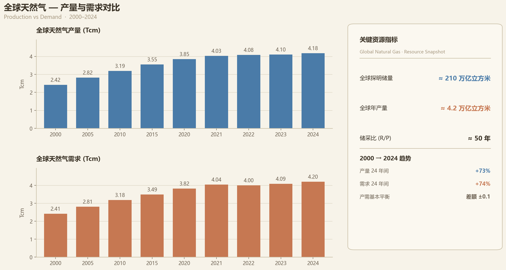

截止目前，天然气开采是否到达瓶颈，增速是否放缓？

并没有，目前全球已探明天然气储量仍然处于历史高位。

| **指标** | **数值** |
|:-----|:-----|
| 全球探明储量 | 约 210 万亿立方米 |
| 全球年产量 | 约 4.2 万亿立方米 |
| 储采比（R/P） | 约 50 年 |

按照目前开采速度，理论上还能开采约 50 年。

---

综上所述可以发现，乙烷和石脑油两者利润差距是 570.75 / 90 = 6.5 倍

这还是正常情况下的利润差距，叠加各国对于乙烷生产乙烯的增长趋势，就会有更多人去投资乙烷裂解装置，这导致石脑油裂解的利润进一步下降，导致石脑油裂解的这种规模缩小，缩小后，丁二烯的供应将会更加紧张，从而推高丁二烯价格，进而影响合成橡胶的价格。

合成橡胶价格上涨变相的再去推动对于天然橡胶的需求，从而导致天然橡胶价格上涨，形成共振效应。
