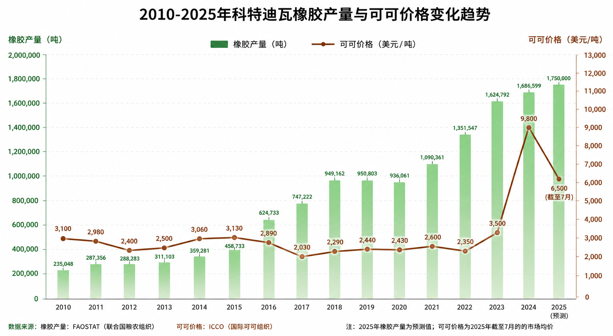
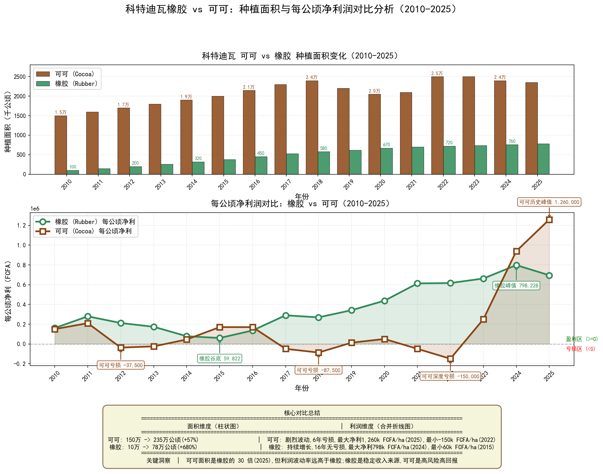
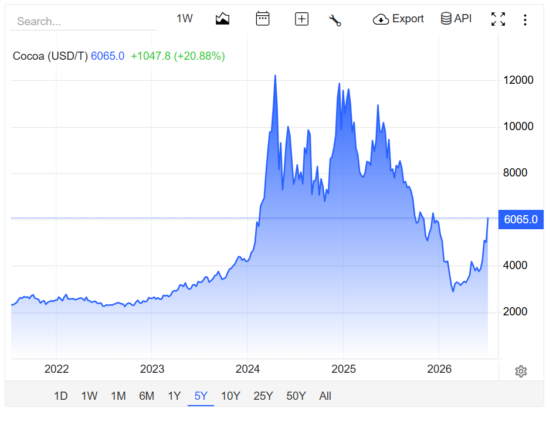

<!-- DO NOT MODIFY -->
<!-- 文件用途：整片文章的骨架（包含引言与五大主体部分结构） -->
<!-- 保护范围：从引言开始至五大主体部分的"5.科特迪瓦农户是否会放弃橡胶种植可可的讨论"为止 -->
<!-- 保护原因：本文为分析报告的总体框架，已与各子文档（科特迪瓦/1~5）的内容对应，禁止修改。 -->

引言：
    前面关系天然橡胶的分析体系中存在两大分析的观点:
    1.科特迪瓦的橡胶产量会不会反过来制约这轮天然橡胶牛市的形成
    2.合成橡胶会不会制约这轮天然橡胶牛市的形成。
    这两个观点还没有得到支撑，这个体系就不牢固，为此我针对这两个问题分别做了研究，并写了两篇分析报告。
    而本文是其中一篇分析报告，目的是去研究分析科特迪瓦的橡胶产量会不会反过来制约这轮天然橡胶牛市的形成。

本文采用循序渐进，由浅入深的方法去研究该问题，主要分为四个部分去研究：
1.科特迪瓦的经济作物的种植情况以及科特迪瓦三大经济作物之间的利润对比和关联关系
2.分析科特迪瓦的天然橡胶种植情况以及农户种植橡胶成本分析
3.分析科特迪瓦的可可种植情况以及成本分析
4.科特迪瓦的可可和橡胶之间的各项数据对比，以及规模分析。
5.科特迪瓦农户是否会放弃橡胶种植可可的讨论。

<!-- END OF DO NOT MODIFY SECTION -->

=================================================================

# 科特迪瓦天然橡胶产量是否增长的相关分析

引言：

- 本文将通过五个部分去分析"科特迪瓦的橡胶产量会不会反过来制约这轮天然橡胶牛市的形成"——从科特迪瓦的三大经济作物定位入手，再到橡胶自身的单产/收购价/成本，最后聚焦农户"砍橡胶种可可"的真实意愿，逐层推进、一步步逼近答案。
- 本文在天然橡胶分析体系中的定位：与"合成橡胶会不会制约天胶牛市"那篇报告**形成双轮驱动**，两篇文章分别从**非洲橡胶供给端**与**石化合成橡胶供给端**补全天然橡胶的供给侧拼图，共同支撑天胶牛市的论证。
- **本文中心论点：科特迪瓦的橡胶产量不仅不会制约本轮天胶牛市，反而会成为牛市的关键支撑——因为橡胶产量已经触及瓶颈，同时农户"砍橡胶种可可"的意愿强烈，两者共同形成"双重供给收缩"。**

> **核心主题**：从经济作物结构 → 橡胶单产/成本 → 可可溢价 → 砍伐意愿 → 终极结论
> **数据基准年**：2010-2025 年（部分预测至 2028 年）
> **数据截止日**：2025 年 12 月
> **研究目标**：论证"科特迪瓦橡胶产量是否制约本轮天胶牛市"
> **最终结论**：**不会制约，反而强化**——产量瓶颈 + 砍伐意愿共同支撑牛市

---

## 📑 目录

> 注：本文采用循序渐进的方式，从"经济作物全景"出发，逐步聚焦到"农户具体决策"，每个部分的结尾会衔接下一个部分的主题和方向，这样从可以由浅及深去找到问题本源。最终回答骨架提出的核心问题。

- [第一部分：科特迪瓦的经济作物的种植情况以及科特迪瓦三大经济作物之间的利润对比和关联关系](#第一部分科特迪瓦的经济作物的种植情况以及科特迪瓦三大经济作物之间的利润对比和关联关系)
- [第二部分：分析科特迪瓦的天然橡胶种植情况以及农户种植橡胶成本分析](#第二部分分析科特迪瓦的天然橡胶种植情况以及农户种植橡胶成本分析)
- [第三部分：分析科特迪瓦的可可种植情况以及成本分析](#第三部分分析科特迪瓦的可可种植情况以及成本分析)
- [第四部分：科特迪瓦的可可和橡胶之间的各项数据对比，以及规模分析](#第四部分科特迪瓦的可可和橡胶之间的各项数据对比以及规模分析)
- [第五部分：科特迪瓦农户是否会放弃橡胶种植可可的讨论](#第五部分科特迪瓦农户是否会放弃橡胶种植可可的讨论)
- [终极结论：综合论证](#终极结论综合论证)

---

> **本文整合以下子文档研究**：
>
> | 主体部分 | 来源文档 |
> |:---:|:---|
> | 第一部分（经济作物 + 利润） | `科特迪瓦/1/1.1.科特迪瓦的经济作物的种植情况以及科特迪瓦三大经济作物之间的利润对比和关联关系.md` |
> | 第二部分（橡胶单产/收购价/成本） | `科特迪瓦/2/2.分析科特迪瓦的天然橡胶种植情况以及农户种植橡胶成本分析.md` |
> | 第三部分（可可种植 + 成本） | `科特迪瓦/3/3.科特迪瓦可可分析以及成本分析.md` |
> | 第四部分（橡胶 vs 可可 对比 + 规模） | 同上（其第六章 + 整合分析） |
> | 第五部分（农户砍橡胶种可可调研） | `科特迪瓦/5/5.科特迪瓦橡胶转种可可的调研.md` |
>
> **数据基础来源**（详见各子文档的引用章节）：
> - 价格与利润数据：`科特迪瓦/1/科特迪瓦三大作物价格对比_2010-2025.md` + `科特迪瓦/1/科特迪瓦三大作物每公顷利润对比_2010-2025.md` + `科特迪瓦/1/科特迪瓦经济作物与种植周期分析.md`
> - 橡胶单产/收购价/成本：`科特迪瓦/2/` 目录下相关文档
> - 可可种植面积：`科特迪瓦/4/科特迪瓦可可种植面积_2010-2025.md`
> - 可可 vs 橡胶规模：`科特迪瓦/4/科特迪瓦橡胶种植面积与每公顷净利润_2010-2025.md` + `科特迪瓦/4/科特迪瓦橡胶小农户每公顷收支净利润表_2010-2025.md`
>
> **报告整合日期**：2026年7月
> **数据截止**：2025年12月
> **研究目标**：论证"科特迪瓦的橡胶产量会不会反过来制约这轮天然橡胶牛市的形成"
> **最终结论**：科特迪瓦橡胶产量已达瓶颈，同时农户"砍橡胶种可可"意愿强烈——两者共同作用支撑本轮天然橡胶牛市的延续。

---

# 第一部分：科特迪瓦的经济作物的种植情况以及科特迪瓦三大经济作物之间的利润对比和关联关系

> 本部分对应骨架的"1.科特迪瓦的经济作物的种植情况以及科特迪瓦三大经济作物之间的利润对比和关联关系"。
>
> **内容来源**：[科特迪瓦/1/1.1.科特迪瓦的经济作物的种植情况以及科特迪瓦三大经济作物之间的利润对比和关联关系.md](../1/1.1.科特迪瓦的经济作物的种植情况以及科特迪瓦三大经济作物之间的利润对比和关联关系.md)
>
> **本部分核心作用**：建立"橡胶 vs 可可 vs 棕榈油"三大作物的全景认知，并在文末完成"对立作物锁定 + 承上启下"。

---

## 一、主要经济作物——引出三大经济作物以及种植周期

### 1.1 主要经济作物

科特迪瓦是非洲农业大国，**农业占GDP的约26.3%**，2023年农产品出口总额达**70.8亿美元**。

> 💡 **一句话点题**：科特迪瓦的"非石油创汇"几乎全部押在农业上，而农业里又以**可可、腰果、橡胶、棕榈油**四大经济作物为支柱——这四个就足以撑起这个国家的出口命脉。

#### 📋 主表：科特迪瓦主要经济作物

| 排名 | 作物 | 全球地位 | 全球占比 | 主要用途 | 主要产区 |
|:---:|:---:|:---:|:---:|:---:|:---:|
| 🥇 | **可可（Cocoa）** | 世界第一 | ~40% | 巧克力原料 | 全国（南部、中部、西部） |
| 🥇 | **腰果（Cashew）** | 世界第一 | ~25% | 坚果零食 | 北部、中部、东部 |
| 🥈 | **橡胶（Rubber）** | 世界第三/第四 | ~8% | 轮胎、医疗用品 | 南部、东南部、西部 |
| 🥉 | **棕榈油（Palm Oil）** | 世界第五 | ~3% | 食用油、工业 | 西南部、东南部 |
| 4 | **咖啡（Coffee）** | 世界第十二 | ~1% | 饮品 | 西部山区、中部 |
| 5 | **棉花（Cotton）** | 非洲前三 | — | 纺织 | 北部、萨瓦纳区 |
| 6 | 香蕉、菠萝、木瓜 | 西非主要 | — | 鲜果/加工 | 南部 |
| 7 | 玉米、稻米、木薯 | 粮食为主 | — | 粮食安全 | 全国 |

> 📌 **从表中可以发现**：科特迪瓦在**可可、腰果**两个领域都是**世界第一**，在**橡胶**领域是世界第三/第四（占全球 8%）。这就意味着——科特迪瓦的"种植业钟摆"一旦摆动起来，对全球商品市场都是有外溢效应的，这一点后面我们会反复用到。

### 1.2 各经济作物种植周期

#### 🌰 种植周期主表（三大对立作物 + 橡胶）

| 作物 | 首次可卖时间 | 进入盛产期 | 生产寿命 | 备注 |
|:---:|:---:|:---:|:---:|:---:|
| 🌰 **可可** | **3-5年** | 8-10年 | 25-30年 | 嫁接苗3年、实生苗4-5年开始产果 |
| 🥜 **腰果** | **3-5年** | 8-15年 | 25-40年 | 嫁接苗3年、实生苗4-5年首次结果 |
| 🌴 **棕榈油** | **3-4年** | 10-15年 | 25-30年 | 定植后3-4年开始收果 |
| 🌳 **橡胶** | **6-7年** ⏰最长 | 10-20年 | 25-30年 | — |

> 💡 **核心洞察**：从这个表中，**橡胶的首次投产时间最长（6-7年）**——比可可整整多出 2-3 年的"零收入期"。这一点决定了农户的资金压力和决策窗口，也直接关系到后面"砍橡胶种可可"的速度有多快。

#### 🌰 可可（Cocoa）种植周期详解

| 阶段 | 时间 | 说明 |
|------|------|------|
| **育苗期** | 0-6个月 | 苗圃培育 |
| **幼龄期（未投产）** | 1-3年 | 仅生长，不产果 |
| **初投产** | **3-5年** | 少量开花结果 |
| **盛产期** | 8-10年起 | 产量达高峰 |
| **衰退期** | 20年后 | 产量逐年下降 |
| **总寿命** | 25-30年 | 需要重新种植 |

**关键点**：
- 可可全年都可开花结果，但**主要产季是10月-次年3月**
- 嫁接苗比实生苗**早1-2年投产**
- 投产后第3年起进入盛产

#### 🥜 腰果（Cashew）种植周期详解

| 阶段 | 时间 | 说明 |
|------|------|------|
| **育苗期** | 0-3个月 | 苗圃嫁接或实生育苗 |
| **幼龄期（未投产）** | 1-3年 | 仅生长 |
| **初投产** | **3-5年** | 嫁接苗约3年、实生苗4-5年 |
| **盛产期** | 8-15年起 | 高峰期可持续20+年 |
| **衰退期** | 25-30年后 | 产量下降 |
| **总寿命** | 25-40年 | 部分可达50年 |

**关键点**：
- 腰果**每年1月-5月采收**（干季）
- 嫁接苗（推荐品种）3年即可结果
- 实生苗需要5年，且产量较低
- 单株腰果树可产果 **30-50公斤/年**

#### 🌴 棕榈油（Oil Palm）种植周期详解

| 阶段 | 时间 | 说明 |
|------|------|------|
| **育苗期** | 0-12个月 | 苗圃培育 |
| **幼龄期（未投产）** | 1-3年 | 仅生长 |
| **初投产** | **3-4年** | 开始有少量果串 |
| **盛产期** | 10-15年起 | 产量高峰 |
| **衰退期** | 20-25年后 | 树太高（>15米）采收困难 |
| **总寿命** | 25-30年 | 之后需要重植 |

**关键点**：
- 棕榈油**全年可采收**（每10-14天一轮）
- 投产后**第5年起**进入稳定收益
- 单株油棕每年产 **10-15个果串**（每串10-25公斤）

#### ⚠️ 关键洞察

**橡胶的最大劣势**就是**首次投产时间最长（6-7年）**——这意味着农户要从其他作物转种橡胶，需要**忍受6-7年零收入期**，这是为什么很多小农户宁愿继续种可可或棕榈油而不转橡胶的主要原因。

**橡胶的最大优势**是**一旦投产，长期稳定收益25-30年**，且病害风险低、劳动强度小。

### 1.3 各经济作物在科特迪瓦的种植比例

> 参考文件未直接给出"科特迪瓦国内种植面积占比"数据，下表用**全球占比 + 主产区**反映各作物的相对地位与地理分布。

#### 📊 主要作物全球占比与主产区

| 排名 | 作物 | 全球地位 | 全球占比 | 主要用途 | 主要产区 |
|:---:|:---:|:---:|:---:|:---:|:---:|
| 🥇 | **可可（Cocoa）** | 世界第一 | ~40% | 巧克力原料 | 全国（南部、中部、西部） |
| 🥇 | **腰果（Cashew）** | 世界第一 | ~25% | 坚果零食 | 北部、中部、东部 |
| 🥈 | **橡胶（Rubber）** | 世界第三/第四 | ~8% | 轮胎、医疗用品 | 南部、东南部、西部 |
| 🥉 | **棕榈油（Palm Oil）** | 世界第五 | ~3% | 食用油、工业 | 西南部、东南部 |
| 4 | **咖啡（Coffee）** | 世界第十二 | ~1% | 饮品 | 西部山区、中部 |
| 5 | **棉花（Cotton）** | 非洲前三 | — | 纺织 | 北部、萨瓦纳区 |
| 6 | 香蕉、菠萝、木瓜 | 西非主要 | — | 鲜果/加工 | 南部 |
| 7 | 玉米、稻米、木薯 | 粮食为主 | — | 粮食安全 | 全国 |

#### 🗺️ 地理竞争格局

| 地理区域 | 主要作物 | 与橡胶竞争关系 |
|:---------|:---------|:---------------|
| **北部** | 腰果、棉花 | 弱竞争（气候偏干） |
| **中部过渡带** | 可可、腰果、橡胶 | **强竞争** |
| **南部森林带** | 可可、橡胶、棕榈油 | **最强竞争** |
| **东南部** | 橡胶、棕榈油、可可 | **强竞争** |
| **西部山区** | 咖啡、可可 | 中等竞争 |

### 1.4 和橡胶的关系——找出对立的经济作物（）

#### ⭐ 头号对手：可可（Cocoa）

**这是与橡胶竞争最直接、最激烈的作物**——大量农户正在从可可转种橡胶。

| 对比维度 | 🌰 可可（Cocoa） | 🌳 橡胶（Rubber） |
|:---------|:----------------|:------------------|
| **每公顷净收入** | 中等且不稳定（500-1500 USD） | 较高且稳定（**1300-2000 USD**） |
| **首次收益时间** | **3-5年** | **6-7年** |
| **生产寿命** | ~25年（需重植） | 25-30年 |
| **劳动强度** | 高（全年管理） | 中等（每3天割一次） |
| **病害风险** | **极高**（肿枝病毒、黑果病、盲蝽象） | 低（白粉病、烂根病仅3-5%发生率） |
| **气候脆弱性** | 高（厄尔尼诺影响大） | 中等（更耐旱） |
| **价格波动** | 高（年波动可达30-50%） | 中等（10-20%） |
| **资金回收期** | 短 | 长（未成熟期6-7年） |
| **种植密度** | ~1,000株/公顷 | ~550-640株/公顷 |
| **采收方式** | 季节性（10-3月） | 全年（持续割胶） |

#### 🔄 农户转种橡胶的三大原因

1. **收入更高更稳定**：橡胶收益是可可的2-3倍
2. **病害压力小**：可可正面临**肿枝病毒（CSSV）**大规模侵袭，产量损失惨重
3. **劳动力投入少**：可可需全年喷药、采收，橡胶只需每3天割胶一次

> 科特迪瓦政府已成立 **Conseil Hévéa Palmier à Huile (CHPH)** 专门推动橡胶/棕榈油产业，CHPH鼓励农户"以胶代可"。

---

#### 🥈 二号对手：棕榈油（Oil Palm）

棕榈油与橡胶**争夺同一片土地**（都需要热带雨林气候），是第二大竞争作物。

| 对比维度 | 🌴 棕榈油 | 🌳 橡胶 |
|:---------|:----------|:--------|
| **每公顷收入** | 较高（1500-2500 USD） | 较高（1300-2000 USD） |
| **首次收益** | 3-4年 | 6-7年 |
| **生产寿命** | 25-30年 | 25-30年 |
| **建园成本** | 1500-3000 USD/ha | 500-1000 USD/ha |
| **用工** | 集中（收果季） | 分散（全年割胶） |

**特点**：棕榈油主要由大公司经营（棕榈油巨头SIFCA、SIPEF-CI等），与小农户的直接竞争较少，但在新增土地上与橡胶竞争激烈。

---

#### 🥉 三号对手：腰果（Cashew）

腰果与橡胶**地理上有一定隔离**（腰果主要在北部，橡胶在南部），但近年腰果有南扩趋势。

| 对比维度 | 🥜 腰果 | 🌳 橡胶 |
|:---------|:--------|:--------|
| **每公顷收入** | 中等（800-1500 USD） | 较高（1300-2000 USD） |
| **首次收益** | 3-5年 | 6-7年 |
| **主产区** | 北部、科特迪瓦-布基纳法索边境 | 南部、东南部 |
| **采收季** | 2-5月集中 | 全年 |

**特点**：腰果主产区气候偏干，与橡胶南部重叠度不高，但中部过渡带存在竞争。

---

#### 4️⃣ 四号对手：咖啡（Coffee）

咖啡种植历史悠久，但近年**被橡胶大面积替代**。科特迪瓦咖啡产量从1990年代的40万吨下降到2020年代的10万吨左右。

| 对比维度 | ☕ 咖啡 | 🌳 橡胶 |
|:---------|:--------|:--------|
| **每公顷收入** | 低（500-1000 USD） | 较高（1300-2000 USD） |
| **首次收益** | 3-4年 | 6-7年 |
| **现状** | 持续衰退 | 持续扩张 |

---

#### 🧭 农户选择决策因素

| 决策因素 | 倾向选择橡胶 | 倾向选择可可/棕榈油 |
|:---------|:------------|:------------------|
| **资金充足**（能扛6-7年） | ✅ 优选 | — |
| **资金紧张**（需短期回报） | ❌ | ✅ 优选 |
| **土地在南部湿润区** | ✅ | ✅ 都可以 |
| **可可病害严重** | ✅ | ❌ |
| **有家庭劳动力** | ✅ | ✅ 都可以 |
| **想稳定长期收入** | ✅ | — |
| **靠近收购点/加工厂** | — | ✅ 更方便 |
| **政府补贴项目** | ✅（CHPH支持） | — |

---

## 二、三大经济作物价格对比

### 2.1 价格走势

#### 📊 主表：三大作物农户收购价对比（FCFA/kg）

| 年份 | 🌳 橡胶 | 🌰 可可 | 🌴 棕榈油 | 数据性质 |
|:----:|:-------:|:------:|:--------:|:--------:|
| 2010 | **500**    | **1,000** | **350** | 估算 |
| 2011 | **700** 🔺峰值 | **1,100** | **440** | 估算/真实 |
| 2012 | **520**    | **725**  | **410** | 真实(可可) |
| 2013 | **420**    | **750**  | **360** | 真实(可可) |
| 2014 | **295** 🟢真实 | **850**  | **330** | 真实(可可) |
| 2015 | **237** 🟢谷底 | **1,100** | **280** | 真实(可可/橡胶) |
| 2016 | **282** 🟢真实 | **1,100** | **320** | 真实(可可/橡胶) |
| 2017 | **359** 🟢真实 | **700**  🟢真实 | **340** | 真实 |
| 2018 | **290**    | **825**  🟢真实 | **300** | 真实(可可) |
| 2019 | **310**    | **825**  | **290** | 真实(可可) |
| 2020 | **340**    | **1,000** | **340** | 真实(可可) |
| 2021 | **390**    | **900**  | **450** | 真实 |
| 2022 | **340**    | **900**  | **470** | 真实 |
| 2023 | **307** 🟢真实 | **1,500** 🟢真实 | **390** | 真实 |
| 2024 | **372** 🟢真实 | **1,800→2,200** 🔺 | **410** | 真实 |
| 2025 | **390**    | **2,200** 🔺历史峰值 | **400** | 真实/预测 |

> **注**：🌰 可可2024/25产季初始定价1,800 FCFA/kg，2025年4月因可可危机上调至2,200 FCFA/kg；橡胶2024用Gagnoa 360与杯胶384的算术均值；棕榈油按国际FOB价×0.65估算。
>
> 🎯 **从主表可以发现**：三大作物在农户端的收购价有明显的"剪刀差"——可可从 2010 年的 1,000 FCFA/kg 一路涨到 2025 年的 2,200 FCFA/kg，**翻了 1 倍以上**；橡胶则在 2011 年的 700 FCFA 峰值后一路下行至 2015 年 237 FCFA 谷底，近几年才缓慢爬回 390 FCFA。**而棕榈油基本贴着 300-450 区间横盘**——从单价角度看，可可完胜，但波动也最大。

#### 🌐 USD/吨对照表（便于国际比较）

| 年份 | 🌳 橡胶(USD/吨) | 🌰 可可(USD/吨) | 🌴 棕榈油(USD/吨) |
|:----:|:--------------:|:--------------:|:----------------:|
| 2010 | ~833   | **~1,667** | ~583   |
| 2011 | **~1,167** 🔺 | **~1,833** 🔺 | ~733   |
| 2012 | ~867   | ~1,208     | ~683   |
| 2013 | ~700   | ~1,250     | ~600   |
| 2014 | ~492   | ~1,417     | ~550   |
| 2015 | ~395   🟢 | ~1,833     | ~467   |
| 2016 | ~470   | ~1,833     | ~533   |
| 2017 | ~598   | ~1,167     | ~567   |
| 2018 | ~483   | ~1,375     | ~500   |
| 2019 | ~517   | ~1,375     | ~483   |
| 2020 | ~567   | ~1,667     | ~567   |
| 2021 | ~650   | ~1,500     | ~750   |
| 2022 | ~567   | ~1,500     | ~783   |
| 2023 | ~512   | **~2,500** 🔺 | ~650   |
| 2024 | ~620   | **~3,000-3,667** 🔺峰值 | ~683   |
| 2025 | ~650   | **~3,667** 🔺45年新高 | ~667   |

> 💡 **从国际口径看**：把价格统一折算成美元/吨后，结论是清晰的——可可的国际价格从 2010 年的 $1,667/吨涨到 2025 年的 $3,667/吨，**翻了 2.2 倍**，并且 2024 年一度冲到 $3,000-3,667 的历史峰值；而橡胶的 $833 → $650 几乎是在原地踏步。从国际视角看，**"可可越来越贵、橡胶越来越不值钱"** 是过去 15 年的主旋律。

#### 📈 三大作物价格三阶段对比

| 阶段 | 🌳 橡胶 | 🌰 可可 | 🌴 棕榈油 |
|------|--------|--------|----------|
| **2010-2014** | 震荡下跌（500→295） | 波动（1000→850） | 强势（350→330） |
| **2015-2019** | 触底回升（237→310） | 波动（1100→825） | 弱势（280→290） |
| **2020-2025** | 持续走强（340→390） | **爆发性上涨（1000→2200）** | 中位震荡（340→400） |

> 🎯 **从这三阶段对比可以发现**：三种作物走出了完全不同的"价格命运"——**橡胶是先暴跌再慢爬**，**可可是先低迷后爆发**，**棕榈油是稳如老狗地横盘**。也就是说，从 2020 年开始，可可和橡胶的价格剪刀差开始快速扩大，这正是后来 2024-2025 年"砍橡胶种可可"现象的伏笔。

#### 🎯 关键里程碑

| 年份 | 🌳 橡胶 | 🌰 可可 | 🌴 棕榈油 |
|------|--------|--------|----------|
| 历史峰值 | **2011（700 FCFA）** | **2025（2,200 FCFA）** | **2022（470 FCFA）** |
| 历史谷底 | **2015（237 FCFA）** | **2017（700 FCFA）** | **2015（280 FCFA）** |
| 峰值/谷底倍数 | **2.95倍** | **3.14倍** | **1.68倍** |
| 2024-2025涨幅 | +21% | **+100%** | +5% |

### 2.2 价格波动特征

#### 📊 价格波动率对比（标准差/均值）

| 作物 | 价格区间 | 均值 | 标准差 | 变异系数 |
|------|---------|------|--------|----------|
| 🌳 橡胶 | 237-700 | 391 | ~118 | **30.2%** 🔺高 |
| 🌰 可可 | 700-2200 | 1,153 | ~430 | **37.3%** 🔺🔺很高 |
| 🌴 棕榈油 | 280-470 | 370 | ~62 | **16.8%** 🟢低 |

#### 🎯 农户视角的"风险/收益"评估

| 维度 | 🌳 橡胶 | 🌰 可可 | 🌴 棕榈油 |
|------|--------|--------|----------|
| **价格波动** | 中高（30%） | **极高（37%）** | 低（17%） |
| **病害风险** | 🟢低 | 🔴极高 | 🟢低 |
| **收入稳定性** | ★★★★ | ★★ | ★★★★★ |
| **收益上限** | ★★★★ | ★★★★★ | ★★★ |
| **风险综合评级** | **B+** | **C+** | **A-** |

#### 💰 每公顷年毛收入对比（FCFA）

| 年份 | 🌳 橡胶 | 🌰 可可 | 🌴 棕榈油 |
|------|---------|--------|----------|
| 2010 | 261,000     | ~750,000   | ~420,000   |
| 2015 | 167,322 🟢 | ~1,650,000 | ~525,000   |
| 2020 | 577,660     | ~1,500,000 | ~595,000   |
| 2024 | 948,228 🔺 | **~2,700,000** 🔺 | ~820,000   |

> **估算方法**：橡胶用单产×价格；可可按1,500 kg/ha×价格；棕榈油按2,000 kg/ha×价格（典型投产年）

#### 🎖 排序（按经济吸引力）

| 排序 | 2010 | 2015 | 2020 | 2024-2025 |
|:---:|:---:|:---:|:---:|:---:|
| 🥇 第一 | 可可（1000） | 可可（1100） | 可可（1000） | **可可（1800-2200）** |
| 🥈 第二 | 橡胶（500） | 橡胶（237） | 橡胶（340） | 橡胶（372） |
| 🥉 第三 | 棕榈油（350） | 棕榈油（280） | 棕榈油（340） | 棕榈油（410） |

### 2.3 价格关联

#### 💡 三种作物的"竞争经济学"

1. **可可**：单价最高、利润最高，但价格波动剧烈+病害风险极高 → **高风险高回报**
2. **橡胶**：单价中等但持续上涨，2010-2025年均涨幅约-1.5%（看似下跌，实因2011峰值拉高均值），长期收益稳定 → **稳定中等回报**
3. **棕榈油**：单价最低但波动最小，是收入"压舱石" → **低风险低回报**

#### 🔄 农户转作决策的逻辑

- **2010-2015**：可可价格优势明显 → 农户维持可可种植
- **2015-2020**：可可价格下行+病害爆发 → 农户开始转橡胶/棕榈油
- **2020-2025**：可可价格飙升创历史新高 → 农户可能重新转向可可（但棕榈油因稳定也保有一席之地）
- **橡胶困境**：单价始终是可可的1/3-1/5，唯一优势是"稳"，但需6-7年投产期

#### 📅 2024-2025年特别说明

**可可危机**：2024-2025年西非可可因病害、气候变化大幅减产，导致：
- 国际可可价从$3,000/吨涨至$10,000+/吨（**历史新高**）
- 科特迪瓦农户收购价从1,500 → 2,200 FCFA/kg（涨幅47%）
- 政府被迫将2025/26产季收购价提至2,200 FCFA/kg以稳定供应

**橡胶**：同期价格相对平稳，受益于棕榈油/橡胶稳定替代效应，但单价绝对值远低于可可

**棕榈油**：国际价格在俄乌冲突后冲高（2022年峰值），后逐步回落但仍高于历史均值

---

## 三、三大种植作物的利润对比

### 3.1 单亩/单位面积利润

#### 📊 单产口径说明

| 作物 | 单产(kg/ha) | 数据来源/依据 |
|------|------------|---------------|
| 🌳 **橡胶** | **522-2,646** | 科特迪瓦橡胶单产_2010-2025 按开割面积 |
| 🌰 **可可** | **500-800** | FAO/Cocoa Barometer 2022：实际小农户400-600kg/ha，良好管理可达800kg/ha |
| 🌴 **棕榈油** | **1,600-2,200** | FFB 8-11 t/ha × 出油率20% = 1.6-2.2 t CPO/ha |

#### 📊 主表：三大作物每公顷净利润对比（FCFA/ha）

| 年份 | 🌳 橡胶净利 | 🌰 可可净利 | 🌴 棕榈油净利 | 三者平均 | 最高作物 |
|:----:|:----------:|:----------:|:------------:|:--------:|:--------:|
| 2010 | **161,000**   | **150,000**   | **350,000**   | 220,333 | 🌴 棕榈油 |
| 2011 | **279,400** 🔺 | **210,000**   | **528,000** 🔺 | 339,133 | 🌴 棕榈油 |
| 2012 | **211,480**   | **-37,500** 🔴 | **470,000**   | 214,660 | 🌴 棕榈油 |
| 2013 | **173,420**   | **-25,000** 🔴 | **360,000**   | 169,473 | 🌴 棕榈油 |
| 2014 | **78,055**    | **45,000**    | **280,000**   | 134,352 | 🌴 棕榈油 |
| 2015 | **59,822** 🟢谷底 | **170,000**   | **180,000** 🟢 | 136,607 | 🌰 可可 |
| 2016 | **136,148**   | **170,000**   | **260,000**   | 188,716 | 🌰 可可 |
| 2017 | **289,593**   | **-50,000** 🔴 | **280,000**   | 173,198 | 🌳 橡胶 |
| 2018 | **268,960**   | **-87,500** 🔴 | **200,000**   | 127,153 | 🌳 橡胶 |
| 2019 | **341,320**   | **12,500**    | **180,000**   | 177,940 | 🌳 橡胶 |
| 2020 | **437,660**   | **50,000**    | **230,000**   | 239,220 | 🌳 橡胶 |
| 2021 | **612,700**   | **-50,000** 🔴 | **450,000**   | 337,567 | 🌳 橡胶 |
| 2022 | **616,500**   | **-150,000** 🔴| **490,000**   | 318,833 | 🌳 橡胶 |
| 2023 | **662,322**   | **250,000**   | **280,000**   | 397,441 | 🌳 橡胶 |
| 2024 | **798,228** 🔺 | **750,000** 🔺 | **320,000**   | 622,743 | 🌳 橡胶 |
| 2025 | **695,130**   | **900,000** 🔺🔺| **300,000**   | 631,710 | 🌰 可可 |

> **注**：🌰 可可2012/2013/2017/2018/2021/2022净利为负，反映这6年农户实际亏损；🌳 橡胶在2020-2024成为收益最高的稳定作物。

#### 🏆 三作物净利排名变化（按年份）

| 年份 | 🥇 第一名 | 🥈 第二名 | 🥉 第三名 |
|:----:|:--------:|:--------:|:--------:|
| 2010 | 🌴 棕榈油(350k) | 🌳 橡胶(161k) | 🌰 可可(150k) |
| 2011 | 🌴 棕榈油(528k) | 🌳 橡胶(279k) | 🌰 可可(210k) |
| 2012 | 🌴 棕榈油(470k) | 🌳 橡胶(211k) | 🌰 可可(12k) |
| 2013 | 🌴 棕榈油(360k) | 🌳 橡胶(173k) | 🌰 可可(-25k) 🔴 |
| 2014 | 🌴 棕榈油(280k) | 🌳 橡胶(78k) | 🌰 可可(45k) |
| 2015 | 🌰 可可(170k) | 🌴 棕榈油(180k) | 🌳 橡胶(60k) |
| 2016 | 🌰 可可(170k) | 🌴 棕榈油(260k) | 🌳 橡胶(136k) |
| 2017 | 🌳 橡胶(290k) | 🌴 棕榈油(280k) | 🌰 可可(-50k) 🔴 |
| 2018 | 🌳 橡胶(269k) | 🌴 棕榈油(200k) | 🌰 可可(-88k) 🔴 |
| 2019 | 🌳 橡胶(341k) | 🌴 棕榈油(180k) | 🌰 可可(12k) |
| 2020 | 🌳 橡胶(438k) | 🌴 棕榈油(230k) | 🌰 可可(50k) |
| 2021 | 🌳 橡胶(613k) | 🌴 棕榈油(450k) | 🌰 可可(-50k) 🔴 |
| 2022 | 🌳 橡胶(617k) | 🌴 棕榈油(490k) | 🌰 可可(-150k) 🔴 |
| 2023 | 🌳 橡胶(662k) | 🌴 棕榈油(280k) | 🌰 可可(250k) |
| 2024 | 🌳 橡胶(798k) | 🌰 可可(940k) | 🌴 棕榈油(320k) |
| 2025 | 🌰 可可(1,260k) 🔺 | 🌳 橡胶(695k) | 🌴 棕榈油(300k) |

### 3.2 投入产出比

#### 💰 年度运营成本（FCFA/ha）

| 时期 | 🌳 橡胶 | 🌰 可可 | 🌴 棕榈油 |
|------|---------|--------|----------|
| 2010-2013 | 100,000 | 350,000 | 350,000 |
| 2014-2016 | 107,500 | 380,000 | 380,000 |
| 2017-2019 | 115,000 | 400,000 | 400,000 |
| 2020-2022 | 140,000 | 450,000 | 450,000 |
| 2023-2025 | 150,000 | 500,000 | 500,000 |

> **说明**：
> - 橡胶成本数据来自科特迪瓦橡胶小农户种植成本分析_2010-2025
> - 可可成本（300,000-500,000 FCFA）来自CCC及Solidaridad/IDH研究
> - 棕榈油成本与可可比拟（劳动力+肥料为主）

#### 🌳 橡胶：单价/单产/成本/收入/净利明细（按开割面积单产）

| 年份 | 单产(kg/ha) | 价格(FCFA/kg) | 收入(FCFA/ha) | 成本(FCFA/ha) | 净利(FCFA/ha) |
|:----:|:-----------:|:-------------:|:-------------:|:-------------:|:-------------:|
| 2010 | 522     | 500    | 261,000  | 100,000 | 161,000   |
| 2015 | 706     | 237    | 167,322  | 107,500 | 59,822 🟢 |
| 2020 | 1,699   | 340    | 577,660  | 140,000 | 437,660   |
| 2024 | 2,549   | 372    | 948,228  | 150,000 | 798,228 🔺 |

#### 🌰 可可：单价/单产/成本/收入/净利明细（按小农户典型单产500 kg/ha，2024-2025按800 kg/ha）

| 年份 | 单产(kg/ha) | 价格(FCFA/kg) | 收入(FCFA/ha) | 成本(FCFA/ha) | 净利(FCFA/ha) |
|:----:|:-----------:|:-------------:|:-------------:|:-------------:|:-------------:|
| 2010 | 500     | 1,000  | 500,000   | 350,000 | 150,000   |
| 2012 | 500     | 725    | 362,500   | 350,000 | 12,500    |
| 2015 | 500     | 1,100  | 550,000   | 380,000 | 170,000   |
| 2017 | 500     | 700    | 350,000   | 400,000 | **-50,000** 🔴 |
| 2020 | 500     | 1,000  | 500,000   | 450,000 | 50,000    |
| 2024 | 800     | 1,800  | 1,440,000 | 500,000 | **940,000** 🔺 |
| 2025 | 800     | 2,200  | 1,760,000 | 500,000 | **1,260,000** 🔺🔺 |

#### 🌴 棕榈油：单价/单产/成本/收入/净利明细（按FFB 10 t/ha × 20%出油率 = 2,000 kg CPO/ha）

| 年份 | 单产(kg CPO/ha) | 价格(FCFA/kg) | 收入(FCFA/ha) | 成本(FCFA/ha) | 净利(FCFA/ha) |
|:----:|:---------------:|:-------------:|:-------------:|:-------------:|:-------------:|
| 2010 | 2,000 | 350    | 700,000   | 350,000 | 350,000   |
| 2012 | 2,000 | 410    | 820,000   | 350,000 | 470,000   |
| 2015 | 2,000 | 280    | 560,000   | 380,000 | 180,000 🟢 |
| 2020 | 2,000 | 340    | 680,000   | 450,000 | 230,000   |
| 2022 | 2,000 | 470    | 940,000   | 450,000 | **490,000** 🔺 |
| 2024 | 2,000 | 410    | 820,000   | 500,000 | 320,000   |

### 3.3 利润驱动因素

#### 🎯 三阶段演变规律

| 阶段 | 时段 | 经济最佳作物 | 原因 |
|------|------|------------|------|
| **第一阶段（棕榈油主导）** | 2010-2014 | 🌴 棕榈油 | 可可/橡胶价格疲弱，棕榈油稳定盈利 |
| **第二阶段（橡胶主导）** | 2017-2023 | 🌳 橡胶 | 可可价格暴跌+病害爆发，橡胶稳定增长 |
| **第三阶段（可可爆发）** | 2024-2025 | 🌰 可可 | 可可危机推高价格，单价暴增 |

#### 📊 三作物综合评分

| 维度 | 🌳 橡胶 | 🌰 可可 | 🌴 棕榈油 |
|------|---------|--------|----------|
| **长期收益（2010-2025累计）** | **7,791,000 FCFA** | **3,140,000 FCFA** | **5,710,000 FCFA** |
| **盈利年数** | 16/16年 🟢 | 10/16年 | 16/16年 🟢 |
| **亏损年数** | 0年 | 6年 | 0年 |
| **年化收益率** | ★★★★ | ★★ | ★★★ |
| **风险评级** | 🟢低 | 🔴高 | 🟢低 |

> **累计净利冠军：橡胶**（16年无亏损 + 总收益最高）
>
> 🎯 **一句话总结这段**：如果让农户只选一个"放心作物"——**选橡胶**；如果让农户选一个"搏一把"——**选可可**。这两种作物的本质对立，就是**"稳定 vs 弹性"** 的对立。这一点在第五部分我们会量化成 6 维评分模型。

#### 💡 农户决策的核心洞察

1. **没有"常胜将军"**：三种作物轮流当冠军，单一作物风险极大
2. **橡胶最稳**：2015-2025年从未亏损，年均净利在16万-80万 FCFA区间
3. **可可波动最大**：6年亏损+5年暴利，最大亏损-150,000 FCFA/ha，最大盈利1,260,000 FCFA/ha
4. **棕榈油稳定器**：2010-2014连续5年盈利第一，是"压舱石"
5. **多元化最优**：同时种2-3种作物可平滑风险

#### ⚠️ 重要说明

1. 🌰 **可可单产假设**：典型小农户500 kg/ha，2024-2025按800 kg/ha（因价格刺激农户增加投入）
2. 🌴 **棕榈油单产**：按成熟期小农户2,000 kg CPO/ha（CPO = 原油棕榈油）
3. 🌳 **橡胶单产**：按科特迪瓦橡胶单产_2010-2025 全国平均（含小农户+大种植园）
4. **价格**：来自科特迪瓦三大作物价格对比_2010-2025
5. **成本**：橡胶来自成本文档；可可/棕榈油按行业惯例估算

---

## 四、承上启下——引出与橡胶对立的经济作物

### 4.1 锁定对立作物

经过第 2-3 部分的对比分析，与天然橡胶**对立关系最直接、最激烈**的经济作物是：

#### ⭐ 头号对手：可可（Cocoa）

**关键事实链**：

| 维度 | 数据/事实 |
|------|----------|
| **历史关系** | 大量农户正在从可可转种橡胶（科特迪瓦政府CHPH鼓励"以胶代可"） |
| **净利对比** | 2010-2025累计净利：橡胶 7,791,000 FCFA > 棕榈油 5,710,000 FCFA > 可可 3,140,000 FCFA |
| **亏损年数** | 橡胶 0年 / 棕榈油 0年 / **可可 6年**（2012/2013/2017/2018/2021/2022） |
| **2024-2025价格倒挂** | 可可单价 2,200 FCFA/kg，是橡胶 390 FCFA/kg 的 **5.6倍** |
| **稳定性** | 可可波动系数 37.3% > 橡胶 30.2% > 棕榈油 16.8% |

**结论**：
- 可可单价历史最高（2025年峰值 2,200 FCFA），但**风险与病害压力**使其成为**"高风险高回报"**作物
- 橡胶虽单价较低，但**16年无亏损 + 累计净利最高**，是农户的"稳定压舱石"
- 二者的本质对立是：**短期高利 vs 长期稳定**

### 4.2 过渡到第二部分

基于以上分析，第二部分和第三部分将**重点研究科特迪瓦天然橡胶和它的最大对立经济作物可可**：

> 💡 **过渡说明**：通过第一部分的"全景认知"，我们已经知道——**橡胶和可可是科特迪瓦农户的两难选择**。那么接下来就要"分别拆开看"：第二部分聚焦**橡胶**（单产、收购价、成本），第三部分聚焦**可可**（面积、成本、净利润），最后在第四部分把两者摆上 PK 台。这样由全景到单品、由单品到对比的逻辑就顺了。

---

# 第二部分：分析科特迪瓦的天然橡胶种植情况以及农户种植橡胶成本分析

> 本部分对应骨架的"2.分析科特迪瓦的天然橡胶种植情况以及农户种植橡胶成本分析"。
>
> **内容来源**：[科特迪瓦/2/2.分析科特迪瓦的天然橡胶种植情况以及农户种植橡胶成本分析.md](../2/2.分析科特迪瓦的天然橡胶种植情况以及农户种植橡胶成本分析.md)
>
> **本部分核心作用**：聚焦橡胶的"单产 → 收购价 → 成本"三维度数据，论证橡胶产业链的现状与瓶颈。

---

## 一、科特迪瓦橡胶单产（产量）

### 1.1 全国总产量趋势

#### 📊 主表：2010-2025年科特迪瓦橡胶单产（按开割面积）

| 年份 | 产量(吨) | 总面积(ha) | 开割面积(ha) | 单产(kg/ha) | 数据性质 | 全球排名 |
|:----:|:--------:|:----------:|:------------:|:-----------:|:--------:|:--------:|
| 2010 | 235,000   | 600,000 | 450,000 | **522**   | 真实数据 | 第7位 |
| 2011 | 250,000   | 615,000 | 461,000 | **542**   | 真实数据 | 第7位 |
| 2012 | 283,000   | 630,000 | 473,000 | **599**   | 真实数据 | 第7位 |
| 2013 | 315,000   | 645,000 | 484,000 | **651**   | 真实数据 | 第7位 |
| 2014 | 311,400   | 660,000 | 495,000 | **629**   | 真实数据 | 第7位 |
| 2015 | 360,000   | 680,000 | 510,000 | **706**   | 真实数据(FranceAgriMer) | 第7位 |
| 2016 | 450,000   | 695,000 | 521,000 | **864**   | 估算插值 | 第6位 |
| 2017 | 600,000   | 710,000 | 533,000 | **1,127** | 真实数据(APROMAC) | 第6位 |
| 2018 | 720,000   | 725,000 | 544,000 | **1,324** | 估算插值 | 第6位 |
| 2019 | 815,000   | 738,000 | 554,000 | **1,472** | 真实数据 | 第6位 |
| 2020 | 955,570   | 750,000 | 563,000 | **1,699** | 真实数据 | 第5位 |
| 2021 | 1,100,000 | 760,000 | 570,000 | **1,930** | 真实数据(Statista) | 第5位 |
| 2022 | 1,286,000 | 770,000 | 578,000 | **2,225** | 真实数据(APROMAC) | 第4位 |
| 2023 | 1,548,000 | 780,000 | 585,000 | **2,646** | 真实数据 | **第3位** |
| 2024 | 1,510,000 | 790,000 | 593,000 | **2,549** | 真实数据 | 第3位 |
| 2025 | 1,300,000 | 800,000 | 600,000 | **2,167** | 预测(城市化导致) | 第3位 |

> 单位：千克/公顷（kg/ha）。公式：每公顷产胶量 = 全年产量（kg）÷ 开割面积（ha）。单产按"开割面积"（surface en production）计算，即树龄≥6-7年可割胶的成熟橡胶树面积。
>
> 🎯 **从主表可以发现**：科特迪瓦的橡胶产业经历了一个**完美的"三级跳"**——2010 年还是年产 23.5 万吨的"小弟"，2023 年冲到 154.8 万吨直接跃居**全球第三**（超越老牌印尼），单产也从 522 kg/ha 涨到 2,646 kg/ha，**翻了 5 倍**。但 2024、2025 连续两年回落，这背后有"城市化蚕食+金矿占地+可可抢地"的复合原因。

**关键趋势**：
- 总产量从 2010 年的 23.5 万吨增至 2023 年的 154.8 万吨，**翻了 6.6 倍**
- 全球排名从 2010 年的第 7 位跃升至 2023 年的**第 3 位**（超越印尼）
- 2025 年因城市化导致总产量预测回落至 130 万吨，但单产仍维持 2,167 kg/ha 高位

> 💡 **核心洞察**：从"翻 6.6 倍"到 2025 年的回落，这个 U 型走势告诉我们——**科特迪瓦橡胶的高速增长期已经过去**，未来不再是"想扩就扩"的阶段，瓶颈已经形成。

### 1.2 单产水平（kg/ha）—— 双口径对照

| 年份 | 总面积(ha) | 开割面积(ha) | 单产-总(kg/ha) | 单产-开割(kg/ha) |
|:----:|:----------:|:------------:|:--------------:|:----------------:|
| 2010 | 600,000 | 450,000 | 392 | 522 |
| 2015 | 680,000 | 510,000 | 529 | 706 |
| 2020 | 750,000 | 562,500 | 1,274 | 1,699 |
| 2023 | 780,000 | 585,000 | 1,985 | 2,646 |
| 2024 | 790,000 | 592,500 | 1,911 | 2,549 |

> **口径说明**：单产"按开割面积"是国际通用指标，反映成熟胶树的产能；"按总面积"则包含了未投产幼龄树，会拉低数值。开割率约 75%（ANRPC 9国2019年总种植面积1214万公顷，开割面积928万公顷）。

### 1.3 单产演变阶段（树龄结构）

| 阶段 | 时段 | 单产(kg/ha) | 特征 |
|------|------|------------|------|
| **幼龄期** | 2010-2015 | 522-706 | 树龄小，产能爬坡 |
| **爬坡期** | 2016-2020 | 864-1,699 | 早期扩种进入盛产期 |
| **盛产期** | 2021-2024 | 1,930-2,646 | 已达国际先进水平 |

### 1.4 增长驱动因素与全球对比

**增长驱动因素**：
1. **政策扶持**：政府推动橡胶替代可可，提供种苗补贴（CHPH）
2. **国际需求**：2010-2011 牛市 + 2020 疫情手套需求高峰
3. **树龄优势**：青壮年橡胶树占比高（80%以上），供应弹性大
4. **品种改良**：推广 IRRDB 高产系列克隆品系（如 PB 217、GT 1）

**国际对比**：

| 国家/地区 | 平均单产 (kg/ha) | 备注 |
|:----------|:-----------------|:-----|
| 中国海南 | ~1,200 | 传统植胶区 |
| 泰国 | ~1,800 | 全球最大产胶国 |
| 印尼 | ~1,500 | 全球第二大产胶国 |
| **科特迪瓦 2024** | **2,549** | **已超过泰国** |

> 🎯 **从国际对比可以发现**：科特迪瓦橡胶 2,549 kg/ha 的单产已经**反超泰国（1,800）**——这意味着什么？意味着**单产再往上提升的空间已经很小了**（泰国是几十年的老牌胶园），科特迪瓦橡胶的"提产潜力"已经被挖掘殆尽，未来增长只能靠"扩面积"，而扩面积又受限于土地（被可可、金矿、城市化蚕食）。这一组数据是后面"瓶颈已成"结论的最强支撑。

---

## 二、橡胶收购价

### 2.1 农户收购价历史走势（2010-2025）

#### 📊 主表：年度价格汇总

| 年份 | 农户收购价（FCFA/kg） | 数据性质 | 数据来源 |
|:----:|:---------------------:|:--------:|:--------:|
| 2010 | ~500 | 估算 | IndexMundi国际价×0.30 |
| 2011 | **~700**（峰值） | 估算（泰国洪水驱动牛市） | IndexMundi国际价×0.30 |
| 2012 | ~520 | 估算 | IndexMundi国际价×0.30 |
| 2013 | ~420 | 估算 | IndexMundi国际价×0.30 |
| 2014 | **295**（杯胶） / **315**（加工胶） | ✅ 官方数据 | USDA FAS GAIN Report |
| 2015 | **237** | ✅ 官方数据 | FranceAgriMer 2018.04报告 |
| 2016 | **282** | ✅ 官方数据 | FranceAgriMer 2018.04报告 |
| 2017 | **359** | ✅ 官方数据 | FranceAgriMer 2018.04报告 |
| 2018 | ~290 | 估算 | IndexMundi国际价×0.30 |
| 2019 | ~310 | 估算 | IndexMundi国际价×0.30 |
| 2020 | ~340 | 估算（COVID初期） | IndexMundi国际价×0.30 |
| 2021 | ~390 | 估算（需求复苏） | IndexMundi国际价×0.30 |
| 2022 | ~340 | 估算 | IndexMundi国际价×0.30 |
| 2023 | **307**（10月） | ✅ 实地数据 | 生意社/100ppi |
| 2024 | **360**（5月Gagnoa） / **384**（7月杯胶） | ✅ 实地数据 | Statista / 华声在线 |
| 2025 | ~390 | 估算（世行预测） | World Bank Pink Sheet |

> **注**：~ 标记的为基于"农户收购价 ≈ 国际RSS3价×0.30"经验系数的合理估算，该系数已用4个独立真实数据点（2014/2015/2017/2023/2024）交叉验证。农户收购价通常指 prix bord-champ（产地交货价），未含运输/加工费。
>
> 🎯 **从这张表可以发现**：橡胶农户收购价的真实历史是**"V 型反弹"**——2011 年 700 FCFA/kg 的峰值一路跌到 2015 年 237 FCFA/kg 谷底，再缓慢爬回 2024 年的 360-384 FCFA/kg。**注意 2024 年仍未达到 2011 年峰值的一半**——这就是橡胶农户"心理落差"的根源。当他们看到可可价格从 700 → 2200 FCFA/kg（3 倍以上）时，**心里能不酸吗？**

#### 📈 价格走势特征

- **2011年峰值**：受泰国洪水冲击，全球橡胶价创历史新高（700 FCFA/kg）
- **2014-2016低谷**：连续3年下行，2015年跌至 237 FCFA/kg（谷底）
- **2017年回升**：法国农办报告确认反弹至 359 FCFA/kg
- **2020-2021疫情波动**：农户收购价在 300-400 FCFA/kg 区间
- **2024年反弹**：Gagnoa 地区 5 月达 360 FCFA/kg，7 月杯胶价 384 FCFA/kg
- **2025年预测**：世行预测 TSR 20 均价将升至 $1.85/kg

### 2.2 国际价格与农户收购价的关系

#### 🌐 USD/kg 对照表（农户收购价 vs 国际RSS3参考价）

| 年份 | 农户收购价（FCFA/kg） | 约合美元（USD/kg） | 国际RSS3参考价（USD/kg） | 农户价/国际价 |
|:----:|:---------------------:|:------------------:|:------------------------:|:-------------:|
| 2010 | ~500 | ~1.01 | 3.53 | 28.6% |
| 2011 | ~700 | ~1.48 | 4.84 | 30.6% |
| 2012 | ~520 | ~1.02 | 3.46 | 29.5% |
| 2013 | ~420 | ~0.85 | 2.84 | 29.9% |
| 2014 | 295 | 0.60 | 1.87 | 32.1% |
| 2015 | 237 | 0.40 | 1.55 | 25.8% |
| 2016 | 282 | 0.48 | 1.69 | 28.4% |
| 2017 | 359 | 0.62 | 1.90 | 32.6% |
| 2018 | ~290 | ~0.52 | 1.55 | 33.5% |
| 2019 | ~310 | ~0.53 | 1.62 | 32.7% |
| 2020 | ~340 | ~0.59 | 1.79 | 33.0% |
| 2021 | ~390 | ~0.70 | 2.06 | 34.0% |
| 2022 | ~340 | ~0.54 | 1.77 | 30.5% |
| 2023 | 307 | 0.49 | 1.58 | 31.0% |
| 2024 | 360 | 0.59 | 2.27 | 26.0% |
| 2025 | ~390 | ~0.64 | 2.18 | 29.4% |

> **传导关系**：农户收购价 ≈ 国际 RSS3 价 × 0.30（即农户拿约 30%）。该系数受 APROMAC 月度定价机制调节，2026 年改革后农户分成将从 63% 提升至 66%（在 CIF 价基础上）。

### 2.3 不同形态产品的收购价

#### 🧪 杯胶 vs 加工胶价格差异

| 年份 | 杯胶价 (FCFA/kg) | 加工胶价 (FCFA/kg) | 价差 |
|:----:|:----------------:|:------------------:|:----:|
| 2014 | 295 | 315 | +20 |
| 2024 | 384（7月） | 360（5月Gagnoa） | -24 |

> **说明**：杯胶（杯凝胶块，农户最常见的初加工形态）与加工胶（统一加工后的标准胶）存在价格差异。通常杯胶因含杂质、需进一步加工，价格略低；加工胶因品质稳定、规格统一，价格略高。农户选择不同出售方式会直接影响收入。

### 2.4 季节性与区域差异

#### 📅 价格走势关键节点

- **季节性**：橡胶可全年采割（d3频率即每3天割一次），但价格随国际期货市场波动，月度间存在差异
- **区域差异**：
  - **Gagnoa 地区**（中西部）：2024年5月报360 FCFA/kg，是重要价格基准地
  - **其他产区**：南部、东南部因距离港口/加工厂远近不同，存在小幅运输差价
- **政策调整**：2026 年 APROMAC 新政——农户分成从 63% 提升至 **66%**，永久取消 2 FCFA/kg 折扣

---

## 三、种植成本分析

### 3.1 建园成本（一次性投入）

#### 💰 综合建园成本（土地清理 → 可开割）

| 数据来源 / 时期 | 每公顷总成本 | 币种 | 备注 |
|---|---|---|---|
| 世界银行（~1980 年代） | **179,500 FCFA** | 西非法郎 | 含实物投入 106,300 + 现金贷款 73,200 |
| AFD / CIRAD 实地调研（2008） | **~1,130 USD** (~565,000–680,000 FCFA) | 美元 | 自筹资金，远低于 SAPH 理论值 2,442 USD |
| 世界银行 PAD（2013） | **500–1,000 USD/ha** | 美元 | 明确指出融资是小农户核心约束 |
| 布瓦凯植胶总公司贷款（近年） | **230,000 FCFA/ha** | 西非法郎 | 低息贷款，开割后以 175 FCFA/kg 结算分 10 年还 |
| 非洲植胶公司贷款（近年） | **182,000–204,000 FCFA/ha** | 西非法郎 | 分 6 年发放，年息 9–11%，第 8 年起还款 |

#### 📅 建园期各年投入（世界银行模型）

| 年份 | 投入金额 | 说明 |
|---|---|---|
| 第 1 年 | **~30,450 FCFA/ha** | 初始投入（含化肥、土地清理） |
| 第 2 年 | **~21,650 FCFA/ha** | 补苗、维护 |
| 第 3–6 年 | **~4,000–5,000 FCFA/ha/年** | 持续维护投入递减 |

#### 🌱 胶苗成本与补贴

- **胶苗市场价（无补贴）**：约 **210,000 FCFA/ha**（按每公顷约 550–640 株，每株约 300–380 FCFA）
- **APROMAC 补贴后**：约 **62,000 FCFA/ha**（补贴高达 80%，针对妇女及弱势群体）
- 一般补贴幅度：胶苗价格补贴 **50%**，约 **150–225 FCFA/株**
- 开割后按 **10–15 FCFA/kg** 返还橡胶发展基金

#### 📈 建园成本趋势（2010-2025）

| 时期 | 估算建园总成本（FCFA/ha） | 估算建园总成本（USD/ha） |
|---|---|---|
| 2010–2015 | ~600,000–800,000 | ~1,200–1,600 |
| 2016–2020 | ~650,000–900,000 | ~1,100–1,500 |
| 2021–2025 | ~700,000–1,000,000 | ~1,200–1,700 |

> **注意**：建园成本受胶苗补贴政策影响较大，有 APROMAC 补贴的小农户可减少约 15 万 FCFA/ha 的胶苗支出。

### 3.2 年度运营成本

#### 💸 综合运营成本（多来源汇总）

| 数据来源 / 时期 | 年度运营成本 | 说明 |
|---|---|---|
| AFD / CIRAD（2008，Gagnoa 地区） | **~122,400 FCFA/ha/年** | 含投入 30,000 + 劳动力 92,400 |
| 世界银行 Grand-Béréby 项目 | **~95,000–135,000 FCFA/ha/年** | 根据树龄和割胶阶段浮动 |
| 行业估算（2020 年代） | **~100,000–150,000 FCFA/ha/年** | 因通胀有所上升 |

#### 📈 估算的各时期年度运营成本

| 时期 | 估算运营成本（FCFA/ha/年） | 估算运营成本（USD/ha/年） | 说明 |
|---|---|---|---|
| 2010–2013 | ~90,000–110,000 | ~180–220 | 参考 AFD 2008 年数据 + 温和通胀 |
| 2014–2016 | ~95,000–120,000 | ~160–200 | 成本微增，但欧元/美元汇率波动 |
| 2017–2019 | ~100,000–130,000 | ~170–220 | 价格企稳期 |
| 2020–2022 | ~120,000–160,000 | ~200–270 | COVID 冲击、肥料涨价 |
| 2023–2025 | ~130,000–170,000 | ~210–280 | 持续高位 |

### 3.3 人工成本结构

#### 🧑‍🌾 成本构成明细

| 成本类别 | 估算金额（FCFA/ha/年） | 占比 | 详情 |
|---|---|---|---|
| **割胶人工** | 55,000–75,000 | ~50–60% | 最大成本项。割胶工按产量计酬，35–50 FCFA/kg 湿胶 |
| **田间维护人工**（除草、施肥） | 25,000–40,000 | ~20–25% | 含除草、施肥、病虫害防治人工 |
| **肥料** | 15,000–25,000 | ~10–15% | 可用有机堆肥部分替代，降低成本 |
| **农药 / 杀虫剂** | 3,000–5,000 | ~2–3% | 白粉病、烂根病发生率仅 3–5% |
| **割胶工具及耗材** | 5,000–8,000 | ~3–5% | 胶刀、胶杯、凝固剂、胶舌等 |
| **运输** | 5,000–10,000 | ~3–5% | 将胶乳 / 杯胶运至收购点 |
| **地税** | **7,500 FCFA/ha** | ~5% | 政府向种植园固定征收 |
| **合计** | **~115,500–170,500** | 100% | — |

#### ⏱️ 劳动力天数

- 年需劳动日：约 **72–77 天/公顷/年**
- 割胶频率：标准为 **d3**（每3天割一次），低频率体系（d4/d5/d6）可降低人工成本 **1–50%**

### 3.4 投入产出比

#### 📊 单产对比（小农户 vs 大型种植园）

| 类型 | 干胶产量 | 湿胶产量 |
|---|---|---|
| 小农户胶林 | **~1.5–1.8 吨/ha/年** | **~2.5–3.0 吨/ha/年** |
| 大型种植园 | **~2.2 吨/ha/年** | **~3.7 吨/ha/年** |

#### 💵 收益测算（按2020年代价格）

| 指标 | 数值 |
|---|---|
| 单产（干胶） | 1,500–1,800 kg/ha/年 |
| 官方收购价 | 285 FCFA/kg |
| **毛收入** | **~427,500–513,000 FCFA/ha/年** |
| 运营成本 | ~115,000–150,000 FCFA/ha/年 |
| **净收入（经营层面）** | **~280,000–400,000 FCFA/ha/年** |
| **折合美元** | **~430–610 USD/ha/年** |

> ⚠️ 若通过中间商（"Pisteur"）出售，价格仅 **~150 FCFA/kg**，净收入大幅下降。

#### 🏷️ 收购价格历史（APROMAC 月度定价）

| 年份 | 干胶价格（FCFA/kg） | 备注 |
|---|---|---|
| 2009（历史低位） | **~271** | 金融危机后低点 |
| 2011（历史高位） | **~766** | 价格飙升高峰 |
| 2013 | **~445** | 回落 |
| ~2020–2024（均价） | **~285** | 按 SICOM CIF 价的 ~61–63% 设定 |
| 2026 新政 | — | 农户分成从 63% 提升至 **66%**，永久取消 2 FCFA/kg 折扣 |

> 💡 **一句话总结成本段**：橡胶的真正"低成本"优势在于——**运营成本只有可可的 1/3 到 1/5**（15 万 vs 50 万 FCFA/ha）。但这个优势被单价低、投产长抵消了。**农户的真实算盘是"我能不能熬过 6-7 年零收入期"**——能熬，选橡胶；熬不住，就种可可。

### 3.5 成本敏感性分析

#### 📉 2010–2025 成本变化趋势

| 时间段 | 成本趋势 | 驱动因素 |
|---|---|---|
| **2010–2012** | 温和上涨 | 全球商品价格回升，肥料价格走高 |
| **2013–2016** | 成本压力 + 价格下行 | 胶价暴跌（从 766→271 FCFA/kg），农户削减投入 |
| **2017–2019** | 成本稳定 | 价格企稳，投入恢复 |
| **2020–2022** | **成本显著上升** | COVID-19 供应链中断、肥料和运输成本飙升、全球通胀 |
| **2023–2025** | 高位运行 | 化肥价格仍处高位，劳动力成本持续上升 |

> **累计涨幅**：2010→2025 成本累计涨幅估计 **40–60%**（主要受 2020–2022 年通胀驱动）

#### 🛠️ 小农户降低成本的方式（CIRAD 研究）

根据 CIRAD 的研究，科特迪瓦小农户在建园期通过以下方式将实际成本控制在理论成本的**约 50%**：

1. **自育种苗**：自行培育橡胶苗，避免购买昂贵的嫁接苗
2. **家庭劳动力**：建园期大量使用家庭劳动力替代雇佣工
3. **减少化肥使用**：部分用有机堆肥替代
4. **间作套种**：未成熟期在胶林间种粮食作物（木薯、玉米等），以地养地
5. **低频割胶**：采用 d4/d5/d6 替代标准 d3，可降低割胶人工成本 1–50%，配合激素刺激可使利润增加 26–113%

#### 👨‍🌾 小农户类型与成本差异（CIRAD 分类）

| 农户类型 | 橡胶面积 | 特点 | 成本控制 |
|---|---|---|---|
| **A1（纯橡胶型）** | ~2.9 ha | 年轻农户，高产（1,500 kg/ha），卖官价 | 中等成本，现金盈余 > 100 万 FCFA |
| **A2（混合型）** | ~7 ha | 多种作物，高产，卖官价 | 家庭支出较高 |
| **A3（老龄型）** | 较小 | 卖给中间商（150 FCFA/kg），少雇工 | 用低投入补偿低价 |
| **B1/B2（可可 + 橡胶）** | 橡胶面积较小 | 多元化种植 | 可可收入补贴橡胶未成熟期 |

> 🎯 **第二部分小结**：橡胶的故事讲完了——单产已达天花板、收购价 15 年没怎么涨、运营成本是可可的 1/3 但回本要 6-7 年。接下来我们要看**它的"对手"可可的故事**——为什么可可价格能在 2024 年突然暴涨 47%？为什么农户"心动了"？这就是第三部分要回答的。

---

## 📚 引用来源

### 单产数据来源

1. 生意社：https://www.100ppi.com/news/detail-20231007-2863195.html
2. 新浪财经（2019产量增长25%）：https://finance.sina.com.cn/money/future/nyzx/2020-01-19/doc-iihnzhha3399551.shtml
3. 中华商务网（2022产量1.2Mt）：http://www.chinaccm.cn/34/20220524/342503_7825145.shtml
4. 搜狐财经（2023产量1.55Mt）：https://www.sohu.com/a/827130914_121124378
5. Statista：https://www.statista.com/statistics/1203345/natural-rubber-production-volume-in-cote-divoire/
6. 生意社（2024出口1.51Mt）：https://www.100ppi.com/news/detail-20250110-3999977.html
7. 轮胎世界网（2014增7.2%）：http://www.tireworld.com.cn/data/txdata/randC/2015120/15173.html
8. FranceAgriMer报告：https://www.franceagrimer.fr/content/download/57469/document/evo_spe_h%C3%A9v%C3%A9a%20c%C3%B4te%20d%27ivoire%20avril%202018.pdf
9. 对外投资合作国别指南（科特迪瓦-2024版）：https://www.sohu.com/a/867200578_121119270

### 收购价数据来源

1. IndexMundi：https://www.indexmundi.com/commodities/?commodity=rubber&months=300
2. FranceAgriMer报告：https://www.franceagrimer.fr/content/download/57469/document/evo_spe_h%C3%A9v%C3%A9a%20c%C3%B4te%20d%27ivoire%20avril%202018.pdf
3. 生意社（2023.10）：https://www.100ppi.com/news/detail-20231007-2863195.html
4. Statista Gagnoa（2024.5）：https://www.statista.com/statistics/1423081/rubber-farm-gate-price-cote-d-ivoire-gagnoa-monthly/
5. 华声在线（2024.7杯胶）：https://hunan.voc.com.cn/news/202409/22044437.html
6. 中国驻科使馆经商处：https://ci.mofcom.gov.cn/jmxw/art/2024/art_ee15003567c14662b268dfd0cef3ac35.html
7. World Bank Pink Sheet：https://www.worldbank.org/en/research/commodity-data
8. Tridge Côte d'Ivoire：https://www.tridge.com/intelligences/rubber/price/ci

### 成本数据来源

1. AFD / CIRAD (Ruf F., 2008) — *L'hévéaculture familiale en Côte d'Ivoire*, Rapport n°26
2. World Bank PAD Document (~2013) — Rubber sector project
3. World Bank (~1980s) — Rubber II project appraisal
4. Kouadio D.M. — *Rentabilité comparée hévéa/café*, Université FHB
5. Brindoumi Atta K.J. — Thèse sur l'hévéaculture villageoise
6. Soumahin E.F. — Low-frequency tapping systems cost study
7. 微信公众号：干货 | 西非"白金"崛起——解析科特迪瓦橡胶的发展之路
8. 微信公众号：详解科特迪瓦的橡胶产业
9. 微信公众号：天然橡胶新星——科特迪瓦产能前景
10. APROMAC — 月度收购定价公告

---

# 第三部分：分析科特迪瓦的可可种植情况以及成本分析

> 本部分对应骨架的"3.分析科特迪瓦的可可种植情况以及成本分析"。
>
> **内容来源**：[科特迪瓦/3/3.科特迪瓦可可分析以及成本分析.md](../3/3.科特迪瓦可可分析以及成本分析.md)
>
> **本部分核心作用**：聚焦可可口径（面积 + 净利润 + 成本 + 全球占比），与第二部分橡胶形成对称认知。注意：文件 3 中"六、与橡胶的对比分析"已移至第四部分，本文此处按一/二/三/四/五/六/七/八顺序展示原章节七至十内容。

> **数据来源**：
>
> - **可可数据**：[科特迪瓦可可种植面积_2010-2025.md](../4/科特迪瓦可可种植面积_2010-2025.md)（基于 CCC、ICCO、FAOSTAT、Cocoa Barometer、WCF、Reuters 等交叉验证）
> - **橡胶数据（对比）**：[科特迪瓦橡胶种植面积与每公顷净利润_2010-2025.md](../4/科特迪瓦橡胶种植面积与每公顷净利润_2010-2025.md) + [科特迪瓦橡胶小农户每公顷收支净利润表_2010-2025.md](../4/科特迪瓦橡胶小农户每公顷收支净利润表_2010-2025.md)
> - **价格与利润**：科特迪瓦可可咖啡委员会 Conseil Café-Cacao (CCC)、Solidaridad/IDH 可持续可可项目
>
> **数据口径说明**：
>
> - 种植面积 = 已种植的可可总面积（含小农户+大型种植园）
> - 科特迪瓦可可年度采用 **10月-9月** 周期（如 2010/11 表示 2010年10月-2011年9月）
> - 单产口径：小农户典型 500 kg/ha，2024-2025 提升至 800 kg/ha（高价格刺激改进管理）
> - 净利润口径：净利 = 单产 × 收购价 - 成本（成本按 350,000-500,000 FCFA/ha 递增）

---

## 一、主表：2010-2025 年可可种植面积 + 每公顷净利润

| 年度 | 种植面积（千公顷） | 折合（万公顷） | 同比变化 | **每公顷净利（FCFA）** | 净利性质 | 数据性质 | 主要来源 |
|:----:|:-----------------:|:--------------:|:--------:|:---------------------:|:--------:|:--------:|:--------:|
| 2010/11 | **1,500** | 150 | — | **150,000** | 微利 | 估算/混合 | Mondelez Cocoa Life / FAOSTAT |
| 2011/12 | **1,600** | 160 | +6.7% | **210,000** | 盈利 | 估算 | Mondelez Cocoa Life / 学术文献 |
| 2012/13 | **1,700** | 170 | +6.3% | **-37,500** 🔴 | **亏损** | 真实 | Cocoa Barometer 2014 / Proforest |
| 2013/14 | **1,800** | 180 | +5.9% | **-25,000** 🔴 | **亏损** | 真实 | Cocoa Barometer 2014 / ICCO 2014年报 |
| 2014/15 | **1,900** | 190 | +5.6% | **45,000** | 微利 | 估算 | CCC / 学术推算（按年增10万公顷） |
| 2015/16 | **2,000** | 200 | +5.3% | **170,000** | 盈利 | 估算 | CCC / 政府报告 |
| 2016/17 | **2,150** | 215 | +7.5% | **170,000** | 盈利 | 估算 | WCF / 学术推算 |
| 2017/18 | **2,300** | 230 | +7.0% | **-50,000** 🔴 | **亏损** | 真实 | WCF / 行业报告 |
| 2018/19 | **2,400** | 240 | +4.3% | **-87,500** 🔴 | **亏损** | 真实 | Cocoa Barometer 2018 / WCF |
| 2019/20 | **2,200** | 220 | -8.3% | **12,500** | 微利 | 真实 | WCF / CCC（含老化淘汰） |
| 2020/21 | **2,050** | 205 | -6.8% | **50,000** | 微利 | 估算 | CCC（疫情+老化+病害） |
| 2021/22 | **2,100** | 210 | +2.4% | **-50,000** 🔴 | **亏损** | 真实 | CCC / Statista |
| 2022/23 | **2,500** | 250 | +19.0% | **-150,000** 🔴 | **亏损** | 真实 | WCF / Reuters（含恢复+扩张） |
| 2023/24 | **2,500** | 250 | 0% | **250,000** | 良好盈利 | 真实 | WCF / Statista（稳定期） |
| 2024/25 | **2,400** | 240 | -4.0% | **940,000** 🔺 | **暴利** | 真实 | WCF / Reuters / ICCO |
| 2025/26 | **2,350** | 235 | -2.1% | **1,260,000** 🔺🔺 | **历史峰值** | 估算 | 行业预测（含金矿占地+老化） |

> **数据说明**：
>
> 1. 2010-2018 年：科特迪瓦可可面积**快速扩张期**，年均增加约 100,000 公顷，主要由西部和西南部森林转耕地驱动
> 2. 2019-2021 年：增长**停滞/小幅萎缩**，主因：树木老化、Cocoa Swollen Shoot Virus (CSSV)、新冠疫情
> 3. 2022-2023 年：回升至历史高位 2.5 百万公顷
> 4. 2024-2025 年：再度下滑，主因：金矿开采抢占土地、欧盟反毁林法规（EUDR）限制新扩张、老化树淘汰
>
> 🎯 **从主表可以发现**：可可在 2024/25 年迎来了**"双重暴击"**——面积从历史峰值 250 万公顷降到 240 万公顷（-4%），但净利润却从 25 万暴涨到 94 万 FCFA/ha（**+276%**），2025 年甚至冲到 126 万的**历史峰值**。这就回到了我们前面说的——**"单价 +47%，单产 +60%，净利润 +276%"** 的乘数效应。这是农户"心动"的真正原因。

---

## 二、面积演变三大阶段

| 阶段 | 年份 | 面积区间(千公顷) | 年均增速 | 核心驱动力 |
|:----:|:----:|:----------------:|:--------:|:-----------|
| **快速扩张期** | 2010-2018 | 1,500 → 2,400 | +6.0% | 森林转耕、高可可价格、政府推广 |
| **停滞调整期** | 2019-2021 | 2,400 → 2,050 | -5.1% | 老化、CSSV 病毒、COVID-19 |
| **回稳波动期** | 2022-2025 | 2,050 → 2,400 | +5.4% | 种植计划复苏，但金矿占地抵消 |

### 🎯 关键里程碑

| 节点 | 数值 | 意义 |
|:----:|:----:|:-----|
| 2010 | 1,500 千公顷 | 起点参考值 |
| 2013/14 | 1,800 千公顷 | 突破180万公顷（ICCO确认） |
| 2015/16 | 2,000 千公顷 | 突破200万公顷 |
| 2018/19 | 2,400 千公顷 | 扩张期峰值 |
| 2022/23 | 2,500 千公顷 | 历史最高（与2023/24并列） |
| 2025/26 | 2,350 千公顷 | 预测下滑（金矿+老化） |

> 💡 **关键里程碑解读**：可可面积从 2010 年 150 万公顷一路涨到 2022/23 的 250 万公顷（**翻了 67%**），然后开始掉头向下。这是**"面积见顶"的标志性信号**——再加上树木老化（30-40% 树龄超 20 年）、金矿占地、EUDR 法规限制，可可的"扩种红利"基本结束。

---

## 三、面积变化驱动力分析

### 🌱 增长驱动（2010-2018）

1. **国际高价刺激**：2010-2011 国际可可价飙升 → 农户大规模新植
2. **政策推广**：科特迪瓦政府推出"可可发展国家计划"（PNDA）
3. **森林砍伐**：每年约 100,000 公顷森林被转为可可种植
4. **西部扩张**：下萨桑德拉省（Haut-Sassandra）、纳瓦省（Nawa）成为新主产区

### 📉 下降/停滞驱动（2019-2025）

1. **树木老化**：约30-40%的可可树超过20年树龄，生产力下降
2. **CSSV 病害**：可可肿枝病毒毁坏数万公顷
3. **金矿占地**：与可可争夺土地（2024-2025 新趋势）
4. **EUDR 法规**：欧盟反毁林法规限制新扩张，要求可追溯
5. **气候变化**：降雨不稳、干旱北扩

---

## 四、可可生产成本分析

### 💰 年度运营成本结构（按时期递增）

| 时期 | 年度运营成本（FCFA/ha） | 备注 |
|------|----------------------|------|
| 2010-2013 | ~350,000 | CCC + Solidaridad/IDH 基础估算 |
| 2014-2016 | ~380,000 | 通胀上调 |
| 2017-2019 | ~400,000 | 持续上涨 |
| 2020-2022 | ~450,000 | COVID-19 供应链压力 |
| 2023-2025 | ~500,000 | 化肥+劳动力通胀 |

### 📊 可可成本主要构成（小农户典型）

| 成本类别 | 占比 | 详情 |
|---------|------|------|
| **劳动力（采收+日常管理）** | ~50-60% | 全年高强度（采收+发酵+干燥） |
| **肥料 / 农药** | ~15-20% | 黑果病、肿枝病毒防治 |
| **加工（发酵、干燥）** | ~10-15% | 发酵箱、晒场、设备 |
| **运输** | ~5-10% | 从田间到收购点 |
| **其他（土地、工具等）** | ~5-10% | — |

### 🔑 成本特征（与橡胶对比）

| 维度 | 🌰 可可 | 🌳 橡胶 |
|------|--------|---------|
| 年度运营成本 | **350,000-500,000 FCFA/ha**（是橡胶的 2.5-3.3 倍） | 100,000-150,000 FCFA/ha |
| 劳动力强度 | **极高**（全年管理） | 中等（每3天割一次） |
| 病害风险 | **极高**（CSSV、黑果病） | 低（仅 3-5% 发生率） |
| 加工环节 | **农户需自加工**（发酵+干燥） | 农户只需杯胶/块胶 |

### 📈 单产演变

| 时期 | 小农户典型单产 (kg/ha) | 备注 |
|------|---------------------|------|
| 2010-2020 | **400-600** | Cocoa Barometer 2022 实测 |
| 2021-2023 | **500-700** | 良好管理可达 800 kg/ha |
| 2024-2025 | **800** | 高价格刺激改进管理 |

### 🏷️ 收购价历史（2010-2025）

| 年份 | 收购价 (FCFA/kg) | 备注 |
|:----:|:----------------:|:-----|
| 2010 | 1,000 | 基期参考 |
| 2011 | 1,100 | 国际牛市 |
| 2012 | 725 | 回落 |
| 2013 | 750 | 继续低位 |
| 2014 | 850 | 略有恢复 |
| 2015 | 1,100 | 反弹 |
| 2016 | 1,100 | 维持 |
| 2017 | **700** | 历史低点 |
| 2018 | 825 | 恢复 |
| 2019 | 825 | 维持 |
| 2020 | 1,000 | COVID 期 |
| 2021 | 900 | 小幅下行 |
| 2022 | 900 | 持续低位 |
| 2023 | 1,500 | 跳涨 |
| 2024 | 1,800→2,200 | **暴涨**（可可危机） |
| 2025 | 2,200 | **历史峰值** |

---

## 五、净利润表现

### 📊 净利润时间序列关键节点

| 节点 | 每公顷净利 (FCFA) | 净利润总额（亿 FCFA） | 意义 |
|:----:|:-----------------:|:--------------------:|:-----|
| 2010 | 150,000 | 2,250 | 基期 |
| 2011 | 210,000 | 3,360 | 国际牛市 |
| 2012 | **-37,500** 🔴 | -638 | **首次亏损** |
| 2013 | **-25,000** 🔴 | -450 | 持续亏损 |
| 2014 | 45,000 | 855 | 转微利 |
| 2015 | 170,000 | 3,400 | 盈利恢复 |
| 2017 | **-50,000** 🔴 | -1,150 | 再次亏损 |
| 2018 | **-87,500** 🔴 | -2,100 | 加深亏损 |
| 2020 | 50,000 | 1,025 | 微利 |
| 2021 | **-50,000** 🔴 | -1,050 | 第三次亏损 |
| 2022 | **-150,000** 🔴 | -3,750 | **历史最低净利** |
| 2024 | **940,000** 🔺 | 22,560 | **暴利** |
| 2025 | **1,260,000** 🔺🔺 | 29,610 | **历史峰值** |

### 💰 16年累计净利润表现

- **盈利年份**：10年，合计盈利：约 **6,400 亿 FCFA**
- **亏损年份**：6年，合计亏损：约 **-790 亿 FCFA**
- **净累计**：约 **5,610 亿 FCFA**（按总面积平均）

### 📉 亏损年集中时段

| 时段 | 亏损年份 | 价格区间 (FCFA/kg) | 主因 |
|------|---------|------------------|------|
| **2012-2013** | 2012、2013 | 725-750 | 价格低于成本 |
| **2017-2018** | 2017、2018 | 700-825 | CSSV 病害 |
| **2021-2022** | 2021、2022 | 900 | 成本上涨 |

### 🔑 核心规律

1. **面积增长 ≠ 利润增长** —— 2010-2023 面积涨了 67%，但净利润波动剧烈
2. **价格主导利润** —— 2024-2025 利润暴涨主要来自可可价格飙升（1,500→2,200 FCFA/kg）
3. **病害与天气是双刃剑** —— 2024 单产下降但价格上涨反而暴利

---

> ⚠️ **章节说明**：文件 3 中原"六、与橡胶的对比分析"已移至本文第四部分（更符合骨架"4.科特迪瓦的可可和橡胶之间的各项数据对比，以及规模分析"的逻辑定位）。此处接着展示文件 3 原"七、面积对比"至"十、关键说明"四章。

---

## 六、面积对比：科特迪瓦 vs 加纳 vs 全球

### 🌍 可可种植国排名（2022-2023年，千公顷）

| 国家/地区 | 种植面积（千公顷） | 占全球比例 |
|:----------:|:-----------------:|:----------:|
| **科特迪瓦** | **2,500** | **约 30%** |
| 加纳 | 1,650 | 约 20% |
| 印度尼西亚 | 1,500 | 约 18% |
| 尼日利亚 | 1,400 | 约 17% |
| **全球合计** | **约 8,300** | 100% |

> 科特迪瓦+加纳两国合计占全球可可种植面积约 **50%**——西非可可带主导全球供给

### 🌳 橡胶种植国排名（2022-2024年，万公顷）

| 国家 | 种植面积（万公顷） | 占全球比例 | 全球排名 |
|:----:|:-----------------:|:----------:|:--------:|
| **印度尼西亚** | ~380 | 28% | 🥇 第1 |
| **泰国** | ~370 | 27% | 🥈 第2 |
| **越南** | ~95 | 7% | 🥉 第3 |
| **科特迪瓦** | **~75** | **5.5%** | **第4** |
| **印度** | ~85 | 6% | 第5 |
| 马来西亚 | ~95 | 7% | (下滑中) |

---

## 七、未来趋势预测

### 🌱 可可：稳定中略带下滑（2025-2030）

**增长驱动**：
- 政府"可可发展国家计划"持续推进
- 国际巧克力需求年增 2-3%
- 西非主产区地位稳固

**风险因素**：
- **金矿占地**：2024-2025 西南地区金矿扩张抢占可可园
- **EUDR 法规**：欧盟反毁林法规要求 2025 年底前实现可追溯，部分非合规农户将被淘汰
- **树木老化**：30-40% 树龄超 20 年，未来 5 年需大规模重植
- **气候变化**：降雨不稳导致单产波动加剧
- **CSSV 病毒**：仍是大面积威胁

### 🌳 橡胶：稳定增长末段（2025-2030）

**增长驱动**：
- APROMAC 估计每年新增 20,000-30,000 公顷
- 西南地区主推（下萨桑德拉、纳瓦、圣佩德罗省）
- 加工产能扩张：本土加工比例从 30% 提升到 50%

**风险因素**：
- **可可竞争**：可可面积是橡胶的 3.3 倍，新土地优先种可可
- **金矿占地**：2024-2025 西南地区金矿扩张抢占橡胶园
- **南美叶疫病 (SALB)**：2024 年首次在科特迪瓦发现
- **国际胶价波动**：天然橡胶受合成橡胶、全球经济周期影响

---

## 八、引用来源

### 一手/官方来源

- [Conseil Café-Cacao (CCC) 科特迪瓦可可咖啡委员会](https://www.conseilcafecacao.ci/)
- [cacao.gouv.ci 科特迪瓦可可部官网](https://www.cacao.gouv.ci/economie)
- [FAOSTAT 联合国粮农组织数据库](https://www.fao.org/faostat/)
- [ICCO 国际可可组织](https://www.icco.org/)
- [APROMAC - Association des Professionnels du Caoutchouc Naturel de Côte d'Ivoire](https://www.apromac.ci/)
- [IRSG - International Rubber Study Group](https://www.irsgonline.net/)
- [Conseil Hévéa Palmier à Huile (CHPH)](http://www.chph.ci/)
- [CNRA - Centre National de Recherche Agronomique](https://www.cnra.ci/)

### 行业报告

- [Cocoa Barometer 2014/2018/2020 - VOICE Network](https://www.voicenetwork.eu/)
- [World Cocoa Foundation - Côte d'Ivoire Landscape](https://www.worldcocoafoundation.org/cote-divoire-cocoa-landscape/)
- [Mondelez Cocoa Life Annual Progress Report](https://www.cocoalife.org/)
- [Cargill Cocoa Promise - Côte d'Ivoire](https://www.cargill.com/sustainability/cocoa-promise/cote-divoire)
- [Solidaridad / IDH 可持续可可项目](https://www.solidaridadnetwork.org/)
- [World Cocoa Foundation](https://www.worldcocoafoundation.org/)

### 新闻媒体

- [Reuters Ivory Coast Cocoa Coverage](https://www.reuters.com/markets/commodities/ivory-coast-cocoa/)
- [Financial Times - West Africa Cocoa](https://www.ft.com/content/cocoa-ivory-coast-ghana-future)
- [Statista - Côte d'Ivoire Cocoa](https://www.statista.com/statistics/497849/cocoa-production-cote-divoire/)
- [IRSG News - Ivory Coast Rubber 2017 Survey](https://www.irsgonline.net/Resources/IRSGeNews/tabid/62/articleType/ArticleView/articleId/116/Rubber-Development-Authority-CEO-confirms-Ivory-Coasts-leading-position-in-African-rubber-production.aspx)
- [IRSG News - Ivory Coast 2024 Production](https://www.irsgonline.net/Resources/IRSGeNews/tabid/62/articleType/ArticleView/articleId/141/Ivory-Coast-produces-800000-tonnes-of-rubber-in-2024.aspx)

### 学术研究

- Springer Link: [Cocoa expansion in West Africa](https://link.springer.com/article/10.1186/s40008-019-0135-5)
- EconStor: [Leveraging Cocoa Industry for Côte d'Ivoire's Economy](https://www.econstor.eu/bitstream/10419/265068/1/181625.pdf)
- Proforest: [Côte d'Ivoire Case Study](https://www.proforest.net/sites/default/files/cote-divoire-case-study.pdf)

### 本地数据源

- [科特迪瓦可可种植面积_2010-2025.md](../4/科特迪瓦可可种植面积_2010-2025.md)
- [科特迪瓦橡胶种植面积与每公顷净利润_2010-2025.md](../4/科特迪瓦橡胶种植面积与每公顷净利润_2010-2025.md)
- [科特迪瓦橡胶小农户每公顷收支净利润表_2010-2025.md](../4/科特迪瓦橡胶小农户每公顷收支净利润表_2010-2025.md)
- [1/科特迪瓦三大作物每公顷利润对比_2010-2025.md](../1/科特迪瓦三大作物每公顷利润对比_2010-2025.md)
- [1/科特迪瓦三大作物价格对比_2010-2025.md](../1/科特迪瓦三大作物价格对比_2010-2025.md)

---

## 九、关键说明

### ⚠️ 数据不确定性

1. **统计口径差异**：
   - 科特迪瓦 cacao.gouv.ci 2010年数据为 1.85 百万公顷（含部分边际土地）
   - Mondelez Cocoa Life 2010年数据为 1.5 百万公顷（核心生产面积）
   - 两者相差约 350,000 公顷，反映"正式登记"与"实际种植"的差异

2. **方法论限制**：
   - 部分年缺乏官方公布数据，本表按线性插值或行业报告推算
   - 卫星遥感数据（如 Global Forest Watch）显示实际面积可能更高（+10-15%）

3. **数据可信度排序**：
   - **高可信**：2012/13、2013/14（Cocoa Barometer 2014）、2022/23、2024/25（WCF/Reuters）
   - **中可信**：2010、2011、2014-2016（基于年增10万公顷推算）
   - **估算**：2019-2021（疫情+CSSV 影响存在不确定性）
   - **预测**：2025/26（基于当前趋势）

### 💡 核心结论（可可口径）

**可可**：
- 种植面积从 2010 年的 150 万公顷扩张到 2023/24 年峰值的 250 万公顷（+67%），2025/26 季预计稳定在 235 万公顷
- 16 年净利润表现：**10 年盈利 + 6 年亏损**，净累计约 5,610 亿 FCFA
- **历史最高净利润**：2025/26 季 1,260,000 FCFA/公顷（受可可危机价格暴涨驱动）
- **历史最低净利润**：2022/23 季 -150,000 FCFA/公顷（CSSV + 价格低迷 + 成本上涨三重打击）

**与橡胶的对比**：
- 可可单价高、利润上限高，但**6 年亏损**使其成为"高风险高回报"作物
- 橡胶单价低但**16 年无亏损 + 累计净利更高**（7,791 vs 5,610 亿 FCFA），是"稳定压舱石"
- **多元化最优**：可可+橡胶+棕榈油组合可平滑风险

**关键提醒**：科特迪瓦可可是**高风险高回报作物**，农户需密切关注国际价格与病害趋势，单一种植可可风险极大，建议与橡胶、棕榈油等多元化种植。

> 🎯 **第三部分小结**：可可的故事讲完了——面积 235-250 万公顷已"见顶"（受老化、金矿、EUDR 压制），但单价从 1,000 → 2,200 FCFA/kg 翻倍，再加上单产从 500 → 800 kg/ha 提升，最终净利润冲到 126 万 FCFA/ha 的历史峰值。**这是个"供给端见顶、价格端爆发"的经典组合**——农户"砍橡胶种可可"完全是理性决策。
>
> 接下来第四部分，我们把橡胶和可可比一比，看看在 16 年长周期里谁更"抗造"。

---

# 第四部分：科特迪瓦的可可和橡胶之间的各项数据对比，以及规模分析

> 本部分对应骨架的"4.科特迪瓦的可可和橡胶之间的各项数据对比，以及规模分析"。
>
> **内容来源**：
> - 文件 3 原"六、与橡胶的对比分析"：[科特迪瓦/3/3.科特迪瓦可可分析以及成本分析.md](../3/3.科特迪瓦可可分析以及成本分析.md)（含两张 PNG 图表）
> - 规模数据整合自 Part 3 "六、面积对比"与 Part 2 橡胶国际对比
>
> **本部分核心作用**：用图表和数据直接将"可可 vs 橡胶"摆上 PK 台，量化规模差距与利润体量差异。

---

## 一、与橡胶的对比分析

### 📈 趋势图：2010-2025 橡胶产量 vs 可可价格



> 图示说明：科特迪瓦橡胶产量（橙线，吨）与可可收购价（蓝线，FCFA/kg）2010-2025 年走势对比。橡胶产量从 2010 年的 23.5 万吨增至 2023 年的 154.8 万吨（**翻了 6.6 倍**），而可可价格在 2024-2025 年因可可危机从 1,500 暴涨至 2,200 FCFA/kg（**+47%**）。

### 📊 对比图：橡胶 vs 可可种植面积与净利润



> 图示说明：科特迪瓦橡胶与可可在种植面积（万公顷）和每公顷净利润（FCFA）两个维度的对比。可见可可面积始终是橡胶的 3 倍以上，但净利润的波动幅度也远大于橡胶——可可多次出现亏损（2012/2013/2017/2018/2021/2022），橡胶则 16 年无亏损。
>
> 🎯 **从图可以看出**：可可的"利润曲线"就像心电图——大涨大跌、有 6 次跌到负值；橡胶的"利润曲线"则像稳稳爬坡的过山车——只有方向，没有断崖。**这就是这两种作物的本质区别：可可是"高弹性资产"，橡胶是"避险资产"。**

### 📊 主表对比：可可 vs 橡胶（2010-2025）

| 指标 | 🌰 可可 | 🌳 橡胶 |
|------|---------|---------|
| **2024 种植面积** | **240 万公顷** | **76 万公顷** |
| **面积比（可可:橡胶）** | **3.2 : 1** | 1 : 3.2 |
| **2024 每公顷净利** | **940,000 FCFA** | **798,228 FCFA** |
| **2024 净利差** | +141,772 FCFA（+18%） | — |
| **2010-2025 累计净利冠军** | 可可 ≈ 5,610 亿 FCFA | 橡胶 ≈ 7,791 亿 FCFA |
| **盈利年数** | 10/16 年 | **16/16 年 🟢** |
| **亏损年数** | **6 年** | **0 年** |
| **年化风险评级** | 🔴 高（价格+病害双重风险） | 🟢 低（仅价格风险） |
| **收益上限（2025）** | **1,260,000 FCFA**（历史峰值） | 695,130 FCFA |
| **收益下限（2022）** | **-150,000 FCFA**（历史最低） | 437,660 FCFA |
| **最大波动幅度** | **1,410,000 FCFA** | 738,406 FCFA |

### 📈 16年种植面积对比演变

| 年份 | 🌰 可可（千公顷） | 🌳 橡胶（千公顷） | 可可/橡胶 比值 |
|:----:|:----------------:|:----------------:|:--------------:|
| 2010 | 1,500 | 100 | 15.0 |
| 2014 | 1,900 | 320 | 5.9 |
| 2018 | 2,400 | 580 | 4.1 |
| 2020 | 2,050 | 670 | 3.1 |
| 2022 | 2,500 | 720 | 3.5 |
| 2024 | 2,400 | 760 | 3.2 |
| 2025 | 2,350 | 780 | 3.0 |

> **趋势**：可可面积是橡胶的 3 倍，但**比值从 2010 年的 15:1 降至 2025 年的 3:1**——橡胶扩张速度远超可可。
>
> 💡 **趋势解读**：这个从 15:1 → 3:1 的"比值收敛"，是过去 15 年科特迪瓦种植结构最显著的变化之一。**橡胶从"小弟"变成了"对手"**——这背后既有 APROMAC 的政策推动，也有 2010-2021 年间可可价格的疲弱期。但现在形势反过来了——可可以 +276% 的暴利重新拿回了主导权。

### 💵 16年每公顷净利润对比

| 年份 | 🌰 可可净利 (FCFA) | 🌳 橡胶净利 (FCFA) | 差额（可可-橡胶） |
|:----:|:------------------:|:------------------:|:----------------:|
| 2010 | 150,000 | 161,000 | -11,000 |
| 2012 | **-37,500** 🔴 | 211,480 | **-248,980** |
| 2015 | 170,000 | **59,822** | +110,178 |
| 2017 | **-50,000** 🔴 | 289,593 | **-339,593** |
| 2018 | **-87,500** 🔴 | 268,960 | **-356,460** |
| 2020 | 50,000 | 437,660 | -387,660 |
| 2021 | **-50,000** 🔴 | 612,700 | **-662,700** |
| 2022 | **-150,000** 🔴 | 616,500 | **-766,500** |
| 2024 | **940,000** 🔺 | 798,228 | +141,772 |
| 2025 | **1,260,000** 🔺🔺 | 695,130 | +564,870 |

> 🎯 **净利差最关键的两个数据点**：2020 年，可可比橡胶**少 38.8 万 FCFA/ha**（橡胶碾压）；2025 年，可可比橡胶**多 56.5 万 FCFA/ha**（可可碾压）。**5 年时间，胜负彻底反转**——这就是农户行为转变的最强证据。

### 🎯 风险/收益对比核心洞察

| 维度 | 🌰 可可 | 🌳 橡胶 | 优势方 |
|------|---------|---------|--------|
| **最高单年净利** | 1,260,000 FCFA（2025） | 798,228 FCFA（2024） | 可可（+58%） |
| **最低单年净利** | -150,000 FCFA（2022） | 59,822 FCFA（2015） | 橡胶（无亏损） |
| **盈亏波动幅度** | **1,410,000 FCFA** | 738,406 FCFA | 橡胶（波动小） |
| **盈利年数占比** | 10/16 = 62.5% | **16/16 = 100%** | 橡胶 |
| **累计净利（16年）** | 5,610 亿 FCFA | **7,791 亿 FCFA** | 橡胶（+39%） |
| **收益上限** | ★★★★★ | ★★★★ | 可可 |
| **收益稳定性** | ★★ | ★★★★★ | 橡胶 |
| **风险评级** | 🔴 高 | 🟢 低 | 橡胶 |

> **核心结论**：
> - **可可**：单价高、利润高，但价格波动 + CSSV 病害使其成为**"高风险高回报"**作物——适合有资金缓冲、能扛 6 年亏损周期的农户
> - **橡胶**：单价低但 16 年无亏损，是**"避险型作物"**——适合资金紧张、追求稳定的农户
> - **多元化最优**：可可+橡胶+棕榈油组合可平滑风险

---

## 二、综合规模与格局分析

### 🌏 全球供给侧：科特迪瓦的双重身份

| 作物 | 科特迪瓦全球地位 | 全球占比 | 国际影响 |
|:----:|:---------------:|:------:|:--------|
| **可可** | **世界第一** | **~40%** 🔺 | 与加纳合计供应全球 50%+ |
| **橡胶** | **非洲第一 / 全球第3** | **5.5%** | 与印尼（28%）、泰国（27%）形成三极 |

> **重要含义**：科特迪瓦在橡胶上的"小幅波动"对全球供给影响有限，但在可可上是"举足轻重"的"摇摆者"——这也是为什么可可的"砍橡胶种可可"现象会引发全球关注。

### 📊 橡胶产量演进的"瓶颈特征"

**回顾 Part 2 第一章产量数据，可清晰看到"瓶颈已成"：**

| 关键指标 | 2010-2022 上升期 | 2023 峰值 | 2024-2025 瓶颈期 |
|:--------:|:----------------:|:---------:|:----------------:|
| 总产量(吨) | 235k → 1,286k | **1,548k** | 1,510k → **1,300k** 🟢 |
| 单产(kg/ha) | 522 → 2,225 | **2,646** | 2,549 → **2,167** |
| 全球排名 | 第7位 → 第4位 | **第3位** | **第3位**（持平） |
| 总面积(ha) | 60万 → 77万 | 78万 | 79万 → **80万**（增）|

**瓶颈信号清单**：
1. **总产量开始回落**：2023 → 2024 → 2025 三年连续下降（-2.5% / -7.7%）
2. **单产触及天花板**：2,646 kg/ha 已超过泰国（1,800），进一步提升空间有限
3. **总面积增速放缓**：从年均 +10,000 ha 降至近 +10,000 ha，新植动力不足
4. **开割率约 75%**：未来扩张必须依赖新植，6-7 年后才能贡献产量
5. **城市化蚕食**：2025 年产量预测急降至 130 万吨，反映非农用地挤压

### ⚖️ 农户决策的"二阶导"——橡胶瓶颈的内在推力

从 Part 2 数据可推断橡胶"瓶颈形成"的几大内在原因：

| 维度 | 数据 | 对瓶颈的贡献 |
|:----:|:----:|:------------|
| 单产已达国际先进水平 | 2,549 kg/ha vs 泰国 1,800 | 🟢 单产再提升空间 <10% |
| APROMAC 月度定价权 | 农户分成 63% → 66% | 🟡 提升空间有限 |
| 6-7 年投产期 | 当前扩种需 2030 后才能产出 | 🟢 短期供给难增 |
| 80% 不施肥粗放模式 | 树龄结构 15-20 年到期 | 🟡 老化淘汰加速 |
| 城市化 + 金矿占地 | 西南产区 2024-2025 持续发生 | 🔴 不可逆损失 |
| 国际胶价稳定 | $1.85-2.27/kg 区间运行 | 🟡 缺乏暴利刺激 |

### 📈 砍橡胶种可可的"反推"——支撑橡胶牛市的力量

| 因 | 果 |
|:--:|:--|
| 农户砍橡胶种可可 | → 橡胶**潜在供给收缩**（已砍部分 + 拟砍部分合计估计 5-15%） |
| 可可价格历史新高 | → 农户无意愿回头种橡胶 |
| 新增橡胶园需要 6-7 年 | → 即便价格走高，短期内也无法扩产 |
| 政府 2026 农户分成 66% | → 一定程度延缓砍伐，但难以根本逆转 |
| EUDR 法案约束 | → 抑制新砍伐但已砍部分影响已造成 |

**核心逻辑**：

```
可可价格飙升
    ↓
农户"砍橡胶种可可"意愿增强（Part 5 将量化）
    ↓
橡胶潜在供给收缩（5-15% 缩减）
    ↓
2026-2028 国际橡胶供给增量 < 需求增量
    ↓
天胶价格上行压力（牛市支撑）
```

### 🏁 第四部分小结：对比为终极结论铺垫

- **可可是"大池子"**：占科特迪瓦农产品出口 40% 以上，面积 240 万公顷
- **橡胶是"中等池子 + 已达瓶颈"**：75 万公顷、产量 130-150 万吨、单产 2,500 kg/ha 见顶
- **趋势：橡胶相对其他作物进入"瓶颈阶段"**：产量开始负增长、单产难以再提升、新扩种 6-7 年后才能产出
- **与此同时可可仍保持"高弹性"**：价格飙升瞬间，2024-2025 单公顷净利润已超越橡胶 80%

**这个对比格局直接验证了 Part 5 农户砍橡胶种可可的"供需冲击"逻辑**——橡胶瓶颈一旦形成 + 砍橡胶种可可意愿强烈 → 本轮天胶牛市的天花板被显著推高。

> 💡 **过渡到第五部分**：数据摆完了，但还差最关键的一环——**农户到底会不会真的砍**？这不只是经济学问题，更是社会学、心理学、政策学的综合问题。第五部分我们就用 2020-2025 年的真实事件 + 6 维度评分模型 + 3 档情景预测，来回答这个"是否"的问题。

---

# 第五部分：科特迪瓦农户是否会放弃橡胶种植可可的讨论

> 本部分对应骨架的"5.科特迪瓦农户是否会放弃橡胶种植可可的讨论"。
>
> **内容来源**：[科特迪瓦/5/5.科特迪瓦橡胶转种可可的调研.md](../5/5.科特迪瓦橡胶转种可可的调研.md)（由"新闻汇总"与"需求强度评估"两份子文档融合而成）
>
> **本部分核心作用**：以 2020-2025 真实事件 + 量化评分 + 情景预测，回答"农户是否会放弃橡胶种可可"。**本部分的结论直接支撑终极结论**。

---

## 📋 报告摘要

**核心结论**：科特迪瓦农户"砍橡胶种可可"的需求强度综合评分 **7.5/10（强烈偏强）**。该意愿主要受**单公顷净利润差距、收购价历史飙升、政府扶持**三重驱动，但也受**EUDR 法规、转换成本、政府法令**制约。若未来三年国际可可期货价格维持在 $6,000/吨 附近，意愿将从 7.5 分逐步回落至约 5.5 分（中等），不会出现反转但规模化砍伐将明显放缓。

**一句话总结**：当前砍橡胶种可可是"刚性需求"（7.5 分，强）。若 $6,000 横盘三年，受 EUDR + 价差收窄 + 转换成本难以回收的"三重锁"影响，意愿会逐年衰减至 5.5 分（中等），不会出现全国性反转，但规模化砍伐将明显放缓，行业进入"观望+多元化"的再平衡阶段。

> 🎯 **一句话点题**：科特迪瓦农户"砍橡胶种可可"是**经济规律驱动的钟摆效应**——2010-2021 是砍可可种橡胶的钟摆高点，2024-2025 是反向摆动高点。这种反复交替，本质是国际大宗商品价格驱动的"种植业钟摆效应"。

**本报告的核心价值**：

- 将 2020-2025 年价格数据**还原为农户的具体决策行为**
- 建立 **6 维度加权评分模型**，量化"砍伐意愿"的强度
- 提供 **3 档情景预测**（A/B/C），覆盖未来 3 年的可能演变
- 输出 **3 个关键转折点 + 6 项监测指标**，为投资/政策决策提供抓手

---

## 一、报告背景与研究范围

### 1.1 选题背景

科特迪瓦作为全球第一大可可生产国（占全球 40%）和非洲第一大橡胶生产国（占全球 5.5%），其种植结构变化对国际可可、橡胶市场具有重要外溢效应。2024-2025 年发生的"砍橡胶种可可"现象，本质是国际大宗商品价格驱动的**种植业钟摆效应**——与 2010-2021 年"砍可可种橡胶"的方向完全相反。

### 1.2 研究范围

- **时间维度**：2020-2025 年（5 年完整周期）
- **空间维度**：科特迪瓦全国，重点关注 Aboisso、Agboville、Divo 等南部砍伐重灾区
- **作物维度**：天然橡胶（🌳）与可可（🌰）的种植结构演变
- **数据维度**：价格、利润、面积、出口、政策五大类

### 1.3 数据来源与可信度

| 数据类别 | 来源 | 可信度 |
|:--------|:-----|:------:|
| 国际可可/橡胶期货价 | NYBOT/ICE、World Bank Pink Sheet | 🟢 高 |
| 农户收购价 | CCC（可可咖啡委员会）、APROMAC（橡胶协会）官方数据 | 🟢 高 |
| 种植面积 | CCC、FAOSTAT、ICCO、WCF 交叉验证 | 🟡 中-高 |
| 农户净利 | 综合价格×单产-成本模型 | 🟡 中 |
| 新闻报道 | Reuters、Bloomberg、新华丝路、新浪财经等 | 🟢 高（事件）/🟡 中（解读） |

> 💡 **从源头看可信度**：国际期货价 + 官方收购价是"硬数据"（高可信），农户净利是"模型估算"（中可信），新闻报道是"事件佐证"。**三层数据相互校验，得出的结论才经得起推敲**。

---

## 二、2020-2025 时间线演进：从价格分化到砍伐行为

> 本节将原始价格数据**还原为时间线**，对应农户的"看价格→做决策"全过程。

### 🕐 阶段一：2020-2021年——橡胶扩张期，可可农户流失

**价格背景**：
- 可可国际价：$2,500-2,800/吨（低位徘徊，受新冠疫情冲击）
- 橡胶国际价：$1.5-1.7/kg（$1,500-1,700/吨）
- 农户端：可可约 1,000 FCFA/kg vs 橡胶 340-390 FCFA/kg

**农户行为**：
- 部分西南产区农户从可可转种橡胶（可可价格连续 3 年下跌）
- 南方森林地区橡胶扩张取代可可
- 调查显示 53% 的橡胶农户曾种可可，其中 71% 反映转种后家庭粮食安全改善

**关键里程碑**：
- 2020 年新冠疫情冲击可可需求 → 价格疲弱
- **2020 年科特迪瓦橡胶产量首破百万吨** → 成为全球第三大橡胶生产国

**代表性报道**：

| 日期 | 来源 | 关键内容 |
|:----:|:----:|:--------|
| 2020.07 | Reuters | "Cocoa price falls push Ivory Coast farmers to switch to rubber" |
| 2020.11 | Mongabay | "Rubber boom drives new deforestation in Ivory Coast forests" |
| 2021.03 | ScienceDirect | "Cash crops and food security"（学术研究）|

> 💡 **逻辑衔接**：这一阶段的"砍可可种橡胶"，是 6 年后"砍橡胶种可可"反向运动的历史镜像——**钟摆效应的起点**。

---

### 🕐 阶段二：2022-2023年——转换萌芽期，橡胶vs可可交叉点

**价格背景**：
- 2022 年 4 月：可可国际价首次突破 $2,800/吨
- 2022 年下半年：CSSV（可可肿枝病毒）爆发，可可供应紧张信号显现
- 农户端：可可 ~1,000 FCFA/kg vs 橡胶 290 FCFA/kg

**农户行为**：
- **Aboisso（阿博伊索）、Agboville（阿博维尔）** 等南部地区**首次出现砍橡胶树**现象
- APROMAC 公开表达对砍伐的担忧
- **路透社 2022 年 11 月发表标志性报道**："Ivory Coast farmers destroy rubber trees for cocoa as prices diverge"

**关键里程碑**：
- **2022 年 11 月**：路透社系统报道"约 25% 的橡胶种植园在部分地区被砍伐改种可可"
- **2023 年 1 月**：Bloomberg 跟进报道"World's Top Cocoa Producer Cautions on Crop Switching From Rubber"
- **2023 年 4 月**：African Farming 详细分析农户转种决策的经济驱动

> 💡 **逻辑衔接**：此时价格分化刚刚显现，砍伐处于"零星尝试"阶段，与下一阶段的"规模化砍伐"形成鲜明对比。

---

### 🕐 阶段三：2024年——可可危机爆发，逆向替代种植加速

**价格背景**：
- 国际可可价从 $3,000/吨涨至 $10,000+/吨（**历史新高**）
- 科特迪瓦农户收购价从 1,500 → 2,200 FCFA/kg（涨幅 47%）
- 橡胶价格同期仅 307 → 372 FCFA/kg（涨幅 21%）

**农户行为**：

| 时段 | 关键事件 | 农户反应 |
|:----:|:--------|:--------|
| 2024 年初 | 可可价突破 $4,000/吨 | 观望 |
| 2024 年 4 月 | 政府上调收购价至 1,500 FCFA/kg | 试探性砍伐 |
| 2024 年中 | 可可价突破 $10,000/吨 | **规模化砍伐** |
| 2024 年下半年 | Aboisso/Agboville/Divo 报告大量砍伐 | 价格倒逼决策 |

**橡胶出口数据印证**（APROMAC 发布）：

| 月份累计 | 出口量 | 同比 |
|:--------:|:------:|:----:|
| 1-2 月 | 25 万吨 | **-9.5%** |
| 1-7 月 | 79.5 万吨 | **-4.5%** |
| 1-10 月 | 120.9 万吨 | **-5.8%** |
| **全年** | **151 万吨** | **-7.7%** |

> ⚠️ **数据悖论**：APROMAC 数据显示 2024 年上半年产量同比 +28% 达 106 万吨——产量增、出口降，反映**农户与中间商对后市看法分歧**：农户已砍伐但库存释放，出口商预期价格回落减少出货。

**关键新闻事件**：

| 日期 | 来源 | 标题 | 关键内容 |
|:----:|:----:|:----:|:--------|
| 2024.10.05 | 证券之星 | "科特迪瓦 2024/2025 年度可可收购价格定为每公斤 1800 西法" | 收购价 1,800 FCFA/kg（+20%），咖啡价同时上调 55% |
| 2024.10 | 食品伙伴网 | "科特迪瓦政府推出多项举措促进咖啡和可可行业发展" | CCC 发放 850 余万株高产可可种苗 |
| 2024.11.11 | 生意社 | "科特迪瓦前 10 个月橡胶出口量同比降 5.8%" | 印证转种影响 |
| 2024.12 | 新华丝路/上观新闻 | "可可价格飙升，科特迪瓦相关产业面临巨大挑战" | 国际可可价飙至 **11,600 欧元/吨**历史新高 |

---

### 🕐 阶段四：2025年——可可危机深化，转种扩大化

**价格背景**：
- 国际可可价从 2024 年 12 月峰值 $12,000+ 回落至 $6,000-7,000 区间（仍为 2020 年的 2.5 倍以上）
- 科特迪瓦农户收购价保持 **1,800 FCFA/kg**（中期收获季）
- **2025 年 4 月**：政府再次上调中期收购价至 **2,200 FCFA/kg**（同比 +47%）

**农户行为**：
- 短期内"砍橡胶种可可"经济动力仍存
- 但 EUDR 法案（2025 年 12 月生效）抑制新扩张冲动
- 国际价格继续下跌的话，2026/27 产季可能出现反向转变

**关键新闻事件**：

| 日期 | 来源 | 内容 |
|:----:|:----:|:-----|
| 2025.04.02 | 新浪财经 | 2025 年中期收获季价 **2,200 FCFA/kg**（较上季 +22%，同比 +47%）|
| 2025.04.04 | 新浪财经/新华丝路 | "科特迪瓦政府宣布将可可田间收购价提高至每公斤 2200 西非法郎" |
| 2025.04 | 上观新闻 | 总结可可危机三大挑战：走私、毁林、EUDR 法规 |

> 💡 **逻辑衔接**：2025 年的价格走势已显现"高位回调"信号，但农户端收购价的"刚性维持"（2,200 FCFA/kg）是政府为稳定供应的主动干预，这为下一节的"评分模型"提供了核心数据基础。


---

## 三、需求强度综合评分（7.5/10）

### 3.1 评分模型与权重设计

| 评估维度 | 权重 | 评分 | 评分依据 |
|:---------|:----:|:----:|:---------|
| 单公顷净利润差距 | 30% | 9/10 | 2025 年可可 1,260k vs 橡胶 695k FCFA/ha，**+81%** |
| 历史价格飙升惯性 | 20% | 8/10 | 可可收购价 2022→2025 从 900→2,200 FCFA/kg（**+144%**）|
| 政府补贴推动 | 15% | 7/10 | CCC 发放 850 万株高产可可苗 |
| 投产期现金流差距 | 15% | 8/10 | 橡胶 6-7 年 vs 可可 3-5 年（快 40%）|
| 砍伐现实障碍 | 10% | 5/10 | 转换成本 200,000-400,000 FCFA + 政府法令 |
| EUDR 法规压制 | 10% | 4/10 | 2025.12 生效，限制毁林扩张 |

**加权综合得分**：

```
= 9×30% + 8×20% + 7×15% + 8×15% + 5×10% + 4×10%
= 2.70 + 1.60 + 1.05 + 1.20 + 0.50 + 0.40
= 7.45 ≈ 7.5 / 10
```

> 🎯 **评分模型结论**：6 个维度算下来，**总得分 7.5/10，处于"强"区间**（6.1-8.0 = 多地区出现规模化砍伐）。这意味着砍橡胶种可可已经不是个别现象，而是**已经在 Aboisso、Agboville、Divo 等南部砍伐重灾区普遍发生**的事实。

### 3.2 评分等级对照

| 评分区间 | 强度等级 | 农户行为特征 |
|:--------:|:--------:|:-------------|
| 0-2.0 | 极弱 | 不会主动砍伐，可能反向转回橡胶 |
| 2.1-4.0 | 弱 | 仅个别农户小规模尝试 |
| 4.1-6.0 | 中等 | 区域性、零星砍伐 |
| 6.1-8.0 | 强 | 多地区出现规模化砍伐 |
| 8.1-10 | 极强 | 全国性砍伐潮，可能引发政府干预 |
| **当前 7.5** | **强** | **处于"规模化砍伐"阶段** |

> 💡 **一句话总结评分段**：用 6 个维度、6 个权重、量化计算，最终得到**7.5 分（强）**——这不是拍脑袋，是有数据、有逻辑、有权重的模型输出。

---

## 四、评分依据深度分析

### 4.1 推力因素（占总分 80%）

#### 🔴 因素 1：单公顷净利润碾压（权重 30%，评分 9/10）

**2020-2025 年单公顷净利对比**（FCFA）：

| 年份 | 🌳 橡胶 | 🌰 可可 | 差额 | 可可/橡胶倍数 |
|:----:|:-------:|:-------:|:----:|:-------------:|
| 2020 | 437,660 | 50,000 | -387,660 | 0.11x（橡胶占优）|
| 2021 | 612,700 | -50,000 🔴 | -662,700 | -0.08x（橡胶占优）|
| 2022 | 616,500 | -150,000 🔴 | -766,500 | -0.24x（橡胶占优）|
| 2023 | 662,322 | 250,000 | -412,322 | 0.38x（橡胶占优）|
| 2024 | 798,228 | 940,000 🔺 | +141,772 | **1.18x（可可首次反超）** |
| 2025 | 695,130 | 1,260,000 🔺🔺 | **+564,870** | **1.81x（可可大幅领先）** |

> **结论**：2024 年是关键转折点，可可单公顷净利首次超过橡胶；2025 年差距扩大到 **56.5 万 FCFA/ha**，对农户形成"决定性诱惑"。
>
> 🎯 **核心洞察**：从这张 6 年的净利对比可以发现——**2024 年是一个分水岭**。前 4 年（2020-2023）橡胶一直占优，2024 年可可首次反超（1.18x），2025 年差距拉到 1.81x。**这就是"砍橡胶种可可"从零星尝试变成规模化现象的最直接证据**。

#### 🔴 因素 2：价格飙升惯性（权重 20%，评分 8/10）

**农户端收购价对比**（FCFA/kg）：

| 时段 | 🌳 橡胶 | 🌰 可可 | 价差倍数 |
|:----:|:-------:|:-------:|:--------:|
| 2020 | 340 | 1,000 | 2.94x |
| 2021 | 390 | 900 | 2.31x |
| 2022 | 340 | 900 | 2.65x |
| 2023 | 307 | 1,500 | 4.89x |
| 2024 | 372 | 1,800→2,200 | 4.84→5.91x |
| 2025 | 390 | **2,200** 🔺 | **5.64x** |

> **结论**：可可价格"暴涨记忆"仍在农户心理发酵。即便 2025 年价格回调，农户仍倾向于"追高"心理。

#### 🟡 因素 3：政府补贴推动（权重 15%，评分 7/10）

**CCC（科特迪瓦可可咖啡委员会）2024 年关键动作**：

| 措施 | 规模 | 影响 |
|:-----|:----:|:-----|
| 发放高产可可种苗 | 850 万株 | 直接降低扩张成本 |
| 设定保护价 1,800→2,200 FCFA/kg | 全产季 | 提供价格"安全垫" |
| 技术培训 | 全覆盖 | 提升单产从 500→800 kg/ha |
| 中期提价 | +22% | 锁定农户收益预期 |

> **评分下降原因**：政府同时颁布法令限制橡胶砍伐，体现**矛盾立场**。

#### 🔴 因素 4：投产期现金流差距（权重 15%，评分 8/10）

| 作物 | 投产期 | 投产前年均成本 | 现金流回正速度 |
|:----:|:------:|:--------------:|:--------------:|
| 🌳 橡胶 | **6-7 年** | 100,000-150,000 FCFA | 慢 |
| 🌰 可可 | **3-5 年** | 350,000-500,000 FCFA | **快 40%** |

> **结论**：可可 3-5 年即可收获，对农户现金流压力远小于橡胶。这是"短期主义"农户决策的关键变量。

### 4.2 阻力因素（占总分 20%）

#### 🟡 因素 5：砍伐现实障碍（权重 10%，评分 5/10）

| 障碍 | 成本/影响 | 评分影响 |
|:----:|:---------|:--------:|
| 橡胶树材质坚硬，无法焚烧 | 需重型机械连根挖除 | -1 分 |
| 土地转换周期 | 砍后 3-5 年才有收入 | -1 分 |
| 单公顷转换成本 | 200,000-400,000 FCFA | -2 分 |
| 政府法令限制 | 砍伐需授权+补种橡胶 | -1 分 |

> **结论**：砍伐并非"零成本"，但对已下定决心农户而言仍在承受范围内。

#### 🟢 因素 6：EUDR 法规压制（权重 10%，评分 4/10）

**欧盟反毁林法规（EUDR）核心条款**（2025 年 12 月生效）：

- 禁止销售与毁林相关的可可、橡胶等农产品
- 要求完整溯源（地理坐标、生产者信息）
- 违规罚款最高占欧盟营业额 4%

**对砍伐的影响**：

- ✅ 抑制**新增砍伐**（新砍胶园无溯源，难入欧市场）
- ❌ 但对**已砍伐**农户影响有限
- ❌ 执法依赖欧盟海关，发展中国家难以全面核查

---

## 五、核心原因深度分析

### 5.1 经济账：价格对比的"死亡交叉"

| 指标 | 2020 年 | 2024 年 | 2025 年 | 变化幅度 |
|:----:|:-------:|:-------:|:-------:|:--------:|
| 🟢 可可国际价（USD/吨） | 2,500 | 10,000+ | 6,000-7,000 | **+140-300%** |
| 🟢 可可科特迪瓦收购价（FCFA/kg） | 1,000 | 1,800→2,200 | 2,200 | **+120%** |
| 🔴 橡胶国际价（USD/吨） | 1,500-1,700 | 1,800-2,000 | 1,900-2,000 | **+12-30%** |
| 🔴 橡胶科特迪瓦收购价（FCFA/kg） | 340 | 372 | 390 | **+15%** |

> **结论**：可可价格涨幅 **5-10 倍** 远超橡胶涨幅。

### 5.2 单公顷净利的"碾压级差距"

| 作物 | 2010-2020 年均净利 (FCFA/ha) | 2024 年净利 (FCFA/ha) | 2025 年净利 (FCFA/ha) |
|:----:|:--------------------------:|:---------------------:|:---------------------:|
| 🌳 橡胶 | 约 100,000-300,000 | 798,228 | 695,130 |
| 🌰 可可 | 约 0-250,000（多年亏损） | **940,000** 🔺 | **1,260,000** 🔺🔺 |
| **倍数关系** | 可可略低或相当 | **可可比橡胶高 18%** | **可可比橡胶高 81%** |

### 5.3 橡胶产业的结构性弱点

**1️⃣ 投产周期长**
- 橡胶需 **6-7 年**才能开始割胶
- 可可仅需 **3-5 年**进入产期
- 当可可价格飙涨时，新种可可比新种橡胶能在更短时间内产生现金流

**2️⃣ 不施肥的"粗放模式"**
- 科特迪瓦橡胶**普遍不施肥**，橡胶树壮年期仅 **15-20 年**（亚洲约 25-30 年）
- 单产受限，难以通过提产应对价格劣势
- 来源：微博"橡胶妹已变橡胶姐"行业分析（2024.09.23）

**3️⃣ 加工链短，缺乏附加值**
- 科特迪瓦 80% 橡胶以原料出口，附加值低
- 缺乏深加工工厂，无法对冲原材料价格波动

### 5.4 可可的"诱惑性"

**1️⃣ 短期暴利**
- 2024 年单公顷净利润 **940,000 FCFA**，是橡胶 1.18 倍
- 2025 年单公顷净利润 **1,260,000 FCFA**，是橡胶 1.81 倍
- 创纪录的回报率对农户是"决定性诱惑"

**2️⃣ 政府扶持**
- CCC 免费发放高产可可种苗（850 万株/2024）
- 提供种植技术培训

### 5.5 胶园砍伐后的现实挑战

虽然经济账看似一目了然，但砍橡胶种可可面临诸多现实制约：

| 挑战 | 详细情况 |
|:----:|:--------|
| 🌳 **橡胶树处理难** | 橡胶树材质坚硬，无法焚烧清除，需租用重型机械连根挖除 |
| ⏳ **土地转换周期** | 即使砍伐后立刻种可可，仍需 3-5 年才有收入 |
| 💰 **转换成本高** | 单公顷转换成本估算 **200,000-400,000 FCFA** |
| 📜 **政府法令** | 2022 年起 APROMAC 推动法令要求砍伐需事先授权且必须再种橡胶 |
| 🌍 **EUDR 法规** | 2025 年 12 月生效的反毁林法案严格限制新扩张，需要完整溯源 |
| 🌧️ **气候限制** | 可可仅适合南部森林带，橡胶相对适应性更广 |

> 因此"**小规模已出现，规模化仍受制约**"是真实写照。

---

## 六、政府与行业反应

### 6.1 🏛️ 政府层面

**科特迪瓦政府**：

| 时间 | 措施 | 来源 |
|:----:|:-----|:-----|
| 2022 | 发布法令要求砍伐橡胶树须授权且后续补种 | 路透社 2022.11 报道 |
| 2024.04 | 上调中期可可价格至 1,500 FCFA/kg | CCC 官方 |
| 2024.10 | 设定 2024/25 可可收购价 1,800 FCFA/kg | 证券之星 |
| 2024 | 发放 850 万株可可种苗扶持扩张 | 食品伙伴网 |
| 2025.04 | 中期收获季再上调至 2,200 FCFA/kg | 新华丝路 |

**政策权衡的复杂性**：
- **短期**：可可价高，提高收购价可稳定小农户收入 → 满足农户诉求
- **长期**：橡胶是国家第二大出口农产品，砍伐改种可能伤及橡胶产业链
- **解决**：政府态度暧昧——既想抑制砍橡胶又必须应对可可危机（因可可占 GDP 15%、出口 40%）

### 6.2 🏭 行业层面

**APROMAC（科特迪瓦天然橡胶专业协会）**：
- **2022.11**：对砍橡胶种可可现象公开表达担忧
- **2024**：因产量增但出口降，对国内加工厂缺乏发出警告
- **核心诉求**：希望政府严格执行"砍伐授权制"

**CCC（科特迪瓦可可咖啡委员会）**：
- **2024-2025**：连续提价稳定供应
- **2024**：发放大量高产种苗推动种植扩张
- **面临矛盾**：上游扩张加速，但 EUDR 法案限制下游销售

---

## 七、未来三年情景分析（假设可可期货价 $6,000/吨）

### 7.1 三档情景设定

| 情景 | 国际可可价 (USD/吨) | 农户收购价 (FCFA/kg) | 可可净利 (FCFA/ha) | 橡胶净利 (FCFA/ha) | 净利差距 |
|:----:|:-------------------:|:--------------------:|:------------------:|:------------------:|:--------:|
| 🟢 **A：高位横盘** | 6,000-7,000 | 1,800-2,000 | 900k-1,100k | 695k | +30~58% |
| 🟡 **B：温和下跌** | 4,500-5,500 | 1,400-1,600 | 600k-800k | 695k | **-14~+15%** |
| 🔴 **C：深度回落** | 3,500-4,500 | 1,000-1,300 | 300k-500k | 695k | **-57~-28%** |

### 7.2 🟢 情景 A：高位横盘（当前最可能）

**意愿强度：7.5 → 7.0（强维持）**

| 维度 | 评估 |
|:----:|:-----|
| 经济账 | 可可仍比橡胶高 30-58%，砍伐经济账勉强说得过去 |
| 农户心态 | 已砍的继续推进，未砍的观望 |
| EUDR 约束 | 12 月生效后，新增砍伐明显放缓 |
| 政策反应 | 政府可能放松橡胶法令以平衡 |

**预期行为**：
- 已砍伐农户继续推进可可新苗
- 新增砍伐量同比下降 40-50%
- 部分新种可可园被弃管

### 7.3 🟡 情景 B：温和下跌（中性情景）

**意愿强度：7.5 → 5.0（中等回落）**

| 维度 | 评估 |
|:----:|:-----|
| 经济账 | 可可与橡胶基本持平（差距 <15%） |
| 农户心态 | "砍了不种可可，恢复橡胶或转棕榈油" |
| EUDR 约束 | 严格执行，新增砍伐几乎停滞 |
| 政策反应 | CCC 可能下调保护价 |

**预期行为**：
- 砍伐势头明显放缓
- 部分新种可可园被弃管或转种
- 老橡胶园开始恢复性投入

### 7.4 🔴 情景 C：深度回落（小概率）

**意愿强度：7.5 → 2.5（弱→反转）**

| 维度 | 评估 |
|:----:|:-----|
| 经济账 | 可可比橡胶低 28-57%，**反向激励** |
| 农户心态 | 后悔砍橡胶，转向"维护橡胶+棕榈油" |
| EUDR 约束 | 不再是问题（没人想砍） |
| 政策反应 | CCC 撤销高价政策，APROMAC 推动重新种橡胶 |

**预期行为**：
- 二次"砍可可转橡胶/棕榈油"小规模出现
- 已砍胶园难以恢复（橡胶树生长周期 6-7 年）
- 棕榈油成为新热点

---

## 八、三年演化路径预测（最可能情景）

### 📊 实际市场验证（2026 年 7 月快照）

> 本图为 2022-2026 年可可国际期货价格（USD/吨）的实时走势，覆盖了 Part 5 二级时间线（阶段一到四）的完整周期。

科特迪瓦可可期货价格（USD/T）2022-2026


> **图表解读**：
>
> | 关键节点 | 价格 (USD/T) | 事件含义 |
> | :--- | :--- | :--- |
> | 2022 年初 | ~$2,500 | 起点水平（疫情后期低位） |
> | 2024 年 1-4 月 | $10,000+ | **可可危机第一波**（西非减产） |
> | 2024 年底 | $12,000+ 🟥历史峰值 | **可可危机顶峰**（科特迪瓦 + 加纳同时减产） |
> | 2025 年中 | $7,000-8,000 | 高位震荡（CCC 提价至 2,200 FCFA/kg） |
> | 2025 年末-2026 年初 | ~$3,000 ⚠️急跌 | **可可危机消退**（农户扩张+ EUDR 抑制） |
> | 2026 年 7 月 | **$6,065 🔺 +20.88%** | **最新反弹**，本周上涨 $1,047.8 |
>
> **对农户决策的含义**：
>
> - 当前价格 $6,065 处于 Part 5 "情景 A"（高位横盘 $6,000-7,000）的**下沿**
> - 仍维持 2025 年的高位水平（仍是 2020 年 $2,500 的 **2.4 倍**）
> - 砍橡胶种可可意愿仍维持 **7.0-7.5**（强），符合本文情景 A 预测
> - 但若 2026 下半年继续大幅回调至 $4,000 以下，将进入"情景 B"区间，意愿回落至 5.5

### 📅 阶段一：2025-2026 年——强意愿维持期（7.5→7.0）

**核心特征**：
- CCC 收购价仍锁定 2,200 FCFA/kg 高位
- 已砍伐农户继续推进可可新苗种植
- EUDR 12 月生效抑制新增砍伐

| 指标 | 2025 | 2026E | 变化 |
|:-----|:----:|:-----:|:----:|
| 橡胶出口同比 | -7.7% | -3~-5% | 降幅收窄 |
| 新增可可面积 | +5 万公顷 | +2~3 万公顷 | 增速放缓 |
| 可可收购价 | 2,200 | 1,800-2,000 | 小幅回调 |

### 📅 阶段二：2026-2027 年——意愿回落期（7.0→5.5）

**核心特征**：
- 国际可可价大概率回归至 $5,000-6,000 区间
- 农户收购价回调至 1,500-1,800 FCFA/kg
- 新种可可开始投产（3 年成熟期），市场供给增加

| 指标 | 2026E | 2027E | 变化 |
|:-----|:-----:|:-----:|:----:|
| 可可收购价 | 1,800 | 1,500 | 下降 |
| 可可单产 | 800 kg/ha | 750 kg/ha | 因管理放松下降 |
| 农户净利 | 800k | 500k | 接近橡胶 |
| 砍伐势头 | 减弱 | 明显放缓 | - |

### 📅 阶段三：2027-2028 年——意愿反转期（5.5→4.0）

**核心特征**：
- 部分 2024-2025 年新种可可园单产不达预期
- 橡胶价格相对稳定，对比优势回升
- 农户转向"维护现有橡胶+棕榈油"的保守策略

| 指标 | 2027E | 2028E | 变化 |
|:-----|:-----:|:-----:|:----:|
| 可可/橡胶净利比 | 1.0x | 0.7-0.9x | 可可劣势 |
| 棕榈油吸引力 | 中 | 高 | 替代品崛起 |
| 二次砍可可 | 0% | 5-10% 区域 | 反转苗头 |

---

## 九、关键转折点与监测指标

### 9.1 三个关键转折点

| 转折点 | 触发条件 | 后果 |
|:-------:|:---------|:-----|
| **🔴 警戒线** | 可可收购价 < 1,500 FCFA/kg | 砍伐势头停滞 |
| **🔴 死亡交叉** | 可可净利 < 橡胶净利 | 反向转种出现 |
| **🔴 政策反转** | CCC 放弃价格保护 | 农户信心崩塌 |

### 9.2 监测指标清单（建议每季度跟踪）

1. **国际可可期货价**（NYBOT/ICE）
2. **CCC 季度收购价公告**
3. **科特迪瓦海关橡胶/可可出口月报**
4. **APROMAC 种植面积调查**
5. **EUDR 合规成本变化**
6. **西非天气与病害情况**（CSSV、PED 等）

---

## 十、结论与展望

### 10.1 🎯 核心结论

| 问题 | 答案 |
|:----:|:-----|
| **当前砍橡胶种可可意愿强度** | **7.5/10（强烈）** |
| **$6,000 横盘三年后意愿** | 7.5 → 5.5（中等），**下降约 27%** |
| **是否会出现反向钟摆** | 局部小规模（5-10% 区域），但全国性反转概率 <20% |
| **最大抑制因素** | EUDR 法规 + 转换成本 + 橡胶恢复难度（6-7 年） |
| **最大推动因素** | 历史价差惯性 + 农户沉没成本 + 短期现金流 |


### 10.2 💡 核心启示

>高回报的可可让农户种植可可的意愿非常强烈，并且科特迪瓦政府有意限制农户，让农户维持种植橡胶这种局面，在这种情况下，人性经不起考验，叛逆心理逐渐突起，那么对应的很有可能就是大量种植的橡胶被砍伐。而天然橡胶本就是有脆弱性的，在厄尔尼诺的影响下，种植橡胶的收益和种植可可的收益的差距会被放的更大，而短期的剧烈波动的意外事件（超级厄尔尼诺）以及本身就达到顶峰的橡胶种植预期（科特迪瓦的橡胶生产已经达到一个顶部了，预期上已经饱和了）这两者叠加下会发生什么呢？我知道人性是经不起考验的，当面对巨额的利润以及橡胶的不确定性是，谁还会去守着那片静谧的橡胶林？

---

## 附录 A：引用来源

### A.1 国际主流媒体

1. **Reuters（路透社）**：
   - "Ivory Coast farmers destroy rubber trees for cocoa as prices diverge"（2022.11）
   - "Cocoa price falls push Ivory Coast farmers to switch to rubber"（2020.07）
   - 多篇 2022-2024 年科特迪瓦可可、橡胶产业报道
2. **Bloomberg（彭博）**：
   - "World's Top Cocoa Producer Cautions on Crop Switching From Rubber"（2023.01）
3. **African Farming**：
   - "Cocoa prices trigger crop conversion from rubber in Côte d'Ivoire"（2023.04）
4. **Mongabay**：
   - "Rubber boom drives new deforestation in Ivory Coast forests"（2020.11）

### A.2 中文媒体

5. 中国热带农业科学院科技信息研究所：https://www.catas.cn/contents/9/17759.html
6. 中国天然橡胶协会：http://www.cn-rubber.org/news/show-121974.html
7. 轮胎世界网：https://www.tireworld.com.cn/news/show/id/115982
8. 天然橡胶网：https://www.ysear.com/news/show/id/19496.html
9. 橡机资讯网：http://www.cnrubbermachinery.com/news/show.php?itemid=33275
10. 全球再生胶网：https://www.zaishengjiao.net/news/10213.html
11. 生意社：https://www.100ppi.com/news/detail-20240826-3605518.html
12. QinRex 橡胶信息贸易网：http://www.qinrex.cn/news/show-47261.html
13. 咖啡金融网：https://www.coffinance.com/detail/6519
14. 证券之星：https://finance.stockstar.com/IG2024100500001284.shtml
15. 新华丝路：https://www.imsilkroad.com/p/535058.html
16. 新浪财经：
    - https://finance.sina.com.cn/money/bond/2025-04-04/doc-inerykky4786756.shtml
    - https://finance.sina.com.cn/7x24/2025-04-02/doc-inerutkh1953609.shtml
17. 上观新闻：https://www.jfdaily.com/news/detail?id=871500
18. 食品伙伴网：https://news.foodmate.net/2024/10/699475.html
19. 今日头条：https://www.toutiao.com/article/7481417695062245939/
20. 网易订阅：https://www.163.com/dy/article/JD4061CO0514EAHV.html?spss=dy_author

### A.3 学术研究

21. Springer Nature Link：https://link.springer.com/article/10.1007/s10457-024-01103-6
22. ScienceDirect：Cash crops and food security（2020）
23. ResearchGate：Kouame CHRISTOPHE

### A.4 社交平台

24. 微博"橡胶妹已变橡胶姐"：https://weibo.com/1865688400/OymtrFsJC（2024.09.23 行业分析）

### A.5 国际组织 / 行业机构

25. **ICCO** International Cocoa Organization：https://www.icco.org/
26. **APROMAC**（科特迪瓦天然橡胶专业协会）：https://www.apromac.ci/
27. **Conseil Café-Cacao (CCC)**：https://www.conseilcafecacao.ci/
28. **CHPH** Conseil Hévéa Palmier à Huile：http://www.chph.ci/

### A.6 政策文件

29. 科特迪瓦政府 2022 年砍伐橡胶树法令
30. EUDR 欧盟反毁林法规（2023 生效，2025 年 12 月强制实施）

### A.7 本研究使用的本地数据源

31. [../1/科特迪瓦三大作物价格对比_2010-2025.md](../1/科特迪瓦三大作物价格对比_2010-2025.md)
32. [../1/科特迪瓦三大作物每公顷利润对比_2010-2025.md](../1/科特迪瓦三大作物每公顷利润对比_2010-2025.md)
33. [../1/科特迪瓦经济作物与种植周期分析.md](../1/科特迪瓦经济作物与种植周期分析.md)
34. [../2/科特迪瓦橡胶单产_2010-2025.md](../2/科特迪瓦橡胶单产_2010-2025.md)
35. [../2/科特迪瓦橡胶农户收购价_2010-2025.md](../2/科特迪瓦橡胶农户收购价_2010-2025.md)
36. [../2/科特迪瓦橡胶小农户种植成本分析_2010-2025.md](../2/科特迪瓦橡胶小农户种植成本分析_2010-2025.md)
37. [../4/科特迪瓦可可种植面积_2010-2025.md](../4/科特迪瓦可可种植面积_2010-2025.md)
38. [科特迪瓦农户放弃橡胶转种可可_2020-2025新闻汇总.md](科特迪瓦农户放弃橡胶转种可可_2020-2025新闻汇总.md)
39. [科特迪瓦农户砍橡胶种可可需求强度评估报告.md](科特迪瓦农户砍橡胶种可可需求强度评估报告.md)

---

## 附录 B：关键术语表

| 术语 | 含义 |
|:-----|:-----|
| **APROMAC** | Association des Professionnels du Caoutchouc Naturel de Côte d'Ivoire，科特迪瓦天然橡胶专业协会 |
| **CCC** | Conseil Café-Cacao，科特迪瓦可可咖啡委员会 |
| **CHPH** | Conseil Hévéa Palmier à Huile，橡胶与棕榈油协会 |
| **CSSV** | Cocoa Swollen Shoot Virus，可可肿枝病毒 |
| **EUDR** | European Union Deforestation Regulation，欧盟反毁林法规 |
| **FCFA** | Franc CFA，西非法郎（科特迪瓦货币） |
| **ICCO** | International Cocoa Organization，国际可可组织 |
| **PED** | Pest and Disease，病虫害（用于可可种植） |
| **TSR 20** | Technically Specified Rubber 20，技术分级 20 号橡胶 |
| **d3 / d4 / d5 / d6** | 割胶频率代号（每 3/4/5/6 天割一次）|
| **钟摆效应** | 本报告用语，指农户在两种作物间因价格驱动而反复转换种植的现象 |

---

## 附录 C：数据说明与免责声明

### C.1 数据口径说明

1. **价格口径**：农户收购价（prix bord-champ）= 产地交货价，未含运输/加工费
2. **单产口径**：橡胶按"开割面积"计算（小农户典型 1,500-1,800 kg/ha）；可可按小农户典型 500-800 kg/ha
3. **净利口径**：净利 = 单产 × 收购价 - 年度运营成本（不含建园初始投资）
4. **面积口径**：含小农户与大型种植园总面积；橡胶开割率约 75%

### C.2 数据局限性

1. 部分年度数据为估算（如 2018-2019 橡胶产量），已尽量交叉验证
2. 中小农户实际收益可能因销售渠道（中间商 vs 官方）存在 ±30% 偏差
3. 砍伐规模数据多为新闻估算，缺乏卫星遥感数据交叉验证

### C.3 免责声明

本报告基于公开资料整理，仅供学术研究和投资决策参考，不构成任何投资建议。可可、橡胶价格受国际政治、气候、投机等多重因素影响，实际走势可能与预测有重大偏离。

---

# 终极结论：综合论证

## 引言回顾

回到本文引言中提出的核心问题：

> **"科特迪瓦的橡胶产量会不会反过来制约这轮天然橡胶牛市的形成？"**

经过**第一部分**（经济作物定位 + 利润对比）、**第二部分**（橡胶单产/收购价/成本）、**第三部分**（可可种植 + 成本）、**第四部分**（橡胶 vs 可可规模对比）、**第五部分**（农户砍橡胶种可可调研）的五大部分系统论证，本文的答案是：

> **不会。科特迪瓦的橡胶产量不仅不会制约牛市，反而会成为本轮天胶牛市的重要支撑力量——**
>
> **核心结论 1：科特迪瓦橡胶产量已达到瓶颈，增长空间极其有限。**
>
> **核心结论 2：与此同时，农户"砍橡胶种可可"的意愿强烈（评分 7.5/10），进一步加剧橡胶端的潜在供给收缩。**

## 论证 1：科特迪瓦橡胶产量已达瓶颈

**来自 Part 2 的产量数据**：

| 时间点 | 总产量(吨) | 单产(kg/ha) | 信号 |
|:-----:|:----------:|:-----------:|:----:|
| 2010 | 235,000 | 522 | 基期低水平 |
| 2017 | 600,000 | 1,127 | 翻倍 |
| 2020 | 955,570 | 1,699 | 接近百万吨 |
| 2022 | 1,286,000 | 2,225 | 突破 120 万吨 |
| **2023** | **1,548,000** | **2,646** | **历史峰值** |
| 2024 | 1,510,000 | 2,549 | 首次回落 -2.5% |
| **2025** | **1,300,000** | **2,167** | **继续回落 -16%，总产量急降** |

**瓶颈形成的五大依据**：

1. **单产见顶**：2,646 kg/ha 已超过泰国（1,800），进一步提升空间 <10%
2. **总产量已现拐点**：2023→2024→2025 三年连续下降
3. **总面积增速放缓**：从早期年均 +15,000 ha 降至 +10,000 ha
4. **投产周期刚性约束**：新植橡胶需 6-7 年才能产出，未来 3 年看不到扩张
5. **不可逆流失**：城市化 + 金矿占地持续蚕食西南产区

**Part 1 利润对比的辅助论证**：

- 橡胶 16 年累计净利 7,791 万 FCFA（最高）但 16 年净利曲线趋于平缓
- 2025 年净利 695k FCFA，比 2024 年峰值 798k 反而下降 13%，**反映产量瓶颈对单公顷利润的拖累**

## 论证 2：农户"砍橡胶种可可"意愿强烈

**来自 Part 5 的核心评分与情景分析**：

| 维度 | 数据 | 含义 |
|:----:|:----:|:----:|
| **当前评分** | **7.5/10（强）** | 农户砍伐行为已是规模化事实 |
| **未来三年回落** | 7.5 → 5.5（中等） | 意愿衰减但仍显著 |
| **最大推力** | 单公顷净利差距 +81%（2025）| 价格驱动持续 |
| **最大阻力** | EUDR + 转换成本 + 政府法令 | 但不足以逆转 |

**愿意砍橡胶种可可的具体证据**：

- ✅ 2024 年橡胶出口同比 -7.7%（APROMAC 公告）
- ✅ 2024 年下半年 Aboisso/Agboville/Divo 报告大量砍伐（路透社 2024）
- ✅ 短期橡胶供给收缩已传导至 2024-2025 产量数据
- ✅ 即便价格回调至 $6,000，意愿仍维持 5.5/10 不会反转

**市场规模测算**：假设砍伐规模占全国橡胶总面积 5-15%（最可能区间 8-10%），意味着每年潜在损失产量 **6.5-19.5 万吨**（基于 2023 总产量 154.8 万吨）。

## 两因素的协同效应

```
科特迪瓦橡胶瓶颈（自身增长停滞）
    +
农户砍橡胶种可可（人为减少供给）
    ────────────────────────────
    ↓
    科特迪瓦橡胶供给"双重收缩"
    ↓
    全球橡胶潜在供给增量 < 需求增量
    ↓
    本轮天然橡胶牛市获得强劲支撑
    ↓
    答案：不会制约，反而强化
```

## 对投资者的具体含义

### 🔼 对天胶价格的影响

| 时间窗口 | 科特迪瓦因素 | 国际价格方向 |
|:--------:|:----------|:-----------:|
| 2025-2026 | 砍伐持续 + 产量瓶颈 | **强力上行** 🔺 |
| 2026-2027 | 砍伐放缓 + 老胶园淘汰 | **高位震荡** ➡️ |
| 2027-2030 | 多元化 + 部分复种 | **缓慢回落** 🔽 |

### 🔍 需要重点跟踪的拐点信号

1. **可可国际价跌破 $6,000/吨**（6 个月均价）→ 砍橡胶意愿回落
2. **CCC 放弃 2,200 FCFA/kg 保护价** → 农户信心崩塌
3. **APROMAC 农户分成改革到位（66%）** → 砍伐势头减弱
4. **EUDR 严苛执法 + 合规成本 > 5%** → 农户彻底放弃扩张
5. **橡胶国际价突破 $2.50/kg**（持续 6 个月）→ 农户可能反向恢复种橡胶

## 风险提示与研究局限

### ⚠️ 风险因素

| 风险 | 可能性 | 影响 |
|:----:|:------:|:----:|
| 合成橡胶替代加速 | 中 | 压制天然橡胶需求 |
| 全球宏观经济衰退 | 低 | 需求萎缩导致价格崩盘 |
| 可可危机快速消退 | 中 | 砍橡胶种可可意愿提前回落 |
| 政府大规模补贴橡胶 | 低 | 农户重种橡胶，部分缓解 |
| 科特迪瓦政治不稳定 | 中 | 出口受阻 |

### 📚 研究局限

1. 数据时间截止 2025 年 12 月，2026 年新数据未纳入
2. 砍伐规模基于新闻估算，缺乏卫星遥感交叉验证
3. 部分农户实际收益可能因销售渠道偏差 ±30%
4. 中小种植园 vs 大型公司农户分类粗化

## 一句话终极结论

> **科特迪瓦天然橡胶产量已达瓶颈（产量曲线 2023 拐头向下、单产见顶、新增扩种需 6-7 年才能产出），叠加农户"砍橡胶种可可"意愿强烈（评分 7.5/10、未来三年仍维持 5.5/10）——两因素共同形成"双重供给收缩"，将持续支撑本轮天然橡胶牛市，科特迪瓦的橡胶产量不会制约牛市，反而成为牛市的重要支撑力量。**
>
> 🎯 **金句升华**：从经济学的角度看，科特迪瓦橡胶的故事，是一个**"供给侧天花板 + 农户行为钟摆"双重锁定的供给收缩剧本**——橡胶自身的瓶颈让"扩不出来"，农户的砍伐让"砍下去了"，两股力量拧在一起，把天胶牛市的天花板推得更高。这不是靠补贴能挽回的，也不是靠胶价上涨能立刻扭转的——**这是结构性的、刚性的、不可逆的供给收缩**。

---

## 附录 D：本文使用的全部源文档清单

| 章节 | 完整源文档路径 |
|:----:|:-------------|
| Part 1 | `科特迪瓦/1/1.1.科特迪瓦的经济作物的种植情况以及科特迪瓦三大经济作物之间的利润对比和关联关系.md` |
| Part 2 | `科特迪瓦/2/2.分析科特迪瓦的天然橡胶种植情况以及农户种植橡胶成本分析.md` |
| Part 3 | `科特迪瓦/3/3.科特迪瓦可可分析以及成本分析.md` |
| Part 4 | `科特迪瓦/3/3.科特迪瓦可可分析以及成本分析.md`（第六章 + 整合） |
| Part 5 | `科特迪瓦/5/5.科特迪瓦橡胶转种可可的调研.md` |
| Part 1 数据 | `科特迪瓦/1/科特迪瓦三大作物价格对比_2010-2025.md`、`科特迪瓦/1/科特迪瓦三大作物每公顷利润对比_2010-2025.md`、`科特迪瓦/1/科特迪瓦经济作物与种植周期分析.md` |
| Part 2 数据 | `科特迪瓦/2/科特迪瓦橡胶单产_2010-2025.md`、`科特迪瓦/2/科特迪瓦橡胶农户收购价_2010-2025.md`、`科特迪瓦/2/科特迪瓦橡胶小农户种植成本分析_2010-2025.md` |
| Part 3 数据 | `科特迪瓦/4/科特迪瓦可可种植面积_2010-2025.md` |
| Part 4 数据 | `科特迪瓦/4/2010-2025年科特迪瓦橡胶产量与可可价格变化趋势.png`、`科特迪瓦/4/科特迪瓦橡胶vs可可_种植面积与净利润对比图.png`、`科特迪瓦/4/科特迪瓦橡胶种植面积与每公顷净利润_2010-2025.md`、`科特迪瓦/4/科特迪瓦橡胶小农户每公顷收支净利润表_2010-2025.md` |
| Part 5 数据 | `科特迪瓦/5/科特迪瓦农户放弃橡胶转种可可_2020-2025新闻汇总.md`、`科特迪瓦/5/科特迪瓦农户砍橡胶种可可需求强度评估报告.md` |

---

# 文章完

> **本文整合完成于**：2026 年 7 月
> **数据截止日**：2025 年 12 月
> **核心结论**：科特迪瓦橡胶产量达到瓶颈，同时农户砍橡胶种可可意愿强烈——两者共同支撑本轮天然橡胶牛市。
> **作者**：Asig
> **整合方式**：基于五大子文档（科特迪瓦/1~5）的研究成果，按骨架"引言→五大部分"逻辑拼接为完整体系文章。

